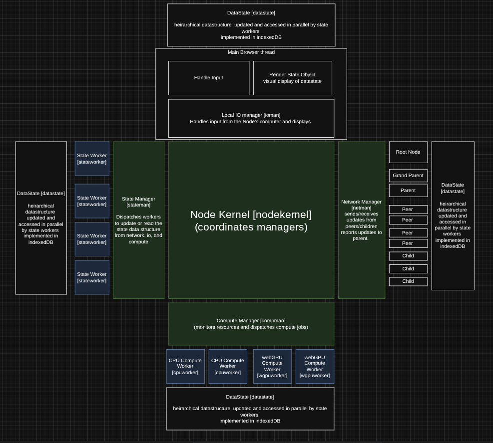

# PeerCompute

PeerCompute is a browser-based P2P networking and distributed compute library built on libp2p. It targets multiplayer games, collaborative simulations, and flexible compute workloads that need to run in the browser with configurable topology and clocking.

## Key Innovation
Given a network of compute nodes with varying mutual bandwidth and compute power it's possible to use cellular automata rules (where each node attempts to maximize it's own compute throughput) to form optimal compute networks for arbitrary workloads. 


## What You Can Use Today
- **libp2p relay + floodsub + presence** for browser P2P sessions.
- **NodeKernel** orchestrator with State, Network, and Compute managers.
- **NetworkScheduler** for decoupled network cadence (snapshots/events/commands).
- **Room + game scoping** so different sessions do not collide.
- **LAN-friendly relay config** via `relay-config.json`.

## Architecture Overview

### Core Components
- **NodeKernel**: orchestration and policy. Chooses what to send, when to send it, and who to send/request from.
- **NetworkManager**: transport, routing, discovery, and scoping (libp2p).
- **NetworkScheduler**: timing primitive (cadence, batching, keepalive, retries).
- **StateManager**: shared state sync (Yjs + scoped namespaces).
- **GPU Hub (main thread)**: shared WebGPU context for render-coupled compute tasks.
- **ComputeManager**: CPU/WebGPU compute worker pool (in progress).
- **ioManager**: controls local input/output (like threejs and your keyboard).
- **DataState (layered)**: hot GPU buffers, warm CPU deltas, cold IndexedDB snapshots.

### Orchestration vs Transport
- NodeKernel defines **policy** (clock mode, profiles, dynamic throttling).
- NetworkManager executes **transport** (dial, pubsub, presence, scope filters).
- NetworkScheduler enforces **cadence** once policy is set.

### Block Diagram


### Network Topology


### Clocking Modes (Configurable)
PeerCompute supports multiple timing models:
- **independent**: managers run event-driven; best throughput, least deterministic.
- **kernel**: NodeKernel drives ticks; best determinism, higher latency.
- **hybrid**: managers run independently but sync at kernel-defined points.

## Network Scheduler Features
- Separate **snapshot**, **event**, and **command** streams.
- **Keepalive** and **reconnect** behavior when idle.
- **Reliable events** with retries + ack (bounded retry budget).
- **Profile-based rates** so different games or rooms can use different cadence.

## Quick Start

```bash
npm install

# Start relay + all demos over HTTPS
npm run dev
```

Dev servers:
- `https://localhost:5175/` (Hyperborea)
- `https://localhost:5176/` (CubeChat)
- `https://localhost:5177/` (PlanetGen)
- `https://localhost:5178/` (Universes)
- `https://localhost:5179/` (WebGPUPhys)
- `https://localhost:5180/` (SneakyWoods)
- `https://localhost:5181/` (Daddy Go!)

### Docs Build / Preview
```bash
npm run build
npm run docs:preview
```

### Relay Host Config (Single File)
Use `config/relay.json` as the single source of truth for dev + prod relay settings:

```json
{
  "relayHost": "relay.secretworkshop.net",
  "relayPort": "443",
  "relayProtocol": "wss",
  "relayPeerId": "<relay-peer-id>",
  "relayIdentityFile": "config/relay-peer-id.json",
  "relayConfigUrl": "https://relay.secretworkshop.net/relay-config.json",
  "relayConfigFile": "/var/www/relay/relay-config.json",
  "listenHost": "127.0.0.1",
  "listenPort": "8080",
  "publicHost": "",
  "publicPort": ""
}
```

Environment variables (`RELAY_PUBLIC_HOST`, `RELAY_PUBLIC_PORT`, `RELAY_LISTEN_HOST`, `RELAY_LISTEN_PORT`) still override the config file.
Relay peer IDs are logged on startup as `Relay Server ID` / `Relay Address`.
Set `relayIdentityFile` (or `RELAY_IDENTITY_FILE`) so the peerId stays stable across restarts.
If you already have the full multiaddr, set `bootstrapPeers` in `config/relay.json` instead.

### Runtime Relay Config
`npm run build` writes each demo's `public/relay-config.json` and `public/relay-config-source.json`.
Demos resolve the relay config in this order:

1. `?relayConfigUrl=...` query param override.
2. `relay-config-source.json` (default URL from `config/relay.json`).
3. Local `relay-config.json` fallback.

To launch the relay with WSS in production, provide certs and run:

```bash
RELAY_SSL_CERT=/path/to/fullchain.pem RELAY_SSL_KEY=/path/to/privkey.pem bash scripts/start-relay-prod.sh
```

If you terminate TLS in nginx, set `relayHost` to the relay subdomain, keep `relayPort` at `443`,
and set `listenHost`/`listenPort` to the local relay (e.g. `127.0.0.1:8080`) with empty cert fields.

## Demo Gallery
See `docs/index.html` for the full demo index.


## Integration: Minimal Game Setup

```js
const cfg = await fetch('/relay-config.json').then(r => r.ok ? r.json() : null).catch(() => null);
const node = new window.NodeKernel({
  bootstrapPeers: cfg?.bootstrapPeers || [],
  enablePersistence: false,
  gameId: 'my-game',
  roomId: 'lobby-1'
});

await node.initialize();
await node.start();

const network = node.getNetworkManager();

// Scheduler configuration (optional)
network.configureScheduler({
  snapshotHz: 15,
  keepaliveMs: 1000,
  reliableEventTypes: ['spawn', 'join']
});
```

### Publish State via Scheduler
```js
network.registerStateProvider(() => ({
  position: { x, y, z },
  rotation: { y: yaw },
  color,
  ts: Date.now()
}), { id: 'player' });

network.addSnapshotHandler((peerId, message) => {
  const entries = message.payload || [];
  entries.forEach((entry) => {
    if (entry.id !== 'player') return;
    // apply remote player state
  });
});
```

### Send Events (Reliable or Best-Effort)
```js
network.queueEvent({ type: 'attack', victimId, ts: Date.now() }, { reliable: true });
```

## DataState + Compute Examples

### Layered DataState + commitDelta
```js
const node = new window.NodeKernel({
  enableGPUHub: true,
  enableWarmDeltaProvider: true,
  enableWebGPU: true,
  deltaNamespace: 'deltas'
});

await node.initialize();
await node.start();

const state = node.getStateManager();

state.commitDelta({
  taskId: 'physics',
  scope: 'deltas',
  version: performance.now(),
  payload: { positions },
  timestamp: performance.now()
});

const dataState = state.getDataState();
dataState.writeWarm('ui:stats', { fps }, 'ui');

const warmDeltas = dataState.getWarmDeltas('deltas');

// Hot layer (shared GPU buffers)
const gpuHub = node.getGPUHub();
await gpuHub.initialize();
const positionsBuffer = gpuHub.createHotBuffer(
  'hot:positions',
  byteLength,
  GPUBufferUsage.STORAGE | GPUBufferUsage.COPY_SRC
);
```

### Compute Workers (CPU + isolated GPU)
```js
// CPU task (runs in a worker when available)
const cpuResult = await node.submitTask({
  data: { positions },
  fn: ({ positions }) => {
    const next = positions.map((p) => p + 1);
    return {
      commitDelta: {
        taskId: 'cpu-physics',
        scope: 'deltas',
        version: Date.now(),
        payload: { positions: next }
      },
      value: { count: next.length }
    };
  }
});

// WebGPU task in a worker (module-based, isolated GPU)
await node.submitTask({
  module: '/compute/stepWebGPU.js',
  exportName: 'stepWebGPU',
  data: { /* inputs */ }
});
```

```js
// /compute/stepWebGPU.js
export async function stepWebGPU(input) {
  // Use WebGPU in the worker and emit CPU deltas for DataState.
  return {
    commitDelta: {
      taskId: 'gpu-physics',
      scope: 'deltas',
      version: Date.now(),
      payload: { /* compact CPU delta */ }
    },
    value: { ok: true }
  };
}
```

## Profiles (Suggested Defaults)
- **Action/FPS**: snapshotHz 10-20, reliable events: spawn/join/attack
- **Co-op**: snapshotHz 5-10, reliable events: spawn/join/revive
- **Turn-based**: event-driven, reliable events: join/turn/commit
- **Sandbox**: low Hz, reliable events: place/delete/join/commit

## Tests
```bash
npm run test:unit
npm run test:auto
```

Note: Playwright is blocked in sandboxed environments (Chromium EPERM).

## Project Structure
```
peercompute/src/peercompute/
├── index.js
├── nodeKernel/NodeKernel.js
├── stateManager/StateManager.js
├── networkManager/NetworkManager.js
├── networkManager/NetworkScheduler.js
├── computeManager/ComputeManager.js
└── utils/Utils.js
```

## Roadmap Highlights
- Adaptive profiles (RTT/peer count aware).
- Authority election + snapshot ownership modes.
- Optional binary encoding for high-throughput channels.
- ComputeManager integration with network scheduler for distributed workloads.

## License
MIT
