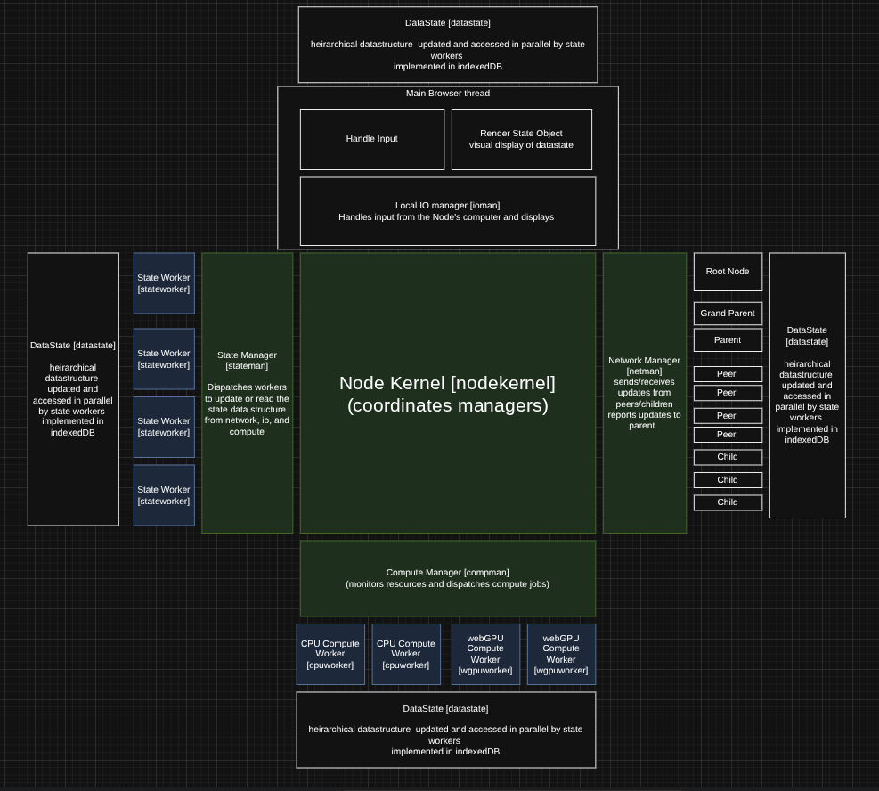
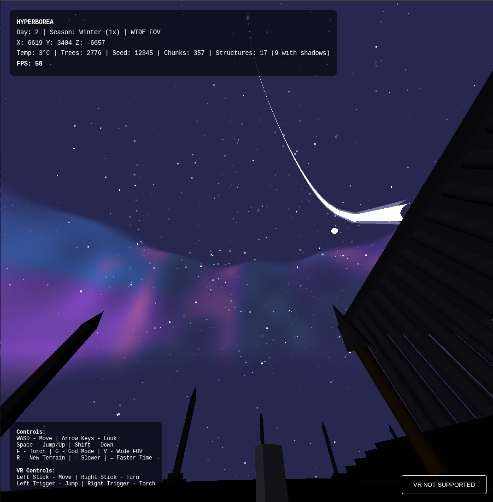
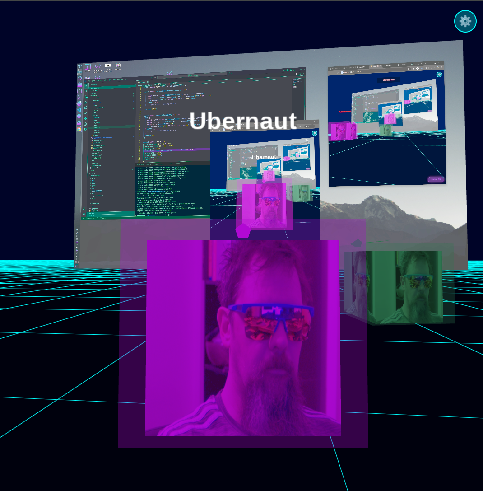
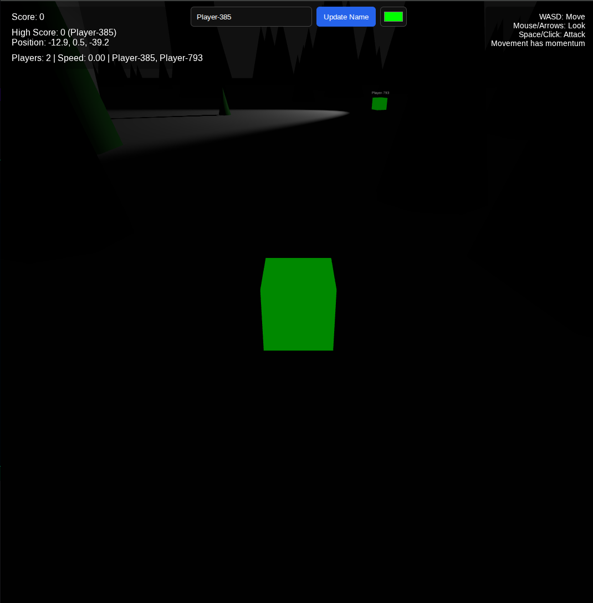
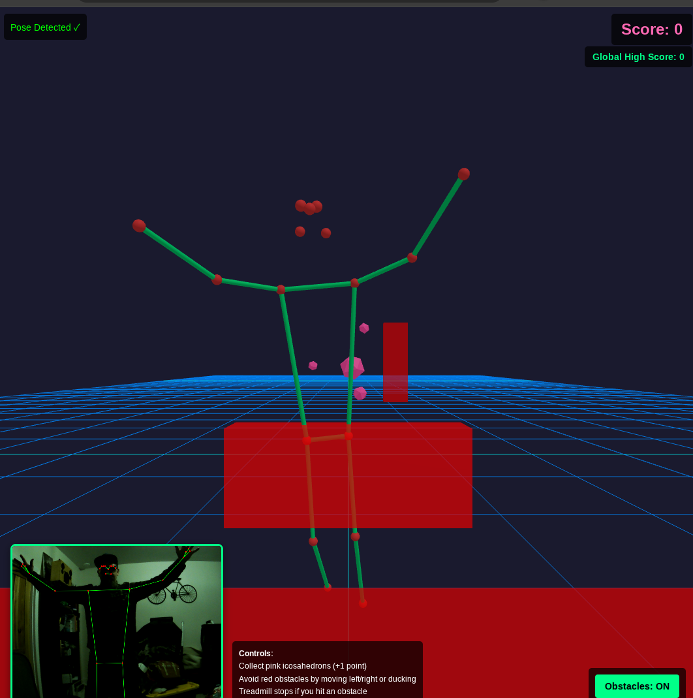
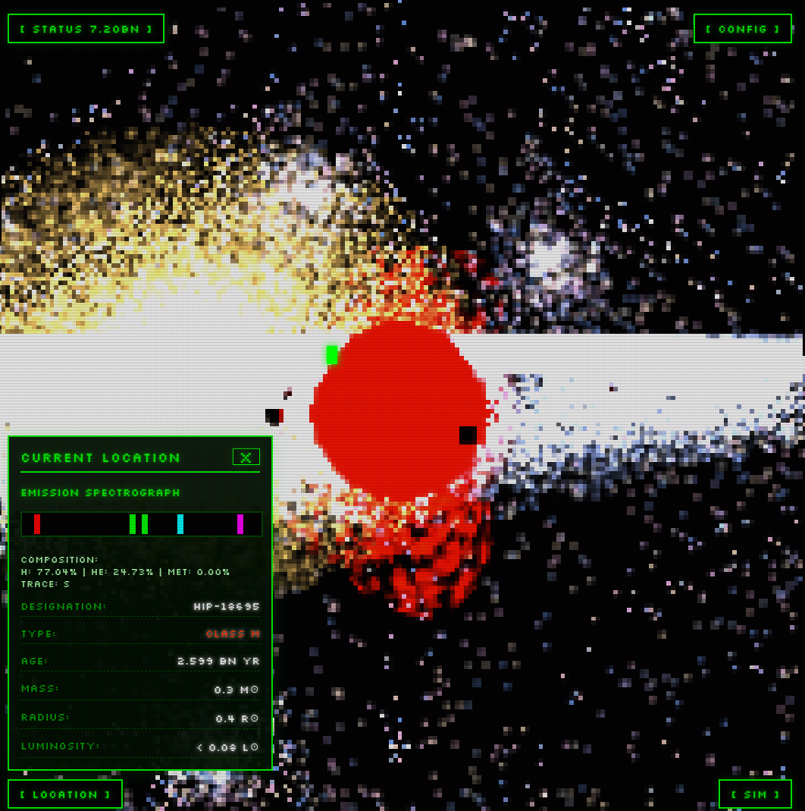
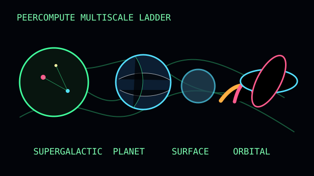
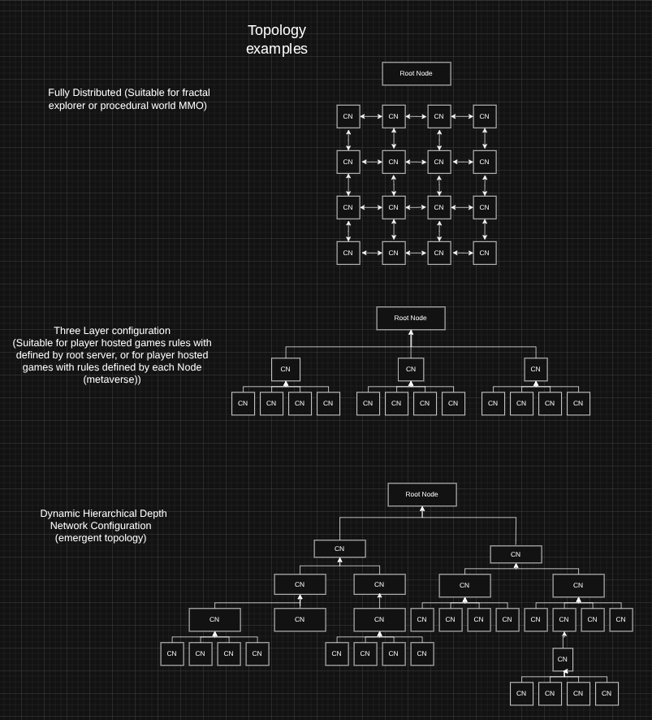
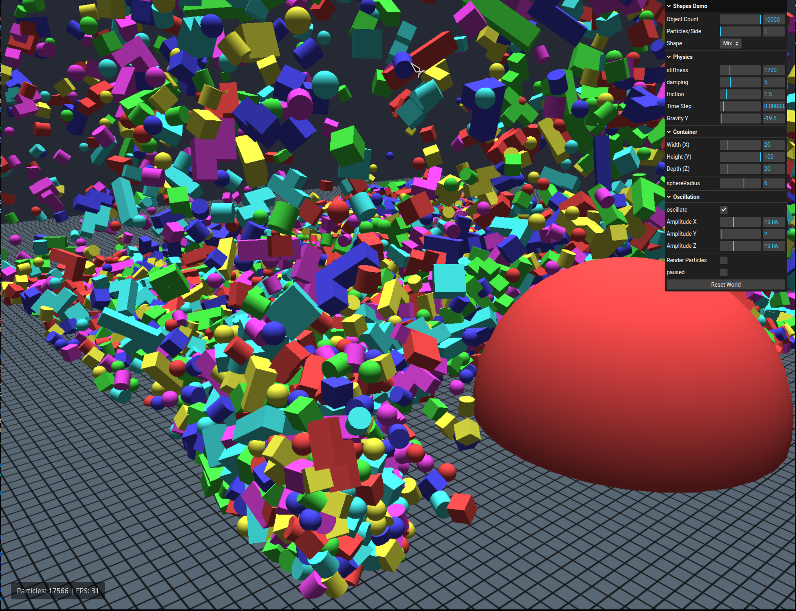
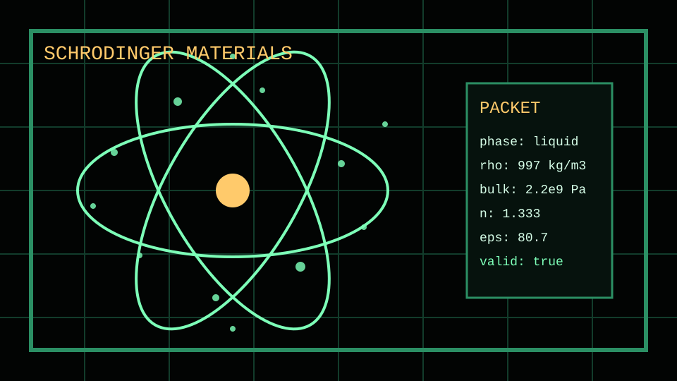

# PeerCompute

PeerCompute is a browser-based P2P networking and distributed compute library built on libp2p. It targets multiplayer games, collaborative simulations, and flexible compute workloads that need to run in the browser with configurable topology and clocking.

## Key Innovation
Given a network of compute nodes with varying mutual bandwidth and compute power it's possible to use cellular automata rules (where each node attempts to maximize it's own compute throughput) to form optimal compute networks for arbitrary workloads. 
The Keystone demo (planned) will visualize this reconfiguration live with selectable workloads and topology modes.


## What You Can Use Today
- **Browser-first libp2p runtime** with websocket relay bootstrap, relay reservations, gossipsub/floodsub messaging, presence, room/game scoping, and relay-config discovery.
- **NodeKernel orchestration** with `NetworkManager`, `StateManager`, `ComputeManager`, `ioManager`, and configurable clocking/policy modes.
- **NetworkScheduler streams** for snapshots, events, and commands with cadence control, retries, keepalive, and profile-based defaults.
- **Direct-path management** with relay-assisted WebRTC upgrades, relay retention/drop policy, logical `targetConnections` / `maxConnections`, and transport headroom.
- **Layered shared state** through Yjs plus `DataState` hot/warm/cold storage, scoped namespaces, `commitDelta`, and optional IndexedDB persistence.
- **Distributed compute runtimes** for CPU workers, pure WASM, worker-local WebGPU, and hybrid WASM+WebGPU tasks.
- **Service orchestration primitives** with `ComputeServiceRegistry`, `ChildWorkerLeaseManager`, `WorkerSupervisor`, and a `ComputeManagerServiceAdapter` for hosting manifest-described services, bounded child-worker leases, classic/module child-worker type preservation for ULG-style service assets, ULG v0.5 manifest/task adapter helpers, cancellation-tree revocation, content-addressed artifact ref handoff, and headless ComputeManager-backed service execution.
- **Compute observability** with manager task stats, per-runtime/task-family buckets, worker resize history, deterministic `peercompute.compute.task-packet.v0` hashes, `peercompute.compute.remote-task-envelope.v0` signer metadata, verification for remote dispatch, `peercompute.compute.worker-utilization.v0` per-worker/inline utilization telemetry, `peercompute.compute.task-placement.v0` requested-vs-actual placement telemetry, compact NodeKernel redundant-placement replica reports, and scoped persistent Multiscale remote-peer reliability history for future peer/cluster scheduling contracts.
- **Cross-demo observability** through NetViz telemetry, attach-session discovery, runtime metadata inspection, RTC path diagnostics, and transport/signaling/media-path truth.
- **Playable demo surfaces** including CubeChat, Hyperborea, SneakyWoods, Daddy Go!, NetViz, PlanetGen, the Multiscale Ladder, Universes, WebGPUPhys, the Fano Reactor scaffold, and the Schrodinger materials console.
- **Multiscale ULG runtime manifest and state-delta worker** in the Multiscale Ladder: packets now expose a WebGPU-only `peercompute.ulg.runtime-manifest.v0` for the Schrodinger/material base layer, including carrier/state-channel declarations, Hamiltonian and quantum-state provenance, derived material closure metadata, canonical WGSL pass capsules, invariant checks, `multiscale-ulg-runtime` warm deltas, and `getUlgRuntime()` / `getUlgRuntimeDeltas()` browser APIs. A manifest-triggered `ulg-runtime` solver runs the pass DAG through worker-local WebGPU buffers via the shared `ComputeManager`, publishes `peercompute.ulg.webgpu-execution-result.v0` / `peercompute.ulg.webgpu-execution-delta.v0`, emits `peercompute.ulg.webgpu-state-delta.v0` channel updates for the reduced ULG state lane, exposes `ulg exec` readouts plus `getUlgRuntimeExecution()` / `getUlgRuntimeStateDelta()`, and reports blocked WebGPU availability instead of falling back to CPU. The molecular WebGPU MD worker now consumes those reduced state deltas as shader source terms in the staged neighbor-list integrate pass and exposes the `molecular ulg` readout row, while keeping the calibrated-science boundary explicit. The focused v0.4 regression compares the same base MD state with and without a ULG delta, proving the uncoupled packet stays inactive while the coupled packet carries temperature, charge, source-delta, contract-audit, and handoff fields.
- **ULG simulation artifact operator-summary handoff** in the Multiscale Ladder: PeerCompute now preserves ULG `peercompute.ulg.edge-message-summary.v0` and `peercompute.ulg.field-observer-summary.v0` evidence from `peercompute.ulg.simulation-artifact.v0` compact deltas through artifact summaries, Multiscale packet aggregates, ULG spec-contract handoffs, the magnetar affordance, and the `ulg sim edge` / `ulg sim field` readout rows. These edge pass/count/residual and field-observer topology fields are runtime/operator evidence only; CPU-reference `carrier-toy` artifacts still keep scientific runtime, SPH/material, material-property, phase-change, and full-physics readiness false.
- **Quantum orbital WebGPU field/magnetic-response handoff** in the Multiscale Ladder: the `quantum-orbital-grid` worker now consumes the demo electric-field and magnetic-field environment boundaries in its WGSL wavefunction-evolution reducer. It emits `peercompute.multiscale.quantum-orbital-grid.field-response-webgpu.v0` with bounded field-energy, dipole, polarizability, and Stark-shift proxy telemetry, plus `peercompute.multiscale.quantum-orbital-grid.magnetic-response-webgpu.v0` with reduced Zeeman energy, magnetic moment projection, spin/orbital projection, and Larmor-frequency proxy telemetry. Those fields propagate through orbital packets/closures, MD quantum coupling, runtime summaries, visual smoke, and the `quantum evolve` / `molecular quantum` readouts. This remains a screened-hydrogenic Stark/Zeeman proxy, not calibrated many-electron electromagnetic response.
- **Quantum orbital statistical bridge** in the Multiscale Ladder: the WebGPU qgrid worker now derives a reduced `peercompute.multiscale.quantum-orbital-grid.statistical-bridge-webgpu.v0` from live Hamiltonian/wavefunction/radial telemetry plus ambient temperature and pressure. It exposes partition/occupation, free/internal energy, heat-capacity, ionization, opacity, degeneracy, ensemble-pressure, temperature-delta, charge-delta, and damping scalars through orbital packets, upward closures, MD quantum coupling, the `quantum qgrid stat` / `molecular qgrid stat` HUD rows, and browser smoke. This is a two-level Boltzmann/Saha-style proxy bridge for the bottom-up handoff, not a calibrated EOS, many-electron partition function, or authoritative chemistry model.
- **Quantum material to molecular dynamics source handoff** in the Multiscale Ladder: the WebGPU-only `quantum-material-potential` batch now feeds a bounded `peercompute.multiscale.molecular-quantum-material-source.v0` into the molecular WebGPU shader path. MD applies qmat-derived bond-order scale, pair-force scale, rest-length shift, temperature, charge, ionization, behavior, reduced force-gradient terms, qmat statistical-ensemble pressure/heat-capacity terms, and qmat reaction-barrier/product-source terms in the staged neighbor-list integrate kernel, with formula-derived target-pair and target-atom selectivity such as `O-H` / O+H for water instead of a uniform correction on every atom or pair. The qmat ensemble now also emits `peercompute.multiscale.quantum-statistical-source-equation.v0`, an explicit five-channel source-equation bridge for ensemble pressure, ionization population, opacity population, degeneracy pressure, and heat capacity; the qmat batch, MD diagnostics, WebGPU status, packets, closures, conservation fields, and `quantum stat source` / `molecular qmat` / `qmat barrier` HUD rows expose that handoff. Na-water qmat evidence now carries reduced Na + H2O -> NaOH + 0.5 H2 stoichiometry, heat-release, charge-transfer, gas-product, and `peercompute.multiscale.quantum-material-product-topology.v0` metadata; MD consumes that topology as a reduced NaOH/H2 bond-graph overlay on existing atoms, while keeping authoritative atom mutation blocked. The active-molecular scheduler now treats missing qgrid/qmat output as lower-law dependency work, so starting directly on the molecular layer can warm the WebGPU Schrodinger/material providers instead of waiting for an orbital-layer side effect. The `molecular qmat` readout plus packet/closure/conservation fields expose target pair label, target/fallback atom counts, primary/secondary atomic numbers, selectivity, fallback factor, selected/fallback pair counts, ensemble pressure ratio/drive, qstat channel count/source drives, heat-capacity proxy, thermal damping scale, barrier schema/gate/damping/blockers, reduced product-source heat/charge/extent/gas/topology fields, product-topology schema/mode, overlay bond count, NaOH/H2 counts, and reduced energy-bias telemetry. This is reduced force/property/statistical/barrier/product-source/topology coupling, not calibrated Born-Oppenheimer forces, calibrated charge-transfer barriers, authoritative product mutation, or reactive chemistry.
- **Quantum material response-derivative handoff** in the Multiscale Ladder: the WebGPU qmat property batch now also emits `peercompute.multiscale.quantum-material-response-derivatives.v0` for density-vs-temperature, mechanical-vs-pressure, conductivity-vs-field, and opacity-vs-radiation response channels. MD consumes those derivatives as bounded source drives in its WebGPU neighbor-list source path, and packets, closures, conservation telemetry, the upward scalar summary, and the `qmat derivatives` HUD row expose the handoff. These derivative channels are reduced proxy/Jacobian telemetry for the bottom-up material-property contract, not calibrated DFT or Born-Oppenheimer response surfaces.
- **Quantum material electronic charge-source and barrier/product handoff** in the Multiscale Ladder: the WebGPU qmat batch now also emits `peercompute.multiscale.quantum-material-electronic-charge-source.v0`, `peercompute.multiscale.quantum-material-reaction-barrier-surface.v0`, reduced Na-water product stoichiometry metadata, and reduced `peercompute.multiscale.quantum-material-product-topology.v0` bond-graph metadata, deriving bounded donor/acceptor, electronegativity, hardness, charge-transfer, mobility, screening, ionization, QEq-mix, activation, probability, gate, damping, product heat, product charge, H2 gas, and topology telemetry from the reduced material/property/ensemble batch. The molecular WebGPU worker consumes those packets without a CPU fallback path, folds them into charge equilibration plus MD shader source parameters, projects seeded water topology when products are unavailable, applies a reduced NaOH/H2 topology overlay when products are available, and exposes the handoff through packet aggregate state, closure chemistry scalars, conservation telemetry, runtime status, and the `qmat electronic` / `qmat barrier` HUD rows. This is an electronic-structure-informed proxy source for MD, not calibrated QEq/ReaxFF, Born-Oppenheimer charge transfer, calibrated reaction barriers, or conservative Na-water product chemistry.

- **Reduced qmat product conservation audit** in the Multiscale Ladder: the Na-water qmat-to-MD handoff now emits `peercompute.multiscale.molecular-qmat-product-conservation-audit.v0` after the reduced NaOH/H2 topology overlay. The audit reports requested/realized reaction sites, water consumed/remaining estimates, expected reactant atoms, observed NaOH/H2/H product atoms, Na/O/H residuals, site coverage, and qmat heat/charge budget residuals through MD diagnostics, WebGPU status, packet aggregate state, shared closure fields, and upward closure scalars. It can mark the two-sodium reduced product graph closed while still keeping `authoritativeAtomMutationReady` and scientific mutation false until calibrated conservative chemistry writes the worker buffers.
- **Reduced qmat product topology state mutation** in the Multiscale Ladder: the same Na-water qmat handoff now also emits `peercompute.multiscale.molecular-qmat-product-topology-mutation.v0`. After the WebGPU MD integration step, MD can relabel existing atoms into NaOH and H2 molecule groups, preserve those product groups across frames, nudge product bonds toward qmat reduced distances, and report mutation schema/status, atom inventory, retired water groups, and NaOH/H2 product counts through diagnostics, closure fields, packet aggregates, WebGPU status, and upward scalars. This is a bounded existing-atom topology commit for the interactive demo; calibrated kinetics, energy-conserving charge transfer, and authoritative scientific worker-buffer mutation remain blocked.
- **Molecular topology metadata in the WebGPU atom buffer** in the Multiscale Ladder: the MD atom record is now a 13-float WebGPU layout that carries molecule group id, molecule group type, and molecule local index alongside position, velocity, element, charge, and temperature. Both the staged neighbor-list kernel and tiled all-pairs kernel preserve those topology fields through GPU readback, and diagnostics/packets expose `molecularTopologyBufferGpuVisible`, `molecularTopologyBufferRoundTripApplied`, stride, offset, and field names. This makes product groups GPU-visible for the next writeback/mutation step while still keeping the current NaOH/H2 commit reduced and non-scientific.
- **Quantum material property source-buffer handoff** in the Multiscale Ladder: qmat material-property responses now also travel as named side-band metadata through molecular source/sink balance, source equations, conservative source-buffer reports, source-buffer application reports, and the reactive thermal / SPH material consumers without changing the existing 8-float `sourceVectorF32` layout. Conductivity, dielectric, optical, thermal-flux, phase-drive, mechanical-stiffness, and damping proxies remain inspectable on each dispatchable target while reactive/SPH workers can fold those properties into reduced heat, ignition, phase, and material-diffusion terms. Those qmat drives are now explicit target application, replay, mutation-audit, queue, worker-write, and qmat verification fields: warmed reactive reports carry at least 27 applied fields, SPH reports carry at least 28, and the two-target handoff carries at least 55 write intents. Qmat side-band application evidence now reconciles molecular-only source-buffer targets when thermal source-vector terms are zero, so `warmMolecularSourceBufferTargets()` can accept, validate, replay, queue, and explicitly proxy-write that 55-intent handoff from the molecular view. Aggregate packets and the `molecular qmat buffer` readout row expose active target count, qmat schema, stride, thermal flux, phase drive, electrical drive, and mechanical drive for live inspection. This keeps the Schrodinger/material property path visible to upper solvers before authoritative GPU worker-buffer mutation or calibrated material science exists.
- **Element-aware molecular force law telemetry** in the Multiscale Ladder: the molecular WebGPU all-pairs and staged neighbor-list kernels now derive reduced pair rest lengths from the periodic-table covalent radii already used by molecule construction, then scale attraction by electronegativity/metal/nonmetal affinity classes instead of using one fixed hydrogen/non-hydrogen distance. `peercompute.multiscale.molecular-force-law.v0` and the `molecular force` readout expose mean pair rest length, mean affinity, and ionic/polar/covalent/weak candidate counts through MD diagnostics, packets, runtime status, and visual smoke. This improves interactive molecule structure and qmat handoff observability; it is still not a calibrated force field or Born-Oppenheimer surface.
- **Reduced water geometry force law telemetry** in the Multiscale Ladder: the molecular WebGPU all-pairs and staged neighbor-list kernels now also apply a bounded H2O geometry stabilizer for recognized O-H/H-O-H triplets. Seeded H2O recipes carry molecule-group metadata and a reduced topology projection so ordinary-temperature water stays intact when qmat blocks unsupported Na-water product chemistry. `peercompute.multiscale.molecular-geometry-force-law.v0` reports triplet count, mean H-O-H angle, O-H/H-H distances, closure fraction, stiffness proxy, and geometry energy through MD diagnostics, packets, closures, runtime status, visual smoke, and the `molecular geometry` readout. This keeps the default 5 O + 10 H water recipe visibly molecular instead of collapsing into unstructured atoms, but it remains a reduced constraint proxy rather than a calibrated flexible-water force field.
- **Automation + stress tooling** including the shared in-browser bot host, reusable Quake-style bot core, runtime multiplayer browser gates, the Containernet-based chaos lab, and Infinite Context Coder codebase memory for long-running Multiscale/PeerCompute architecture work.
- **Deployment support** with generated relay config artifacts, Node relay for dev, Go relay for production, coturn integration, and systemd installers for the backend stack.

## Functional Surface Area

### Core Runtime
- `NodeKernel` is the top-level orchestration surface for browser peers. It starts and coordinates networking, shared state, compute, telemetry, and local IO policy.
- Clocking is configurable: independent, kernel-driven, or hybrid sync points depending on determinism vs throughput requirements.
- Profiles and scheduler settings let one app use low-latency action-game cadence while another uses sparse co-op or turn-style messaging.
- Rooms, game IDs, and topology IDs keep sessions isolated even when multiple demos share the same relay fabric.

### Networking and Topology
- Browser peers bootstrap through a relay, then attempt to upgrade to more direct paths when possible instead of staying relay-bound forever.
- Active transport truth is tracked explicitly: plain relay, relay-scoped WebRTC, direct WebRTC/media, websocket relay, and pubsub overlays are not collapsed into one ambiguous state.
- Topology policy includes `connectionRadius`, `targetConnections`, `maxConnections`, unsolicited-peer pruning, relay-assist redials, and direct-upgrade overlap headroom.
- Relay retention is tunable, including logN keeper modes so a swarm can keep only a minority of peers attached to the bootstrap relay after convergence.
- Runtime relay config can be loaded from built artifacts, a default prod URL, or an explicit `?relayConfigUrl=...` override.

### State, Persistence, and Compute
- `StateManager` provides shared Yjs-backed documents plus PeerCompute-specific scoped state publication.
- `DataState` is layered on purpose: hot GPU buffers for render-coupled/high-frequency state, warm CPU deltas for replicated working state and telemetry, and cold IndexedDB persistence for snapshots and durable caches.
- `commitDelta` lets compute tasks emit small authoritative state updates instead of forcing full-state rewrites.
- `ComputeManager` supports inline and worker-safe JS, pure WASM modules with typed memory views, isolated worker WebGPU jobs, hybrid WASM+WebGPU pipelines, a Vite-visible module worker bootstrap with explicit production worker URL overrides, runtime worker resize policy with revisioned resize history, manual worker autoscale holds, demand revival of retained target workers before inline fallback, worker/memory/GPU-limit workload budgets, optional WebGPU adapter-limit probing, task-throughput/load stats by runtime and task family via `peercompute.compute.manager-stats.v0`, advisory task-placement telemetry via `peercompute.compute.task-placement.v0`, and opt-in placement admission/executor hooks for non-advisory peer/cluster dispatch while keeping scheduling owned by one manager. Placement hooks can be installed or cleared after construction through `configurePlacementHooks()`, so a `NodeKernel` transport can be attached once peer identity/admission policy is known. Return envelopes now include `peercompute.compute.task-execution.v0` executor metadata so worker/inline completions can be audited per task. The remote hook has admission rejection, timeout, failure, deterministic task-packet hashing (`peercompute.compute.task-packet.v0`), pluggable task-envelope signer metadata (`peercompute.compute.remote-task-envelope.v0`), hash verification (`peercompute.compute.remote-placement-verification.v0`), custom result validation (`peercompute.compute.remote-placement-validation.v0`), transient retry/backoff reports (`peercompute.compute.remote-placement-retry.v0`), compact replica provenance for quorum checks, and provenance accounting (`peercompute.compute.remote-placement-provenance.v0`) but is still a bridge point rather than a default network scheduler. A reusable `createPlacementAdmissionPolicy()` helper can admit or reject peer/cluster work from measured bandwidth, RTT, remote worker capacity, cluster capacity, confidence, and trusted-peer hints; `createRemoteResultQuorumValidator()` can reject delegated results when replica output or delta hashes disagree before `commitDelta` is applied.
- `NodeKernel` exposes a guarded remote-compute request/response scaffold with `peercompute.compute.remote-request.v0` and `peercompute.compute.remote-result.v0`. It can create a network placement executor for a chosen peer, or a redundant primary-plus-replica executor through `createRedundantNetworkPlacementExecutor()`, route remote module/WASM tasks through each peer's local `ComputeManager`, and return task envelopes without committing remote deltas on responders; function-string payloads remain disabled unless explicitly opted in. Network placement executors preserve full remote response metadata as `peercompute.nodekernel.remote-compute-placement-provenance.v0`, including responder/request ids, task-packet hashes, task-envelope signer metadata, response schema, result schema, responder `workerId` when available, `peercompute.compute.task-execution.v0` `remoteExecution`, and round-trip timing for the core `ComputeManager` provenance verifier. Redundant placement attaches `peercompute.nodekernel.redundant-network-placement.v0` summaries with replica output/delta/task hashes so `createRemoteResultQuorumValidator()` can reject mismatched outputs before requester-side `commitDelta`. If the primary fails, the executor can promote the first successful replica as the commit source while excluding that promoted result from its own quorum replica list; an additional matching replica is still needed when the caller's validator requires redundant agreement. NodeKernel presence now carries compact `peercompute.nodekernel.peer-capabilities.v0` compute-capacity snapshots so connected peers can advertise worker target/active counts, GPU availability, resource tier, memory budgets, and load through the existing `NetworkManager` presence path. The unit gate includes in-memory two-kernel requester/responder placement round trips, a primary-plus-replica quorum case, and a dead-primary/two-replica promotion case; the Multiscale live remote-placement smoke drives requester, primary responder, promoted-replica responder, and independent-quorum responder browser `NodeKernel` peers through a local relay to verify redundant cosmology tasks execute as actual `remote-peer` worker-pool work with per-task primary/replica worker provenance before requester-side primary or promoted-replica `commitDelta`.
- Redundant NodeKernel placement can now use role-specific primary/replica request timeouts and a separate Multiscale quorum-result target. The live Multiscale smoke also opens a fourth browser peer, closes the requested primary, and verifies a promoted replica commits only after an independent replica matches output/task hashes, so primary-failure promotion is covered over the real relay transport as well as by core unit tests.
- Multiscale now publishes `peercompute.multiscale.remote-placement-readiness.v0` so demos can show whether remote placement is off, explicitly armed by URL flags such as `?enableRemotePlacement=1&remotePlacementPeerId=...`, or dispatch-ready with an executor/trust path. `window.__multiscaleDemo.configureRemotePlacement()` can install explicit executor/admission/signer/validator hooks at runtime and exposes `peercompute.multiscale.remote-placement-configuration.v0`; the default remains advisory/local. For local end-to-end testing without a second peer, `?enableLoopbackRemotePlacement=1` or `window.__multiscaleDemo.runLoopbackRemotePlacementProbe()` installs `peercompute.multiscale.loopback-remote-placement.v0` and runs a real non-advisory solver task through the remote placement, provenance, verification, validation, task-placement, and `commitDelta` path. `window.__multiscaleDemo.runLoopbackRemoteSolverPlacementProbe()` goes one step further by enabling the remote-solver policy and proving a normal `getSolverPlacementHint('cosmologyExpansion')` promotion executes through that same loopback remote path. `autoSelectRemotePlacementPeer=1` / `remotePlacementAutoSelectPeer=1` can opt into `peercompute.multiscale.remote-peer-selection.v0`, which scores connected non-relay peers from trusted/preferred/sticky peer hints, network capacity, local manager pressure, advertised NodeKernel peer-capacity fields, and the local `peercompute.multiscale.remote-peer-reliability.v0` outcome ledger before installing the chosen NodeKernel placement executor. `balanceRemotePlacementPeers=1` / `remotePlacementBalancePeers=1` adds `peercompute.multiscale.remote-peer-placement-plan.v0`, rotating the auto-selected primary across ranked connected peers while preserving explicit `remotePlacementPeerId` pinning and filling replicas from requested ids plus ranked candidates; `remotePlacementBalanceSeed=N` can pin deterministic rotation for repeatable tests. That plan is exposed through `getState().remotePeerPlacementPlan`, `getRemotePeerPlacementPlan()`, runtime debug, `remotePlacementConfiguration.remotePeerPlacementPlan`, and the `remote peer plan` HUD row, and active balanced executors remain dispatch-ready even though the temporary auto-primary is not persisted as the next override. That ledger is scoped by Multiscale room/topology, persisted through `peercompute.multiscale.remote-peer-reliability-store.v0`, prunes stale entries, and decays old scores back toward the prior so ancient outcomes do not dominate fresh scheduling. The selected peer's advertised target capacity plus learned reliability score are overlaid into placement admission before dispatch, so idle-retired but scalable browser worker pools are admitted by target capacity while peers with successful remote completions become more attractive than failed/timeout-prone peers. `window.__multiscaleDemo.runRemoteSolverPlacementProbe()` and `npm --prefix demos/multiscale run test:remote-placement` exercise the live browser transport path with four relay-connected pages, advertised primary/replica worker/GPU capacity, positive primary admission `remoteWorkerCapacity`, auto-selected trusted primary admission, deterministic balanced primary rotation to a non-top-ranked responder, remote-peer selector/reliability telemetry, hash verification, primary-plus-replica quorum validation with matching output/task hashes, primary and replica compute completion on live workers with concrete `workerId` / `remoteExecution` provenance, requester-side commit application from the primary or promoted replica, and a normal runtime cosmology cadence step promoted by the remote-solver policy rather than only a dedicated probe call.
- Multiscale solver dispatch now has a separate opt-in `peercompute.multiscale.remote-solver-placement-policy.v0` layer. URL/API controls such as `?enableRemoteSolverPlacement=1&remoteSolverFamilies=cosmologyExpansion,nbody` or `window.__multiscaleDemo.configureRemoteSolverPlacement()` can promote selected coarse solver families to non-advisory peer/cluster placement only after the remote placement readiness gate is dispatch-ready; tight local solvers remain advisory unless an explicit policy expands the allowed classes. A companion `peercompute.multiscale.remote-solver-placement-decisions.v0` report and `getRemoteSolverPlacementDecisions()` API expose per-solver promote/advisory/block reasons in state, compute status, runtime debug, and the `remote decisions` HUD row.
- Multiscale also has an opt-in peer-network layer. `?enablePeerNetwork=1` or `window.__multiscaleDemo.startPeerNetwork()` starts a real `NodeKernel` with relay-config discovery, publishes `peercompute.multiscale.node-kernel-status.v0` through `getState()`, compute status, runtime debug, NetViz metadata, and the `node kernel` HUD row, and can auto-wire `NodeKernel.createNetworkPlacementExecutor(peerId)` when remote placement is explicitly enabled with a trusted `remotePlacementPeerId` or an auto-selected remote peer.
- `SolverRegistry` lets physics law/rule workers declare typed inputs, outputs, conserved fields, timestep policy, validity domains, affinity policy, and warm-delta schemas before `ComputeManager` schedules them. The Multiscale Ladder now exercises that path with executable N-body, Maxwell, cosmology expansion, stellar-fusion, magnetosphere plasma/MHD, PIC plasma patch, relativistic correction, reactive thermal, molecular dynamics, quantum orbital grid, quantum material potential, SPH material, membrane-shell, hydro-atmosphere, radiation-opacity, and combustion-plume solver families, each emitting typed warm deltas through the shared manager/state path. N-body supports WebGPU direct-sum plus CPU Barnes-Hut tree mode; Maxwell, cosmology expansion, stellar-fusion, magnetosphere plasma/MHD, PIC plasma patch, relativistic correction, reactive thermal, molecular dynamics, quantum orbital grid, SPH, membrane-shell, hydro-atmosphere, radiation-opacity, and combustion-plume all have WebGPU-capable browser workers with deterministic CPU fallbacks where applicable, while ULG runtime and quantum material potential fail closed without CPU replacement.
- Multiscale live workload resizing now publishes `peercompute.multiscale.solver-state-remap.v0` and preserves existing solver timelines/state where possible. Record/particle solvers carry stable prefixes forward, grid solvers resample fields with optional mean preservation, and compact invariant summaries report mass, charge, momentum, kinetic/field/thermal energy, species/phase, and field proxies where available. Runtime packet/readout/debug APIs use the compact summary, while `getSolverRemapReport()` keeps the full field-level debug report available on demand.
- Multiscale compute-capacity resizing now publishes `peercompute.multiscale.compute-capacity-resize.v0`: worker target changes and WebGPU adapter-limit probes trigger a fresh capacity budget, `ScaleComputeOrchestrator.resizePool()` rebuilds the per-scale shard plan through the same shared manager, reusable shard runtimes stay warm when their task identity and particle count match, particle-count changes seed new shard workers from prior live particle records where available and compact snapshot positions otherwise, and the runtime/readout/debug APIs report worker resize revision, compute resize status, capacity scale, carried-forward shard/record counts, `peercompute.multiscale.compute.particle-resize-audit-summary.v0` continuity metrics, `peercompute.multiscale.compute.particle-resize-correction-summary.v0` scale-weighted mass/momentum/kinetic proxy correction metrics, scaler cooldown, and the core manager's manual worker autoscale hold. The correction now redistributes record float 7 (`scale`) across rebuilt records to preserve total record-scale mass proxy before applying the velocity projection, and the active readout/runtime-debug panel render before/after residuals as a compact `resize corr` row.
- Multiscale solver budgets now pass through `peercompute.multiscale.solver-admission.v0` before law-worker reset. The admission pass uses the same shared `ComputeManager.estimateWorkloadBudget()` resource envelope to clamp explicit particle/grid/sample/atom overrides to local worker, memory, and GPU ceilings, exposes the result through state/compute status/runtime debug/readout rows, and feeds admission pressure back into the adaptive scaler.
- Multiscale solver submissions now pass through `peercompute.multiscale.solver-submission-budget.v0` on each frame. The budget ranks eligible law-worker runs by event-triggered refinement and active-layer proximity, keeps newly viewed native-layer solvers urgent until each gets one submission, limits new shared-manager submissions when frame, manager-load, or queue pressure is high, and exposes admitted/deferred solver families through state, compute status, runtime debug, NetViz metadata, API, and the `solver submit` HUD row.
- Multiscale packet and warm-delta publication now pass through `peercompute.multiscale.state-publication-budget.v0`. The animation loop still advances the model, visible scene, solver scheduler, and active readout every frame, but full cross-scale packet construction plus conservation/coupling `StateManager` warm-delta commits are adaptively throttled from frame/render/queue/manager pressure, with state/API/compute/runtime-debug/NetViz telemetry and a `state publish` HUD row.
- Multiscale runtime diagnostics now pass through `peercompute.multiscale.runtime-diagnostics-budget.v0`. The runtime-debug snapshot, `getRuntimeDebug()`, `getState().runtimeDebug`, and NetViz metadata reuse a cached diagnostic object under frame/render/state-publication/manager pressure instead of rebuilding cross-scale coupling and manager telemetry on every API/readout request; build/reuse counts and last snapshot cost are exposed through state/API/compute/runtime-debug/NetViz metadata and the `runtime diag` HUD row.
- The Multiscale Ladder now includes a reduced molecular-dynamics law worker under the same `ComputeManager` / `StateManager` path. It evolves a WebGPU-capable atom/bond patch with CPU fallback, emits molecule/species/bond/reaction/charge/temperature diagnostics as `multiscale-solver-deltas`, renders a live atom/bond overlay on the molecular layer, and consumes the orbital closure through `peercompute.multiscale.molecular-quantum-coupling.v0` so quantum electron-shell telemetry can bias reduced electronegativity, charge, ionization, and bond-order proxies. It is an interactive MD proxy, not a validated force field or quantum-chemistry solver.
- The Multiscale orbital layer now emits a first bottom-up `peercompute.multiscale.quantum-orbital-closure.v0` packet using the Schrodinger demo's element/orbital reference math: electron configuration, active screened hydrogenic orbital, effective nuclear charge, valence/unpaired electron counts, ionization, polarizability, dielectric, conductivity, bonding-tendency, and a shared `ClosureState -> ClosureResult`. It also publishes `peercompute.multiscale.quantum-orbital-finite-grid.v0` summaries with grid size, normalization drift, boundary mass, radius moments, `peercompute.multiscale.quantum-orbital-eigen-residual.v0` residual telemetry, `peercompute.multiscale.quantum-orbital-wavefunction-evolution.v0` single-step finite-difference evolution telemetry, and `peercompute.schrodinger.radial-finite-difference-eigensolver.v0`, a model-local CPU-reference one-electron radial diagnostic for baseline tests. The standalone Schrodinger console now uses `peercompute.schrodinger.orbital-grid-webgpu.v0` for the 3D orbital probability grid and point cloud, plus `peercompute.schrodinger.radial-webgpu-eigensolver.v0` for the radial Hamiltonian path, with no CPU fallback for either standalone solve. Element/orbital/grid controls remain exposed through the UI and `window.__multiscaleDemo.setQuantumOrbital()`, and `quantum-orbital-grid` runs through the same shared `ComputeManager` / `StateManager` path as the other law workers. `quantum-material-potential` now runs beside it as a WebGPU-capable concurrent material-property plus reduced force-surface preview batch, evaluating condition-adjusted density, mechanics, optical/electrical response, behavior-drive records, Morse-style bond-energy-gradient preview telemetry, an uncalibrated `peercompute.multiscale.quantum-material-reaction-barrier-surface.v0`, reduced `peercompute.multiscale.quantum-material-product-stoichiometry.v0` Na-water product source metadata, and reduced `peercompute.multiscale.quantum-material-product-topology.v0` NaOH/H2 bond-graph metadata from the Schrodinger material packet. It also emits a first `peercompute.multiscale.law-graph-fragment.v0` that represents the current qmat state variables, law nodes, and product-source/scientific-readiness constraint edges. The current browser orbital worker is WebGPU-only: it runs WGSL screened-hydrogenic finite-grid density evaluation, WebGPU residual/evolution/field/magnetic-response reductions, and the standalone `peercompute.schrodinger.radial-webgpu-eigensolver.v0` radial Hamiltonian contract on the worker's shared GPU device, reports `webgpu-only-no-cpu-fallback`, and emits `blocked-webgpu-unavailable` or `blocked-webgpu-execution-error` instead of substituting CPU samples when WebGPU is absent or broken. This is still a screened-hydrogenic finite-grid/material-property reference proxy with reduced Stark/Zeeman, bond-force, barrier, product-source, and product-topology previews only; many-electron DFT, Born-Oppenheimer forces, calibrated quantum chemistry, authoritative product mutation, calibrated electromagnetic response, and stable production TDSE propagation remain future gates.
- Multiscale law-graph packets now include a scheduler-facing `peercompute.multiscale.law-graph-dispatch-queue.v0` after update-plan, reduced solve, and proposal admission. The queue orders admitted law operations by dependency phase, active-layer bias, executor, and blocker state, separates ComputeManager-ready solver tasks from model-local law work, exposes batch counts and next queue action through `getLawGraphDispatchQueue()` / `getState().lawGraphDispatchQueue`, and keeps the boundary explicit: partial proxy dispatch can be visible while authoritative mutation remains blocked.
- A companion `peercompute.multiscale.law-graph-scheduler-manifest.v0` now resolves those queue entries onto concrete scheduler lanes, registered solver descriptors, module/export executor readiness, affinity/timestep hints, warm-delta scopes, and StateManager application links. It exposes descriptor/executor/scientific blockers through packets, runtime debug, `getState().lawGraphSchedulerManifest`, `getLawGraphSchedulerManifest()`, and the `law graph` HUD row, while still leaving actual task submission and authoritative mutation to downstream gates.
- `peercompute.multiscale.law-graph-scheduler-execution-audit.v0` now observes whether those ComputeManager lanes have matching live solver-runtime completions and `multiscale-solver-deltas` warm-delta evidence. The audit is exposed through packets, runtime debug, `getState().lawGraphSchedulerExecutionAudit`, `getLawGraphSchedulerExecutionAudit()`, warm deltas, and the `law graph` HUD row; it is evidence telemetry only, not task submission or authoritative mutation.
- `peercompute.multiscale.law-graph-result-admission.v0` consumes that execution audit and admits matching worker runtime plus warm-delta evidence only as proxy result evidence. It reports required/admitted/missing/scientific-blocked counts through packets, upward aggregate state, runtime debug, `getState().lawGraphResultAdmission`, `getLawGraphResultAdmission()`, warm deltas, and the `law graph` HUD row while keeping authoritative mutation and scientific promotion blocked.
- `peercompute.multiscale.law-graph-state-application-preflight.v0` maps proxy-admitted worker results back to StateManager application targets without mutating them. It reports required/ready/waiting/missing-link/scientific-blocked counts through packets, upward aggregate state, runtime debug, `getState().lawGraphStateApplicationPreflight`, `getLawGraphStateApplicationPreflight()`, warm deltas, and the `law graph` HUD row so application readiness is visible before any scientific promotion.
- Molecular dynamics now preserves that orbital wavefunction-evolution telemetry as a bottom-up coupling input, deriving `quantumEvolutionDrive` from norm drift, density drift, energy expectation, field/magnetic response, phase rotation, and explicit WebGPU worker provenance. The live browser path packages that coupling as `peercompute.multiscale.molecular-quantum-source.v0`, carries `webgpu-worker` source labels plus radial Schrodinger energy/residual fields from `peercompute.schrodinger.radial-webgpu-eigensolver.v0`, and applies matched-element temperature, charge, ionization, and bond-order source terms inside the staged WebGPU MD integrate shader. `quantumCouplingApplicationMode`, `quantumCouplingWebgpuKernelApplied`, source/radial/Stark/Zeeman provenance, and `molecular quantum` HUD visibility are now part of the handoff. Node/no-adapter coverage remains a regression path only; calibrated force fields and reference chemistry are still future gates.
- Molecular dynamics also consumes `peercompute.ulg.webgpu-state-delta.v0` from the ULG runtime as a lower-law source term. Browser WebGPU runs encode the compact temperature, charge, velocity, magnetic, energy, and normalization channels into the molecular shader parameter buffer and apply them inside the `cell-neighbor-list` integrate kernel, then report `ulgStateDeltaApplicationMode`, `ulgStateDeltaWebgpuKernelApplied`, channel count, source hash, and delta magnitudes through packets, closures, runtime status, and the `molecular ulg` HUD row. Node/no-adapter tests keep a separate non-WebGPU source path only for regression coverage; the live demo path is WebGPU-kernel applied.
- Molecular dynamics now also emits `peercompute.multiscale.molecular-charge-equilibration.v0`, a reduced electronegativity/hardness charge-relaxation report after each MD initialization, append, and timestep. The report exposes QEq-style residuals, charge deltas, hardness proxy, transfer magnitude, quantum-coupling influence, and clamp-aware neutralization residuals through diagnostics, packet aggregate state, `ClosureResult` chemistry, runtime status, and the `molecular qeq` HUD row. This keeps patch charge conservation visible in the bottom-up packet path, but it is still an interactive proxy rather than calibrated QEq/ReaxFF or quantum chemistry.
- Molecular dynamics now emits `peercompute.multiscale.molecular-force-energy-ledger.v0`, a reduced per-step energy ledger that splits total MD energy into kinetic, thermal, bonded-attraction, bond-strain, electrostatic, repulsion, QEq-residual, and quantum-coupling-bias proxy terms. The ledger flows through diagnostics, aggregate packets, `ClosureResult` chemistry/conserved state, runtime status, and the `molecular energy` HUD row so bottom-up force/energy balance is visible before calibrated force fields exist.
- Molecular dynamics now also emits `peercompute.multiscale.molecular-phase-eos-basis.v0`, a reduced phase/EOS basis that carries specific free/internal/enthalpy/entropy proxies, latent-heat budget, phase-energy rate, source-temperature delta, and phase-stability residual from the MD thermo ledger into `ClosureResult` thermodynamics, molecular source/sink and source-equation summaries, reactive thermal and SPH source forcing, conservation/coupling exchange metadata, and the `molecular eos` HUD row. This is explicitly an interactive proxy, not a calibrated water EOS or thermodynamic integration.
- The Multiscale molecular worker now prefers a staged WebGPU cell-neighbor-list kernel over the tiled all-pairs reference shader, with dynamic per-step grid origin/cell-size bounds, neighbor capacity, candidate/accepted pair counts, and overflow telemetry in worker status, packet aggregates, and solver-load reports. The adaptive scaler now uses those GPU pair/capacity/overflow signals when deciding whether to reduce or restore the molecular workload. The all-pairs shader remains the fallback when the neighbor-list path overflows or is unavailable.
- The Multiscale molecular layer can be rebuilt from counted atom recipes through the retro UI or `window.__multiscaleDemo.setMolecularComposition()` / `addMolecularAtoms()`. Current presets include water, carbon dioxide, and a simple air mix; browser smoke verifies a 5 O + 10 H recipe produces a 15-atom H10/O5 patch with visible bonds.
- Molecular diagnostics now include `peercompute.multiscale.molecular-reaction-ledger.v0`, a graph-derived component/species ledger from the live inferred bond graph. It classifies reduced H2O, CO2, CH4, NaCl, H2, O2, N2, CO, free atoms, and unknown components, then exposes molecular species counts, dominant molecule, component closure fraction, and stoichiometry residual proxy through packets, closures, source/sink summaries, and the `molecular ledger` HUD row. This is deterministic telemetry for the bottom-up handoff, not a validated reaction network.
- Molecular steps now also emit `peercompute.multiscale.molecular-reaction-event-ledger.v0`, comparing pre-step and post-step bond graphs to report formed/broken/retained bonds, molecule species deltas, atom species deltas, reaction-progress/heat-release deltas, and an event-intensity proxy. The existing `molecular ledger` HUD row shows the current event count so bond/reaction changes are visible without opening packet JSON.
- The Multiscale SPH material worker now exposes first-pass water phase-change telemetry: ice/liquid/vapor mix, boiling/freezing fractions, phase-change-rate and latent-heat sink/release proxies, plus closure fields for downstream material consumers. CPU and WebGPU paths include a small latent-heat-style damping step around vaporization/condensation, while the model boundary remains an interactive proxy rather than a validated water EOS.
- The shared demo closure contract normalizes material/solver outputs as `ClosureState -> ClosureResult`, including thermodynamics, transport, mechanics, electromagnetics, chemistry, phase, validity, uncertainty, provenance, and conservation. Multiscale consumes it from molecular, reactive, SPH, and orbital workers, commits normalized `multiscale-closures` warm deltas through `StateManager`, and now feeds the typed molecular closure into the reactive thermal and SPH material workers as a bottom-up local heat/chemistry source. Schrodinger property packets can publish compatible closure deltas without replacing their existing UI packet format.
- The molecular-to-material handoff now also emits `peercompute.multiscale.molecular-source-sink.v0` reports for reactive thermal and SPH consumers. These reports name the molecular closure source, target solver/field, reduced heat-flux and thermal-drive terms, open-system energy/species residual proxies, validity warnings, and provenance so downstream coupling code can distinguish typed proxy source accounting from a validated conservative exchange law.
- Reactive thermal and SPH material consumers now also read the nested `peercompute.multiscale.molecular-reaction-source.v0` fields inside molecular closure chemistry. Event-derived heat-source, species-rate, bond-rate, and cooling proxies influence the reduced thermal/material drive and are preserved as compact reaction-source fields in diagnostics, packet aggregate state, upward closures, and source/sink summaries.
- Conservation and cross-scale coupling reports now preserve compact molecular reaction-source exchange fields separately from generic heat-flux provenance, including reaction heat-source proxy, species-rate proxy, source drive, cooling drive, and field metadata for downstream source/sink accounting.
- Multiscale packets now also include `peercompute.multiscale.molecular-source-sink-balance.v0`, a reduced fanout balance between the molecular event source and the reactive/SPH source/sink consumers. It reports active target count, source/cooling coverage, heat/species residual proxies, fanout oversubscription, and a `molecular balance` HUD row so unaccounted chemistry-source handoff is visible before conservative equations exist.
- That balance report is now committed as a `multiscale-source-sink-balances` warm delta through `StateManager` and exposed through `window.__multiscaleDemo.getSourceSinkBalanceDeltas()` / `getState().sourceSinkBalanceState`, matching the existing closure/conservation/coupling state surfaces.
- The molecular conservative-transfer dry-run report now follows the same state path under `multiscale-source-transfers`, exposed through `window.__multiscaleDemo.getSourceTransferDeltas()` / `getState().sourceTransferState`, so allocation telemetry can feed downstream tools before any solver-state mutation is enabled.
- Multiscale packets now also include `peercompute.multiscale.cross-scale-coupling.v0`, a structured handoff report for the current proxy ladder. It summarizes upward and downward links such as molecular heat to reactive thermal closure, reactive thermal to combustion, SPH water contact to fire suppression, membrane rupture to SPH release, combustion to weather, radiation to surface heating, stellar/radiation/magnetosphere/PIC/relativity/cosmology feedback, and environment boundary forcing. The report is committed as `multiscale-couplings`, exposed through `getState().crossScaleCoupling`, `getState().couplingState`, `getCouplingDeltas()`, runtime debug/readout rows, and NetViz session metadata. It is coupling telemetry for runtime integration, not a validated multiscale exchange law.
- Multiscale packets now include a first `peercompute.multiscale.conservation-audit.v0` open-system audit that tracks reduced mass, energy, species, water inventory, solver drift, cosmology expansion exchange, magnetosphere/MHD exchange, PIC charge/current exchange, membrane rupture exchange, active cross-solver exchange terms, and compute-resize residuals via `peercompute.multiscale.compute-resize-conservation.v0` when capacity changes rebuild particle records. The same audit is committed as a `multiscale-conservation` warm delta through `StateManager`; it is a regression/telemetry surface for coupling work, not a scientific conservation proof.
- Coupling and conservation packets now embed `peercompute.multiscale.field-metadata-report.v0` summaries. Each exchanged source/target or residual field carries descriptor-backed or runtime-override metadata for solver family, quantity, unit, dimensions, storage location, and unit status, so future conservative transfer and closure adapters can reject dimensionless/proxy fields explicitly instead of treating every scalar as a physical SI value.
- Cross-scale coupling packets also include `peercompute.multiscale.field-compatibility-report.v0`, which checks each source/target handoff for unit and dimension compatibility, reports where proxy or dimensionless adapters are required, and separates those expected adapter cases from hard physical dimension mismatches.
- The same coupling packets now publish `peercompute.multiscale.field-adapter-plan.v0`, a metadata-derived adapter plan that classifies each handoff as identity pass-through, known unit conversion, named response adapter, stub-required proxy/dimensionless adapter, or blocked physical mismatch. Named response adapters now include `peercompute.multiscale.adapter.molecular-reactive-thermal-source-response.v0`, which maps molecular heat release plus bond, reaction, ionization, oxygen, pressure, radiation, and water context into reduced reactive-cell heat forcing; `peercompute.multiscale.adapter.thermal-ignition-response.v0`, which maps reactive-cell temperature plus oxygen/pressure/water context into combustion fire-area forcing; `peercompute.multiscale.adapter.sph-water-suppression-response.v0`, which maps SPH cooling/contact/phase context into combustion water-contact suppression; `peercompute.multiscale.adapter.membrane-rupture-spill-response.v0`, which maps membrane rupture risk plus pressure/heat/water context into reduced SPH spill impulse forcing; `peercompute.multiscale.adapter.plume-weather-cloud-response.v0`, which maps combustion buoyancy/smoke/heat plus wind, precipitation, pressure, water contact, and existing storm/cloud context into reduced cloud-cover forcing; `peercompute.multiscale.adapter.radiation-surface-heat-response.v0`, which maps radiation-opacity net heating plus greenhouse, stellar-flux, radiation-pressure, material-temperature, and water-contact context into reduced surface radiative heat-flux forcing; `peercompute.multiscale.adapter.stellar-radiation-pressure-response.v0`, which maps stellar luminosity, fusion power, core temperature, stellar flux, and opacity context into reduced radiation-pressure forcing; `peercompute.multiscale.adapter.maxwell-magnetosphere-boundary-response.v0`, which maps Maxwell field energy, Poynting flux, solar-wind, reconnection, radiation-pressure, and stellar-flux context into reduced magnetosphere magnetic-energy forcing; and `peercompute.multiscale.adapter.pic-mhd-reconnection-feedback.v0`, which maps PIC reconnection heating, current density, field energy, charge separation, and particle escape into reduced MHD reconnection-rate forcing. These named adapters are interactive proxy equations with validation gates, not validated conservative transfer laws.
- Coupling packets also publish `peercompute.multiscale.field-transfer-report.v0`, which executes ready scalar identity/unit-conversion/named-response adapters against current source values, reports predicted target values and residuals, and explicitly skips remaining proxy stubs. The molecular reactive thermal preview now reads the dry-run conservative-transfer allocation context so the predicted reactive-cell target reflects the current molecular heat/species assignment, while remaining transfer telemetry only. It does not silently mutate solver state or claim scientific conservation.
- Multiscale mobile traversal now includes fixed retro output-panel toggles for `controls`, `runtime`, `readout`, and `packet`. The controls publish `peercompute.multiscale.output-panel-visibility.v0` through `getOutputPanels()`, `setOutputPanelVisibility()`, `setOutputPanelsVisibility()`, `toggleOutputPanel()`, HUD state, runtime debug, and query presets such as `?mobileOutputs=focus` / `?hideOutputs=runtime,packet`; narrow viewports use a flex-stacked HUD bounded above the fixed toggle strip so ladder buttons, the zoom slider, and visible readout rows remain reachable without panel overlap. Focus mode keeps the bottom-up `molecular response`, `molecular reconcile`, `molecular buffer`, `molecular buffer apply`, `molecular buffer accept`, `molecular buffer writeback`, `molecular buffer replay`, `molecular buffer mutate`, `molecular buffer queue`, `molecular buffer writer`, `molecular buffer verify`, `molecular sci gate`, and `molecular sci manifest` rows visible so mobile users can hide bulky output divs without losing source-handoff status.
- The optional GPU hub keeps a shared main-thread WebGPU context available for render-adjacent workloads that should not live in isolated workers.

### Observability, Automation, and Test Infrastructure
- NetViz can attach to any running demo session, discover rooms from shared pubsub beacons, inspect structured runtime metadata such as Multiscale worker/task-family pressure, and render peer/edge truth across transport, pubsub, signaling, and media paths.
- Browser telemetry includes warm-delta debug state, RTC selected-candidate evidence, connection counters, and relay-retention diagnostics for live prod investigation.
- `net-chaos-lab/` provides scenario-driven protocol testing with NAT segments, dual-stack/IPv4-only/IPv6-only modes, partitions, churn, bandwidth shifts, and multi-agent browser probes.
- The shared bot system can now spawn hidden same-origin browser peers from demo settings screens and drive them through a reusable bridge contract instead of per-demo hacks.
- The reusable bot behavior core is intentionally modular: world model, navigation, memory, personalities, and combat/steering logic live under `net-chaos-lab/agent/quake3/` and can be adapted to more games.
- The repo includes both lightweight static gates and full headless Chromium runtime gates so transport or demo regressions can be checked locally before deploy.

### Demo and Product Surfaces
- **CubeChat** is a browser 3D social/video world with room/password deep links, remote webcam playback, screen share, themed worlds, and bot spawning from settings.
- **Hyperborea** is a top-down multiplayer action surface used to validate replicated remote-player state, attacks, room flow, bot control, and runtime attach/debug behavior.
- **SneakyWoods** is a stealth/action multiplayer surface with shared room presence, combat hooks, and the same bot/settings integration path as the other live demos.
- **Daddy Go!** is a smaller multiplayer validation surface used for deterministic replicated score/state checks in the browser runtime suite.
- **NetViz** is the live multiplayer debugger and topology viewer, not just a demo. It is the primary surface for inspecting transport truth, room attach, relay keepers, and chaos-lab overlays.
- **PlanetGen**, **Universes**, and **WebGPUPhys** exercise rendering, procedural generation, and compute-oriented browser workloads on the same stack.
- **Multiscale Ladder** is the first WebGPU-first keystone scaffold for zooming from supergalactic structure down through planetary weather, human-scale physics, MLS-MPM material patches, molecular dynamics, and orbital clouds while emitting explicit model-tier packets. Its ladder particles run through one shared PeerCompute `ComputeManager`, which adapts worker targets from the local resource profile, reports real manager task stats/load by runtime and task family, schedules affinity-keyed shard jobs per scale, commits worker deltas into `StateManager`/`DataState`, exposes warm state to the renderer, and runs executable law-worker slices for WebGPU direct-sum / CPU Barnes-Hut N-body gravity, WebGPU cosmology expansion, WebGPU stellar-fusion plasma, WebGPU magnetosphere plasma/MHD, WebGPU PIC kinetic-plasma patch, WebGPU relativistic correction telemetry, WebGPU Maxwell fields, WebGPU hydro-atmosphere weather, WebGPU radiation/opacity heat transfer, WebGPU combustion plume/smoke/fuel evolution, WebGPU reactive thermal closure state, WebGPU SPH material particles, and a WebGPU membrane-shell pressure/heat-damage worker for the water-balloon shell. Solver cadence is now scale-separated by default and governed by `scale-aware-multirate-v0`, so large/coarse field solvers update slower than local material/molecular loops and back off more aggressively under frame pressure; `active-layer-priority-v0` maps solver families to the scale ladder, cools distant inactive layers, and exposes a `solver focus` HUD/runtime row with effective cadence. `peercompute.multiscale.lower-scale-refinement.v0` adds an `event-sampled-current-view-v0` scheduler that targets the current view for 60fps responsiveness, runs lower-scale solvers on rupture/fire/chemistry/weather/plasma/cosmology events, and rotates background spot checks only when frame budget allows; the HUD/runtime row is `refinement schedule`. HUD/packet JSON refresh is throttled by `peercompute.multiscale.readout-cadence.v0` so debug serialization does not run every animation frame. Manual/demo worker target changes now briefly hold both the adaptive scaler and the core manager autoscaler so a user-visible resize is not immediately undone by queue pressure, and particle-count-changing capacity resizes now publish resize audit/correction summaries for carried-prefix continuity plus first-pass record-scale mass-proxy preservation and scale-weighted momentum/kinetic-energy proxy preservation, including a `resize corr` HUD/runtime row for before/after mass, momentum, and kinetic residuals. Solver budgets now pass through `peercompute.multiscale.solver-admission.v0`, so requested law-worker sizes are clamped against the same shared-manager resource envelope before reset and exposed as a `solver admission` HUD/runtime row. Advisory placement-plan entries are now carried into solver task submissions, and `peercompute.compute.task-placement.v0` reports requested local/peer/cluster intent versus the actual local worker/inline executor path in the HUD/runtime state; opt-in non-advisory remote dispatch also carries deterministic `peercompute.compute.task-packet.v0` code/input/task hashes plus optional signed task envelopes into admission, executor, provenance, hash-verification, result-validation, and retry/backoff hooks. Runtime `configureRemotePlacement()` can attach those hooks explicitly and render a `remote config` row without changing the default local/advisory solver path, while `configureRemoteSolverPlacement()` controls the separate `peercompute.multiscale.remote-solver-placement-policy.v0` gate that can promote selected coarse solver families only after remote placement is dispatch-ready and now publishes per-solver decisions in the `remote decisions` row/API. The separate opt-in `startPeerNetwork()` / `?enablePeerNetwork=1` path starts a real `NodeKernel`, publishes `peercompute.multiscale.node-kernel-status.v0`, and can wire that kernel's network placement executor only when remote placement is deliberately armed; the live remote-placement smoke verifies that path with four browser peers over a local relay, including primary-plus-replica redundant execution and closed-primary promoted-replica failover, before requester-side state commit. Live workload resize now preserves current solver state through `peercompute.multiscale.solver-state-remap.v0` where possible, so adaptive quality changes do not cold-start every law worker. The cosmology expansion tile emits reduced scale factor, Hubble-rate, density-contrast, filament-energy, void-fraction, structure-growth, and expansion-work diagnostics, renders a visible supergalactic web overlay, and feeds galactic turbulence/star-formation terms back into packet/conservation state. The stellar-fusion tile emits reduced core temperature, density, hydrogen/helium, fusion-power, luminosity, and neutrino-loss diagnostics, renders a visible solar-core overlay, and feeds luminosity/radiation-pressure terms toward the radiation and magnetosphere layers. The magnetosphere plasma tile emits reduced solar-wind pressure, magnetopause radius, reconnection rate, ionization, Alfven speed, magnetic/plasma energy drift, and divergence-B proxy diagnostics, renders a visible solar magnetosphere overlay, and feeds radiation-pressure/debris-flux coupling toward downstream layers. The PIC patch consumes magnetosphere and Maxwell forcing, pushes charged particles, deposits charge/current back to a reduced field grid, renders a visible charge-colored kinetic overlay, and feeds charge imbalance, current density, reconnection heating, escape fraction, and divergence-E telemetry into packet/conservation state. The relativistic correction tile consumes N-body, stellar, Maxwell, magnetosphere, and PIC forcing, emits reduced Lorentz factor, time-dilation, redshift, perihelion-precession, frame-dragging, lensing, and Shapiro-delay telemetry, renders a visible solar/galactic/supergalactic orbit-shell overlay, and feeds redshift/lensing terms back into packet and conservation state. Radiation output now feeds a reduced radiative heat-flux closure back into the reactive thermal, combustion-plume, SPH, and membrane-shell kernels, while SPH reports fire-contact/cooling diagnostics back into the surface suppression state. The membrane rupture path now drives a decaying SPH spill impulse, released-water accounting, and a reduced stream placement term so the rupture control produces water-release telemetry and positive fire-contact/cooling feedback instead of only a shell state change; SPH momentum and kinetic-energy drift are now surfaced in packets/audits so that reduced impulse work is visible. The combustion plume tile now also advects smoke/heat/oxygen with hydro wind, reports smoke centroid, plume rise, buoyancy flux, oxygen depletion, and suppression diagnostics; the membrane-shell worker reports stress, strain, damage, integrity, rupture risk, and burst state. Molecular, reactive thermal, and SPH outputs are normalized into the shared `ClosureState -> ClosureResult` contract; reactive thermal and SPH consume the typed molecular closure as a bottom-up heat/chemistry source, and packet/coupling/conservation reports now preserve that molecular source accounting as explicit reactive/SPH heat-flux provenance. These fields flow through packets, warm deltas, the retro HUD, the `peercompute.multiscale.runtime-debug.v0` panel/API, same-origin `peercompute.multiscale.netviz-session.v0` metadata beacons, and visual smoke. Packets and `multiscale-conservation` warm deltas carry the reduced conservation audit so cross-solver residuals, compute-resize residuals, and exchange terms are visible in the retro HUD, state API, and browser smoke. The demo exposes live workload controls/APIs plus an adaptive runtime scaler for resizing solver problem sizes and compute-worker targets from frame, manager-load, queue, solver-load, solver-admission, browser memory-pressure, network/cluster-capacity telemetry, and an advisory `peercompute.multiscale.placement-plan.v0` report without a reload.
- Multiscale's lowest orbital layer still has legacy CPU-reference closure diagnostics for the model-local baseline, but the executable `quantum-orbital-grid` worker is now WebGPU-only. Browser WebGPU workers run `peercompute.multiscale.quantum-orbital-grid.eigen-residual-webgpu.v0` and `peercompute.multiscale.quantum-orbital-grid.wavefunction-evolution-webgpu.v0` as WGSL reductions, publish finite density/residual/evolution telemetry into the orbital closure, and fail closed with explicit blocked status when WebGPU is unavailable. The standalone Schrodinger radial WebGPU contract remains the target for replacing the remaining Multiscale radial CPU diagnostic.
- Multiscale's bottom material-property path now also publishes `peercompute.multiscale.quantum-material-potential.concurrent-batch.v0` from the `quantum-material-potential` solver. It runs through the shared `ComputeManager`, requires a WGSL storage-buffer property/force-preview batch kernel in browser workers, validates shader/pipeline creation, blocks silent all-zero WebGPU readbacks for nonzero batches, reports `blocked-webgpu-unavailable` with `webgpu-only-no-cpu-fallback` when WebGPU is absent, emits `peercompute.multiscale.quantum-statistical-ensemble.v0` plus the explicit `peercompute.multiscale.quantum-statistical-source-equation.v0` bridge, emits `peercompute.multiscale.quantum-material-reaction-barrier-surface.v0` plus product stoichiometry/topology metadata as a reduced barrier/product-availability gate, and exposes `quantum material` / `quantum ensemble` / `quantum stat source` readout fields while keeping Na-water chemistry blocked until calibrated charge-transfer, reaction-network, and conservative product-mutation artifacts exist.
- Multiscale molecular dynamics now consumes that qmat WebGPU batch as `peercompute.multiscale.molecular-quantum-material-source.v0`. The reduced source report is only created from a WebGPU qmat concurrent batch, packs bounded material bond-scale, pair-force scale, rest-length shift, temperature, charge, ionization, behavior, force-gradient terms, statistical source-equation pressure/opacity/ionization/degeneracy/temperature/charge terms, heat-capacity proxy, thermal damping scale, reaction-barrier gate terms, formula-derived target-pair parameters, and reduced product-topology overlay metadata into the MD shader/diagnostic path, contributes target-atom, selected-pair, ensemble qmat, and product-overlay terms to the energy/topology ledger, and exposes packet/closure/conservation/WebGPU-status/HUD fields through the `molecular qmat` and `qmat barrier` rows.
- Multiscale now exposes a representative ULG v0.4 contract audit as `peercompute.ulg.spec-contract-report.v0`. The packet and HUD rows `ulg spec` / `root contracts` list the nine foundation/root contracts from the updated spec, report the 14-pass WebGPU core DAG audit, hot/warm/cold state layout, hard-rule compliance, acceptance checklist readiness, quantum-state -> statistical-ensemble -> material-closure bridge, hydrogen-star activation path, and ULG-to-MD handoff without promoting reduced closures to scientific authority.
- Multiscale packets now also include `peercompute.multiscale.law-graph-consistency.v0`, a packet-level bipartite state/law/constraint report. It merges the qmat law-graph fragment with environment, orbital closure, molecular dynamics, molecular source-buffer, reactive/SPH consumer, cross-scale coupling, and conservation-audit nodes, then derives `peercompute.multiscale.law-graph-update-plan.v0`: a topological proxy update plan with read/write state ids, gating constraints, runnable/blocked operation counts, dispatch-ready ComputeManager solver tasks, residual targets, and explicit authoritative-mutation blockers. The same packet nests `peercompute.multiscale.law-graph-consistency-solve.v0`, a reduced fixed-point consistency-solve report that walks the current plan, records proxy/scientific residuals, proposed state updates, operation solve status, and authoritative-mutation blockers, plus `peercompute.multiscale.law-graph-proposal-admission.v0`, which admits proposed updates to StateManager warm-delta scopes and ComputeManager dispatch plans while keeping authoritative worker-buffer mutation blocked. `peercompute.multiscale.law-graph-dispatch-queue.v0` converts those admissions into ordered ComputeManager/model-local queue entries and batches, `peercompute.multiscale.law-graph-scheduler-manifest.v0` resolves queue entries to scheduler lanes, registered solver descriptors, module exports, warm-delta scopes, and state-application links, `peercompute.multiscale.law-graph-scheduler-execution-audit.v0` observes matching solver-runtime and warm-delta evidence, `peercompute.multiscale.law-graph-result-admission.v0` admits fully observed worker outputs only as proxy result evidence, and `peercompute.multiscale.law-graph-state-application-preflight.v0` maps admitted results to StateManager application targets without mutating them. The report publishes a `multiscale-law-graph` warm delta and exposes `law graph` telemetry through the active readout, runtime debug, NetViz metadata, `getState()`, `getLawGraphUpdatePlan()`, `getLawGraphConsistencySolve()`, `getLawGraphProposalAdmission()`, `getLawGraphDispatchQueue()`, `getLawGraphSchedulerManifest()`, `getLawGraphSchedulerExecutionAudit()`, `getLawGraphResultAdmission()`, and `getLawGraphStateApplicationPreflight()`. This is an executable reduced graph solve/admission/queue/scheduler/evidence/result-admission/preflight path over current telemetry, not a calibrated nonlinear scientific solver yet.
- Multiscale now defaults to a compact `focus` HUD that keeps the simulation view clearer, filters the active-layer readout to current-scale rows, writes `peercompute.multiscale.packet-preview.v0` instead of the full packet into the DOM, and throttles the center runtime-debug panel separately at 1000 ms; `?hud=telemetry` or the HUD buttons restore the full telemetry layout.
- Multiscale molecular bottom-up chemistry now carries three explicit reduced packet layers: `peercompute.multiscale.molecular-reaction-ledger.v0` for component/species classification, `peercompute.multiscale.molecular-reaction-event-ledger.v0` for before/after bond-graph changes, and `peercompute.multiscale.molecular-reaction-source.v0` for event-derived bond-rate, species-rate, and heat-source proxies. These fields flow through molecular diagnostics, closure chemistry, packet aggregate state, source/sink summaries, runtime status, and the `molecular ledger` HUD row without claiming validated kinetics or enthalpy accounting.
- Multiscale's reactive thermal and SPH material workers consume that reaction-source subpacket when present, so event-derived molecular source/cooling drive can affect reduced reactive heat and material heating while staying marked as proxy provenance rather than a conservative chemistry law.
- Multiscale conservation and coupling telemetry now expose the same reaction-source handoff as separate exchange fields and metadata, so future conservative transfer code can target event-derived heat/species source accounting without scraping full closure payloads.
- The current bottom-up source path now has a separate balance packet, `peercompute.multiscale.molecular-source-sink-balance.v0`, which compares event-derived source drive against reactive/SPH consumer receipt and surfaces residuals in packets, conservation/coupling exchange telemetry, and the active molecular/orbital readout.
- The same balance packet follows the warm-delta path under `multiscale-source-sink-balances`, so downstream demos, NetViz/debug tools, and future conservative source-equation code can subscribe to the balance summary without scraping full packet payloads.
- Multiscale packets now also carry `peercompute.multiscale.molecular-source-equation.v0`, a unit-aware reduced scaffold over the molecular source/sink balance. It records representative volume/mass/heat-capacity basis values, open-system status, `dE/dt`, `dT/dt`, and species-rate equation forms, scaled proxy W and count/s terms, coverage/residuals, and a `molecular equation` HUD row. This is the bridge toward conservative enthalpy/stoichiometry transfer, not calibrated chemistry yet.
- Conservation and coupling packets now preserve the molecular source-equation heat-rate, temperature-rate, species-rate, and open residual heat-rate terms with field metadata and adapter context on the reactive/SPH molecular handoffs, so the next conservative transfer pass has named source terms instead of reading free-form packet summaries.
- Multiscale packets now include `peercompute.multiscale.molecular-conservative-transfer.v0`, a dry-run allocation report that distributes the molecular source-equation heat/species proxy terms across the active reactive thermal and SPH consumers. The `molecular transfer` HUD row exposes allocation count and closed-system residual while the report stays marked `dryRun`/`applied: false` until conservative solver mutation is validated.
- The dry-run transfer report also publishes as `multiscale-source-transfers` warm deltas, so `getSourceTransferDeltas()` and `getState().sourceTransferState` expose allocation summaries without packet scraping.
- Conservation and coupling reports now also expose dry-run transfer allocation count, allocation fraction, allocated/unallocated heat and species rates, and closed residual fields with metadata plus reactive/SPH adapter context. This keeps the future conservative transfer adapter input typed while still avoiding solver-state mutation.
- The molecular reactive thermal field-transfer preview consumes that dry-run allocation context for predicted target telemetry, adding allocated heat/species drive and closed-residual penalty without applying any source term to the reactive solver.
- Packets now also include `peercompute.multiscale.molecular-transfer-application.v0`, a validation-gated application report for the dry-run transfer. It checks transfer schema, target allocations, proxy units, closed-residual tolerance, dry-run state, mutation enablement, scientific-mode enablement, and target-adapter validation, then publishes blocked target counts through `multiscale-source-transfer-applications`, `getSourceTransferApplicationDeltas()`, `getState().sourceTransferApplicationState`, and the `molecular apply` HUD row. In the current demo it correctly remains blocked and applies zero source terms.
- The molecular transfer application gate now has an explicit default-off configuration surface via `window.__multiscaleDemo.configureMolecularTransferApplication()` / `getMolecularTransferApplicationConfig()` and `getState().molecularTransferApplicationConfig`. Enabling requested application, mutation, scientific mode, and target validation clears those operator gates in telemetry, but the current dry-run transfer still blocks source-term mutation.
- Packets now also include `peercompute.multiscale.molecular-transfer-transaction.v0`, a default-off non-mutating transaction scaffold downstream of the application gate. It publishes under `multiscale-source-transfer-transactions`, surfaces through `getSourceTransferTransactionDeltas()` and `getState().sourceTransferTransactionState`, and renders a `molecular txn` HUD row with allowed/applied/blocked target counts so future source-term mutation has an auditable boundary. The transaction gate is separately configurable through `configureMolecularTransferTransaction()` / `getMolecularTransferTransactionConfig()` and `getState().molecularTransferTransactionConfig`, but remains non-mutating without a validated target mutator path.
- Packets now include `peercompute.multiscale.molecular-target-mutator-preview.v0`, a dry-run target-mutator preview after the transaction scaffold. It estimates current reactive thermal and SPH target before/after source-term fields, publishes through `multiscale-source-transfer-target-previews`, exposes `getSourceTransferTargetPreviewDeltas()` / `getState().sourceTransferTargetPreviewState`, and renders the `molecular preview` HUD row while keeping `dryRun: true`, `applied: false`, and `mutationEnabled: false`.
- Conservation and coupling reports now carry that target-mutator preview as a named preview-only exchange surface. Audit exchange metadata exposes preview target counts, blocked/applied counts, blocker count, total heat/species-rate proxies, max temperature delta, and max phase-drive delta; reactive/SPH coupling links and field-transfer context receive the full preview report plus compact summary without mutating solver state.
- Packets now also include `peercompute.multiscale.molecular-target-mutator-registry.v0`, a default-off registry for the target mutators implied by the preview. It declares the reactive thermal and SPH fields a future transaction may touch, their unit/dimension metadata, required energy/species/phase/provenance invariant scopes, and blockers such as `target-mutator-validation-pending` and `conservative-accounting-not-validated`. It publishes through `multiscale-source-transfer-target-mutators`, exposes `getSourceTransferTargetMutatorRegistryDeltas()` / `getState().sourceTransferTargetMutatorRegistryState`, renders the `molecular mutators` row, and reports zero validated/applied mutators.
- Packets now include `peercompute.multiscale.molecular-target-mutation-preflight.v0`, a default-off readiness report downstream of the mutator registry. It checks registry/preview presence, declared fields, invariant scopes, target validation, conservative accounting, mutation dispatch, and residual-risk proxies before any future source-state mutation can be armed. It publishes through `multiscale-source-transfer-target-preflights`, exposes `getSourceTransferTargetMutationPreflightDeltas()` / `getState().sourceTransferTargetMutationPreflightState`, renders the `molecular preflight` row, and stays blocked by `preflight-non-mutating`.
- Packets now include `peercompute.multiscale.molecular-target-mutation-operation-plan.v0`, a field-level dry-run journal downstream of the preflight. It expands each registered target mutator into per-field before/after/delta operations with source term, unit/dimension, role, blockers, and allowed-by-registry status. It publishes through `multiscale-source-transfer-target-operation-plans`, exposes `getSourceTransferTargetMutationOperationPlanDeltas()` / `getState().sourceTransferTargetMutationOperationPlanState`, renders the `molecular op plan` row, and keeps every operation blocked until applied mutation has validated invariant enforcement.
- Packets now include `peercompute.multiscale.molecular-target-mutation-invariant-check.v0`, a non-mutating validator downstream of the operation plan. It verifies planned energy/species/phase/provenance invariant coverage plus residual-budget proxies for the reactive thermal and SPH targets, publishes through `multiscale-source-transfer-target-invariant-checks`, exposes `getSourceTransferTargetMutationInvariantCheckDeltas()` / `getState().sourceTransferTargetMutationInvariantCheckState`, renders the `molecular invariants` row, and remains blocked until conservative source-term mutation is validated.
- Packets now include `peercompute.multiscale.molecular-target-mutation-commit.v0`, an invariant-gated commit decision downstream of the invariant check. It separates invariant-eligible targets from actually committable targets, publishes through `multiscale-source-transfer-target-commits`, exposes `getSourceTransferTargetMutationCommitDeltas()` / `getState().sourceTransferTargetMutationCommitState`, renders the `molecular commit` row, and keeps committed operation count at zero until dispatch and validated target mutators exist.
- Packets now include `peercompute.multiscale.molecular-target-mutation-dispatch.v0`, a commit-gated target operation batch assembly report downstream of the commit decision. It packages operation-plan fields by target solver/state key, publishes through `multiscale-source-transfer-target-dispatches`, exposes `getSourceTransferTargetMutationDispatchDeltas()` / `getState().sourceTransferTargetMutationDispatchState`, renders the `molecular dispatch` row, and keeps queued/dispatched operation counts at zero until conservative mutation dispatch and validated target apply code exist.
- Packets now include `peercompute.multiscale.molecular-target-mutation-apply-validation.v0`, a dispatch-derived target apply validator. It reconstructs target before/after write previews, checks per-field residuals before any write path is allowed, publishes through `multiscale-source-transfer-target-apply-validations`, exposes `getSourceTransferTargetMutationApplyValidationDeltas()` / `getState().sourceTransferTargetMutationApplyValidationState`, renders the `molecular apply val` row, and keeps applied operation counts at zero while target mutator application remains disabled and unimplemented.
- Packets now include `peercompute.multiscale.molecular-target-mutation-apply-execution.v0`, an explicit reduced proxy apply boundary after apply validation. Default packets stay blocked and non-mutating, but `window.__multiscaleDemo.executeMolecularTargetMutationApply({ executionRequested: true, proxyApplyEnabled: true, targetApplyImplemented: true })` can apply the validated reactive thermal and SPH target previews into reduced aggregate state, acknowledge the matching target-source intake/source-buffer sequence, publish execution telemetry through the packet/conservation/coupling path, and render `molecular apply exec` as `applied-proxy`. This is an auditable interactive proxy state write, not yet scientific conservative worker-buffer mutation.
- Explicit apply execution now derives `peercompute.multiscale.molecular-target-source-intake.v0`, a bounded target-source intake report for the bottom-up worker-input path. The report preserves applied target operation counts, source values, heat/species/reaction/phase/temperature terms, field deltas, and per-target thermal drive, then feeds reduced reactive thermal and SPH material worker inputs through `molecularTargetSourceIntake` while rendering the `molecular intake` HUD row. It also publishes through `multiscale-source-transfer-target-source-intakes`, `getSourceTransferTargetSourceIntakeDeltas()`, `getState().sourceTransferTargetSourceIntakeState`, runtime-debug warm-delta counts, and the `target intake` telemetry row. This remains reduced proxy source intake, not scientific conservative worker-buffer mutation.
- Target workers now answer that intake with `peercompute.multiscale.molecular-target-source-response.v0`, a reduced acknowledgement/response report after reactive thermal and SPH material consume the intake. It reports schema/sequence acknowledgement, responded vs pending target counts, response thermal drive, qmat side-band response drive, source-buffer acknowledgement, heat-flux response, temperature, phase/cooling/contact proxies, publishes under `multiscale-source-transfer-target-source-responses`, exposes `getSourceTransferTargetSourceResponseDeltas()` plus `getState().sourceTransferTargetSourceResponseState`, and renders `molecular response` / `target response` telemetry. This is response observability for the bottom-up source path, not validated conservative target-buffer mutation.
- Packets now reconcile those two surfaces through `peercompute.multiscale.molecular-target-source-reconciliation.v0`. The report compares active source-intake targets against target-worker acknowledgement, tracks reconciled/pending targets, sequence mismatches, unacknowledged thermal drive, total intake heat-rate, response heat-flux, residual tolerance/pass status, publishes through `multiscale-source-transfer-target-source-reconciliations`, exposes `getSourceTransferTargetSourceReconciliationDeltas()` plus `getState().sourceTransferTargetSourceReconciliationState`, and renders `molecular reconcile` / `target reconcile` telemetry. It is a typed observability gate before conservative source-buffer mutation, not a conservation proof.
- Packets now derive `peercompute.multiscale.molecular-conservative-source-buffer.v0` after source-intake response reconciliation. Each active target receives an 8-float source vector (`heatRateWProxy`, `speciesRateCountPerSProxy`, `temperatureDeltaKProxy`, `phaseDriveDeltaProxy`, `reactionDriveDeltaProxy`, `radiativeHeatFluxBoostProxy`, `thermalDrive`, `reconciliationResidualProxy`) with explicit proxy units, dispatch/reconciliation status, residual summaries, a `multiscale-conservative-source-buffers` warm-delta path, `getConservativeSourceBufferDeltas()`, `getState().conservativeSourceBufferState`, and the `molecular buffer` readout. Reactive thermal and SPH workers consume this buffer when present and echo stride/schema/thermal-drive/residual acknowledgement; it is still reduced worker-input telemetry, not calibrated conservative thermodynamic mutation.
- Reactive thermal and SPH workers now attach `peercompute.multiscale.molecular-source-buffer-application.v0` after consuming the source buffer. Explicit proxy apply also emits a deterministic local reduced application ledger for the just-applied target fields, so acceptance/replay/queue planning can advance immediately while later worker reports can supersede it. Packet aggregate state wraps those target reports in `peercompute.multiscale.molecular-source-buffer-application-aggregate.v0`, publishes through `multiscale-source-buffer-applications`, exposes `getSourceBufferApplicationDeltas()` plus `getState().sourceBufferApplicationState`, and renders the `molecular buffer apply` / `buffer apply` rows so the demo can distinguish dispatchable source vectors from actual target-side worker consumption.
- Molecular conservative source buffers preserve qmat material-property and response-derivative side-band data without changing the 8-float source-vector stride. Reactive thermal and SPH workers consume the qmat property and derivative drives as reduced source terms, and warmed target application/replay/mutation/worker-write reports now carry the full derivative field bundle through at least a 55-field two-target proxy handoff. Packet aggregate state and the `molecular qmat buffer` / `qmat deriv buffer` readout rows expose the active qmat target counts, derivative drives, and proxy scientific blockers.
- A molecular-only view can now explicitly warm that qmat source-buffer path through `window.__multiscaleDemo.warmMolecularSourceBufferTargets()` or the default `executeMolecularTargetMutationApply()` flow. When reactive/SPH target reports have not naturally run yet, the model synthesizes active reduced source/sink reports from current qmat MD fields and treats qmat side-band application evidence as reduced response acknowledgement, so the two-target source-buffer/application/acceptance/writeback/replay/queue/write-intent path is visible without first visiting upper layers. Scientific mutation remains blocked.
- Packets now also include `peercompute.multiscale.molecular-source-buffer-acceptance.v0`, a reduced acceptance report that compares the dispatched source buffer with target-side application reports. It checks schema/stride/sequence, source-term counts, field-delta coverage, and residual tolerance before setting `canMutateProxy`; the same report publishes through `multiscale-source-buffer-acceptances`, exposes `getSourceBufferAcceptanceDeltas()` plus `getState().sourceBufferAcceptanceState`, and renders `molecular buffer accept` / `buffer accept`. `scientificMutationReady` remains false until calibrated closures, closed enthalpy/species/charge accounting, and target-buffer writeback validation exist.
- Packets now include `peercompute.multiscale.molecular-source-buffer-writeback-validation.v0`, a reduced target-delta validation report after source-buffer acceptance. It checks that accepted target applications cover source terms and finite before/after field deltas, publishes through `multiscale-source-buffer-writeback-validations`, exposes `getSourceBufferWritebackValidationDeltas()` plus `getState().sourceBufferWritebackValidationState`, and renders `molecular buffer writeback` / `buffer writeback`. `scientificWritebackReady` stays false until live worker-buffer replay, calibrated invariants, and reference tolerances exist.
- Packets now include `peercompute.multiscale.molecular-target-buffer-replay-validation.v0`, a reduced replay gate after writeback validation. It compares the full reactive thermal and SPH target-side application reports against current live target snapshots, publishes through `multiscale-target-buffer-replay-validations`, exposes `getTargetBufferReplayValidationDeltas()` plus `getState().targetBufferReplayValidationState`, and renders `molecular buffer replay` / `buffer replay`. `scientificReplayReady` and `scientificMutationReady` stay false until calibrated target-buffer mutation, conservative invariants, and reference replay tolerances exist.
- Packets now include `peercompute.multiscale.molecular-target-buffer-mutation-audit.v0`, a reduced write-intent audit after replay validation. It converts replay-validated reactive thermal and SPH target fields into explicit write intents, publishes through `multiscale-target-buffer-mutation-audits`, exposes `getTargetBufferMutationAuditDeltas()` plus `getState().targetBufferMutationAuditState`, and renders `molecular buffer mutate` / `buffer mutate`. `canMutateProxy` can be true for reduced readiness, but `canQueueWorkerWrite` and `scientificMutationReady` remain false until live worker-buffer mutation and calibrated conservative tests exist.
- Packets now include `peercompute.multiscale.molecular-target-buffer-worker-write-queue.v0`, a non-mutating worker-write queue plan after mutation audit. It groups replay-ready write intents by target worker batch, publishes through `multiscale-target-buffer-worker-write-queues`, exposes `getTargetBufferWorkerWriteQueueDeltas()` plus `getState().targetBufferWorkerWriteQueueState`, and renders `molecular buffer queue` / `buffer queue`. `canPlanWorkerWrite` can be true for reduced queue planning, but queue, dispatch, apply, and scientific mutation remain blocked until a live worker-buffer writer, conservative writeback path, and reference replay suite exist.
- Packets now include `peercompute.multiscale.molecular-target-buffer-worker-write-execution.v0`, an explicit reduced proxy execution report after worker-write queue planning. Default packets remain blocked and non-mutating; deliberate API execution through `executeMolecularTargetBufferWorkerWrite({ executionRequested: true, proxyWorkerWriteEnabled: true, targetWorkerWriteImplemented: true })` writes replay-ready target field values into the demo's reduced reactive thermal and SPH aggregate state, publishes `multiscale-target-buffer-worker-write-executions`, exposes `getTargetBufferWorkerWriteExecutionDeltas()`, `getState().targetBufferWorkerWriteExecutionState`, and the current `getState().targetBufferWorkerWriteExecution` report, and renders `molecular buffer writer` / `buffer writer`. This is an interaction and validation proxy only; `scientificMutationReady` remains false until authoritative GPU worker-buffer mutation, conservative invariants, and reference replay suites exist.
- Packets now include `peercompute.multiscale.molecular-target-buffer-worker-write-verification.v0`, which re-reads current reactive thermal and SPH target snapshots after explicit proxy worker-write execution and compares them against the executed field writes. The report publishes `multiscale-target-buffer-worker-write-verifications`, exposes `getTargetBufferWorkerWriteVerificationDeltas()`, `getState().targetBufferWorkerWriteVerificationState`, and the current `getState().targetBufferWorkerWriteVerification` report, renders `molecular buffer verify` / `buffer verify`, and keeps `scientificMutationReady` false until the same path is backed by authoritative GPU worker-buffer mutation plus calibrated conservative replay tolerances.
- Packets now include `peercompute.multiscale.molecular-scientific-readiness-manifest.v0`, a companion manifest downstream of the scientific invariant gate. It lists the authoritative artifacts still required before reduced proxy writes can become scientific mutation, including the GPU worker-buffer writer, calibrated thermodynamic EOS, stoichiometric charge ledger, phase/latent-heat reference, field metadata lock, deterministic replay suite, and calibrated invariant residual suite. The report publishes through `multiscale-scientific-readiness-manifests`, exposes `getScientificReadinessManifestDeltas()` plus `getState().scientificReadinessManifestState`, renders `molecular sci manifest`, and remains blocked even when proxy execution and verification are promotable.
- Conservation and coupling reports now thread target-source intake and response summaries through exchange telemetry. The audit and coupling exchange rows expose intake active/applied-operation counts, response active/responded/pending counts, response thermal drive, heat-flux response, max target temperature, blocker counts, field metadata, and reactive/SPH adapter context carrying the full response plus compact summary. This gives downstream material layers a typed acknowledgement surface before worker-buffer mutation is promoted to scientific mode.
- Conservation and coupling reports also carry target-source reconciliation as exchange telemetry. The audit and coupling exchange rows now expose reconciliation active/reconciled/pending counts, sequence mismatches, residual proxy, unacknowledged thermal drive, intake heat-rate, response heat-flux, blocker count, field metadata, and reactive/SPH adapter context carrying the full reconciliation report plus compact summary.
- Conservation and coupling reports also preserve molecular conservative source-buffer exchange fields, including active/dispatchable/reconciled/pending target counts, source-term count, total proxy heat/species rates, residual, unacknowledged drive, field metadata, and reactive/SPH adapter context with the full buffer plus compact summary.
- Conservation and coupling reports also preserve molecular source-buffer application, acceptance, writeback-validation, target-buffer replay-validation, target-buffer mutation-audit, target-buffer worker-write queue, explicit reduced worker-write execution, and worker-write verification exchange fields. Exchange rows expose applied/accepted/validated/replayed/ready/blocked target counts, field/source-term/write-intent counts, target batch counts, applied/verified batch/write counts, residuals, blocker counts, reduced mutation readiness, worker-write queue/execution/verification readiness, scientific readiness, and reactive/SPH adapter context with the target-side reports before any scientific worker-buffer write path exists.
- Conservation and coupling reports now expose the same application-gate status, ready/blocked/applied target counts, blocker count, and closed residual fields with metadata plus reactive/SPH adapter context. This lets downstream layers distinguish "allocated but blocked" from "allocated and applied" before any source terms mutate solver state.
- Multiscale scene overlays now publish `peercompute.multiscale.render-budget.v0`. Focus mode skips CPU buffer rebuilds for hidden inactive-scale overlays, decimates visible overlay point/cell counts, throttles active overlay geometry commits, lowers effective renderer pixel ratio, and slows non-state dynamic visual animation cadence under frame pressure while keeping solver/model state unchanged; telemetry mode can still capture fuller hidden-overlay status. Under severe frame pressure the same report enters an explicit rescue tier that drops active overlay density floors and pixel ratio further for the current view. Renderer pixel-ratio changes now use cooldown/hysteresis so pressure oscillation does not resize backing buffers every frame, and the per-frame render-budget path returns compact dominant-overlay telemetry instead of cloning the full application map until API/debug callers need it. The scene also emits `peercompute.multiscale.overlay-data-update.v0` inside the render-budget report, marking partial Three.js `BufferAttribute` update ranges and reusing N-body trail draw buffers so dynamic overlay uploads are observable. The state API, runtime-debug panel, NetViz metadata, and active readout expose render pressure, rescue level, point scale, min-visible scale, pixel-ratio scale/effective pixel ratio, pending/applied pixel ratio, dynamic visual cadence/skip count, commit cadence, reuse count, overlay partial/full upload counters, hidden-skip count, and the dominant overlay budget.
- The generic ladder snapshot point-cloud renderer has been removed from the Multiscale scene implementation. The underlying WebGPU ladder snapshots still feed compute/readback telemetry, but no scale renders, allocates, or maintains resident hidden geometry for the uncoupled scaffold particle system; visible motion now comes from dedicated overlays such as cosmology expansion, N-body, weather/radiation, SPH/material, combustion, molecular atoms/bonds, and Schrodinger orbital clouds.
- Multiscale ladder particles now also publish `peercompute.multiscale.readback-budget.v0`, an adaptive WebGPU readback cadence that keeps active-scale snapshots fresher near budget but backs off GPU-to-CPU readbacks when frame/render pressure or pending readback backlog rises. The frame loop now recalculates and propagates that budget on a shared cadence instead of every animation frame or duplicate status path, while explicit compute-status/API/debug refreshes still surface the current interval/backlog. The cadence flows through `ScaleComputeOrchestrator`, worker-local `WebGpuLadderCompute` instances, compute status, runtime debug, NetViz metadata, and the `readback budget` HUD row.
- Multiscale animation-loop observability now emits `peercompute.multiscale.frame-phase-timing.v0` through state/runtime-debug/readout APIs, and `npm --prefix demos/multiscale run test:perf` runs a no-screenshot Playwright performance probe for app-side frame phases. The probe is diagnostic rather than a hard pass/fail performance gate; headless Chrome rAF and `ReadPixels` stalls remain noisy, so the internal phase report is the primary optimization signal.
- Multiscale scene direction now follows the existing demos explicitly through `peercompute.multiscale.visual-reference.v0`: scales 1-3 borrow the Universes luminous star/filament/orbital language, scales 4-5 borrow PlanetGen plus WebGPUPhys dynamics cues, scales 6-7 borrow WebGPUPhys MLS-MPM/material-particle cues, and scale 8 borrows the Schrodinger orbital-cloud language. The scene also carries `peercompute.multiscale.zoom-continuity.v0` state with a first camera/target transition path so the ladder keeps moving toward seamless zoom navigation rather than hard scale jumps.
- Multiscale's bottom orbital layer now publishes the same kind of closure contract as the material layers through a screened-hydrogenic electron-shell model plus a finite-grid summary that can be supplied by the `quantum-orbital-grid` worker. The active readout shows `quantum basis`, `quantum shell`, `quantum EM`, `quantum grid`, `quantum residual`, `quantum worker`, `quantum evolve`, and `quantum closure` rows for the orbital/molecular views, while packets expose the result as `upward.aggregateState.quantumOrbital`, `upward.closures.quantum*`, and `upward.closureResults.quantumOrbital`. The orbital panel can switch element, `n`, `l`, `m`, and finite-grid size so zooming into the bottom layer has a deterministic microstate instead of a fixed oxygen-only cloud.
- Multiscale molecular dynamics now publishes `peercompute.multiscale.molecular-thermo-phase-ledger.v0`, a reduced bottom-up phase ledger for solid/liquid/vapor/plasma fractions, water-molecule fraction, phase-change drive, latent-heat sink/release proxies, condensation order, and specific-enthalpy proxy. It appears in aggregate packets, normalized `ClosureResult.phase`, runtime summaries, visual smoke, and the `molecular phase` HUD row; reactive thermal and SPH material consumers now receive reduced phase/latent source terms through the shared molecular source/sink path. This is still proxy telemetry, not a calibrated water EOS.
- **Fano Reactor** is the current chemistry/scaffold branch for exact sedenion bond classification and future distributed chemistry/compute workloads.
- **Schrodinger Materials Console** is the standalone atom/orbital and water/material-property workbench with visible molecule geometry, covalent/ionic bond classes, a toy reactive atom sandbox, a CPU-reference radial finite-difference one-electron eigensolver, validated low-level property packets, and future PeerCompute sharding.

### Backend and Deployment
- Local development can run entirely from Vite plus the repo relay scripts, with strict demo ports and loopback-safe relay defaults.
- Production is designed around the Go relay under systemd, with coturn either bundled through `pcserver.sh` or split into its own hardened systemd unit.
- `npm run build` emits the docs site plus per-demo relay config artifacts so GitHub Pages builds can point back at the live production relay config.
- Repo scripts cover dry-run backend validation, relay-only launch, combined relay+TURN launch, coturn install, and full split-service production install.

## Architecture Overview

### Core Components
- **NodeKernel**: orchestration and policy. Chooses what to send, when to send it, and who to send/request from.
- **NetworkManager**: transport, routing, discovery, and scoping (libp2p).
- **NetworkScheduler**: timing primitive (cadence, batching, keepalive, retries).
- **StateManager**: shared state sync (Yjs + scoped namespaces).
- **GPU Hub (main thread)**: shared WebGPU context for render-coupled compute tasks.
- **ComputeManager**: JS/WASM/WebGPU compute runtime with worker offload, hybrid `wasm-webgpu` tasks, and `commitDelta` support.
- **ioManager**: controls local input/output (like threejs and your keyboard).
- **DataState (layered)**: hot GPU buffers, warm CPU deltas, cold IndexedDB snapshots.

### Orchestration vs Transport
- NodeKernel defines **policy** (clock mode, profiles, dynamic throttling).
- NetworkManager executes **transport** (dial, pubsub, presence, scope filters).
- NetworkScheduler enforces **cadence** once policy is set.

### Block Diagram


### Network Topology


### Clocking Modes (Configurable)
PeerCompute supports multiple timing models:
- **independent**: managers run event-driven; best throughput, least deterministic.
- **kernel**: NodeKernel drives ticks; best determinism, higher latency.
- **hybrid**: managers run independently but sync at kernel-defined points.

## Network Scheduler Features
- Separate **snapshot**, **event**, and **command** streams.
- **Keepalive** and **reconnect** behavior when idle.
- **Reliable events** with retries + ack (bounded retry budget).
- **Profile-based rates** so different games or rooms can use different cadence.

## Quick Start

```bash
npm install

# Start relay + all demos over HTTPS
npm run dev
```

Dev servers:
- `https://localhost:5175/` (Hyperborea)
- `https://localhost:5176/` (CubeChat)
- `https://localhost:5177/` (PlanetGen)
- `https://localhost:5185/` (Multiscale Ladder)
- `https://localhost:5178/` (Universes)
- `https://localhost:5179/` (WebGPUPhys)
- `https://localhost:5180/` (SneakyWoods)
- `https://localhost:5181/` (Daddy Go!)
- `https://localhost:5183/` (Fano Reactor)
- `https://localhost:5184/` (Schrodinger Materials Console)
- `https://localhost:5182/` (NetViz)

Multiplayer bot controls:
- CubeChat, Hyperborea, and SneakyWoods now expose a `Bots` section inside their settings menus.
- `Add Bots` spawns hidden same-origin browser peers that join the current room/password and drive themselves through the shared Quake-style bot bridge/runtime.

### NetViz Attach (Any Demo)
- Every `NodeKernel` now publishes NetViz debug telemetry (`telemetry:<peerId>`) by default.
- Demos now also publish lightweight NetViz session beacons on a shared pubsub topic (`peercompute-netviz-sessions`), so NetViz can discover sessions across different demo ports/origins.
- Open NetViz (`https://localhost:5182/`), connect to the relay network, then use **Attach demo** to auto-load topology/room from discovered live sessions.
- NetViz then connects to that session and shows peer graph + link types (direct/relay/pubsub) for the target demo. If the session publishes metadata, the Session Runtime panel also shows worker counts, manager tasks, top task families, solver pressure, autoscale state, and warm-delta counts.
- To disable publishing in a demo, set `enableNetVizDebugTelemetry: false` on that demo's `NodeKernel` config.

### Docs Build / Preview
```bash
npm run build
npm run docs:preview
```

- The overview page (`docs/index.html`) now defaults to production folder links (`./hyperborea/`, `./cubechat/`, etc.), so GitHub Pages-style deploys work under nested paths like `https://MetaverseJS.github.io/<repo>/`.
- When the overview is served from local docs dev port `4173`, links automatically switch to local demo ports for dev workflows. Use `?prod=1` to force production links locally.

### Relay Runtime Selection
For local dev, `npm run dev` and `npm run dev:local-relay` launch the Node relay by default.
Production should run the Go relay under systemd, not a detached shell or ad hoc tmux session.

To use the Go relay in dev, install Go 1.24+ and set `RELAY_IMPL=go`:

```bash
go version
RELAY_IMPL=go npm run dev:relay
```

To run the relay directly without the npm wrapper:

```bash
bash scripts/run-go-relay.sh
```

For production launchers, `scripts/start-relay-prod.sh` now treats `RELAY_IMPL=go` as strict and will fail instead of silently falling back to Node when `go` is missing.

`npm run dev` and `npm run dev:local-relay` now default to loopback-safe relay settings (`localhost` / `127.0.0.1`) so HTTPS/WSS certs stay valid and demos consistently discover peers.  
If you explicitly want LAN exposure, opt in:

```bash
RELAY_DEV_EXPOSE_LAN=1 npm run dev:local-relay
```

For VPN/LAN testing with an already-running local coturn service, use the coturn-aware launcher. It detects the Tailscale IPv4 address when available, binds the demo stack on `0.0.0.0`, disables auto-open, and advertises the same host as the WSS relay and TURN endpoint in every generated demo/docs relay config:

```bash
npm run dev:vpn-coturn
npm run dev:vpn-coturn -- --dry-run
```

Override the detected host or credentials when needed:

```bash
RELAY_DEV_EXPOSE_LAN=1 \
RELAY_PUBLIC_HOST=100.86.83.35 \
RELAY_LISTEN_HOST=0.0.0.0 \
RELAY_LISTEN_PORT=0 \
RELAY_TURN_HOST=100.86.83.35 \
RELAY_TURN_PORT=3478 \
RELAY_TURN_USERNAME=peer \
RELAY_TURN_CREDENTIAL=compute \
DEV_OPEN_OVERVIEW=0 \
PEERCOMPUTE_NO_OPEN=1 \
npm run dev:vpn-coturn
```

Quick health checks for that local VPN stack:

```bash
curl -k -I --max-time 10 https://100.86.83.35:4173/?dev=1
curl -k -I --max-time 10 https://100.86.83.35:5185/
curl -k -I --max-time 10 https://100.86.83.35:5182/
turnutils_uclient -u peer -w compute -p 3478 -n 1 -m 1 -y 100.86.83.35
```

The generated demo/docs `relay-config.json` files should advertise the VPN WSS relay plus Google STUN and coturn UDP/TCP TURN entries.

Dev launchers now run Vite with `--strictPort` by default (`DEV_STRICT_PORT=1`) so port conflicts fail fast instead of silently moving demos to different ports.
If you intentionally want automatic port fallback, opt out:

```bash
DEV_STRICT_PORT=0 npm run dev:local-relay
```

### Relay Host Config (Single File)
Use `config/relay.json` as the single source of truth for dev + prod relay settings:

```json
{
  "relayHost": "secretworkshop.net",
  "relayPort": "8080",
  "relayProtocol": "wss",
  "relayPeerId": "<relay-peer-id>",
  "relayIdentityFile": "config/relay-peer-id.json",
  "relayConfigUrl": "https://secretworkshop.net/peercompute/config/relay-config.json",
  "relayConfigFile": "config/relay-config.json",
  "webrtc": {
    "iceServers": [
      {
        "urls": "stun:stun.l.google.com:19302"
      },
      {
        "urls": [
          "turn:secretworkshop.net:3478?transport=udp",
          "turn:secretworkshop.net:3478?transport=tcp"
        ],
        "username": "peer",
        "credential": "compute"
      }
    ],
    "dropRelayOnDirect": true,
    "dropRelayBootstrapOnDirect": true,
    "countRelayWebrtcAsDirectCapable": true,
    "relayRetention": {
      "mode": "logn",
      "min": 1,
      "max": 10
    }
  },
  "listenHost": "127.0.0.1",
  "listenPort": "8080",
  "publicHost": "",
  "publicPort": ""
}
```

Environment variables (`RELAY_PUBLIC_HOST`, `RELAY_PUBLIC_PORT`, `RELAY_LISTEN_HOST`, `RELAY_LISTEN_PORT`) still override the config file.
Relay peer IDs are logged on startup as `Relay Server ID` / `Relay Address`.
Set `relayIdentityFile` (or `RELAY_IDENTITY_FILE`) so the peerId stays stable across restarts.
If you already have the full multiaddr, set `bootstrapPeers` in `config/relay.json` instead.

### Runtime Relay Config
`npm run build` writes each demo's `public/relay-config.json` and `public/relay-config-source.json`.
Demos resolve the relay config in this order:

1. `?relayConfigUrl=...` query param override.
2. `relay-config-source.json` (default URL from `config/relay.json`).
3. Local `relay-config.json` fallback.

To launch the backend stack with WSS relay plus local STUN/TURN in production, provide certs and run:

```bash
RELAY_SSL_CERT=/path/to/fullchain.pem RELAY_SSL_KEY=/path/to/privkey.pem bash scripts/pcserver.sh
```

This starts the relay and a coturn-compatible TURN/STUN service together.
For production, the intended relay runtime here is Go (`RELAY_IMPL=go`), and the production launcher now fails closed if Go is unavailable.
For a headless config/render check, run `npm run backend:dry-run`.
If you only want the relay process without TURN/STUN, run `bash scripts/start-relay-prod.sh`.

If you terminate TLS in nginx, set `relayHost` to the relay subdomain, keep `relayPort` at `443`,
and set `listenHost`/`listenPort` to the local relay (e.g. `127.0.0.1:8080`) with empty cert fields.
Point nginx at the on-disk `relayConfigFile` location so `/relay-config.json` is served with CORS.
In that proxied setup, keep `RELAY_PUBLIC_HOST` / `RELAY_PUBLIC_PORT` / `RELAY_PUBLIC_PROTOCOL` correct in the systemd environment as well:
the Go relay now uses them for libp2p advertised addresses and relay reservations, not just for writing `relay-config.json`.

### Relay as a systemd Service
The repo includes a helper that installs and enables the recommended production unit for the backend stack:

```bash
sudo -E bash scripts/install-relay-systemd.sh
```

That installer creates `peercompute-relay.service`, runs `scripts/pcserver.sh`, starts both relay + TURN/STUN, and defaults the service to `RELAY_IMPL=go`.
When installed with the Go relay, the generated unit also sets `RELAY_REQUIRE_GO=1` so production cannot silently drift back to Node.
It also writes the install-time `PATH` into the unit so a Go toolchain outside the default systemd search path still resolves correctly.
You can install it as relay-only by passing `PCSERVER_ENABLE_TURN=0`, or leave TURN enabled for the combined backend unit.

Optional overrides:

```bash
RELAY_SERVICE_NAME=peercompute-relay \
RELAY_SERVICE_USER=$USER \
RELAY_SERVICE_GROUP=$USER \
RELAY_IMPL=go \
PCSERVER_ENABLE_TURN=0 \
sudo -E bash scripts/install-relay-systemd.sh
```

The service runs `scripts/pcserver.sh`, so it starts the relay and TURN/STUN together using `config/relay.json` plus the same env overrides from `config/relay.env`.
Use `systemctl status peercompute-relay` (or your custom name) to verify it is running.

If you want one command that installs the recommended split production layout, use:

```bash
sudo -E env "PATH=$PATH" bash scripts/install-prod-systemd-services.sh
```

That wrapper defaults to:
- `peercompute-relay.service` as Go relay only
- `peercompute-coturn.service` as TURN/STUN only

Useful variants:

```bash
sudo -E env "PATH=$PATH" bash scripts/install-prod-systemd-services.sh --dry-run
sudo -E env "PATH=$PATH" bash scripts/install-prod-systemd-services.sh --combined
```

### Production ICE (Google STUN + Coturn)
Current defaults are configured for Google STUN plus your own coturn:
- `stun:stun.l.google.com:19302`
- `turn:secretworkshop.net:3478?transport=udp`
- `turn:secretworkshop.net:3478?transport=tcp`

You can override coturn host/credentials in `config/relay.env`:

```bash
RELAY_TURN_HOST=secretworkshop.net
RELAY_TURN_PORT=3478
RELAY_TURN_USERNAME=peer
RELAY_TURN_CREDENTIAL=compute
```

`scripts/pcserver.sh` and `scripts/start-turn-prod.sh` use the same TURN host/port/credential values when they generate the local coturn config.
If your TURN server is behind NAT, set:

```bash
PCSERVER_TURN_EXTERNAL_IP=<public-ip>
PCSERVER_TURN_RELAY_IP=<local-interface-ip>
```

Minimal coturn config example (`/etc/turnserver.conf`):

```ini
listening-port=3478
fingerprint
lt-cred-mech
user=peer:compute
realm=secretworkshop.net
stale-nonce
no-loopback-peers
no-multicast-peers
min-port=49152
max-port=65535
total-quota=200
bps-capacity=0
```

If you use special characters in TURN credentials, set `RELAY_WEBRTC_CONFIG` directly with a full JSON string instead of composing it via per-field env vars.

### Coturn as a systemd Service
If you want TURN/STUN isolated from the combined backend service, you can still install coturn separately with the repo helper:

Install coturn and create your config first:

```bash
sudo apt update
sudo apt install -y coturn
sudoedit /etc/turnserver.conf
```

Then install and start the hardened systemd unit with the repo helper:

```bash
sudo -E bash scripts/install-coturn-systemd.sh
```

Optional overrides:

```bash
COTURN_SERVICE_NAME=peercompute-coturn \
COTURN_SERVICE_USER=turnserver \
COTURN_SERVICE_GROUP=turnserver \
COTURN_CONFIG_FILE=/etc/turnserver.conf \
sudo -E bash scripts/install-coturn-systemd.sh
```

The helper writes `/etc/systemd/system/<service>.service`, enables it, starts it, and prints `systemctl status`.
Use this together with `PCSERVER_ENABLE_TURN=0` on `scripts/install-relay-systemd.sh` when you want relay and coturn as separate systemd units.

### Coturn Hardening Checklist
- Use long random TURN credentials and rotate them regularly.
- Keep `stale-nonce`, `no-loopback-peers`, and `no-multicast-peers` enabled.
- Open firewall for `3478/tcp`, `3478/udp`, and relay RTP/RTCP UDP range (`49152-65535/udp`).
- If your server is behind NAT, set coturn `external-ip` and `relay-ip` explicitly.
- Keep relay `webrtc.iceServers` aligned with coturn host/port and credentials.

## Demo Gallery
See `docs/index.html` for the full demo index.

Current demos and validation surfaces:
- **CubeChat**: browser video chat world with themed maps, room/password deep links, shared movement/state, screen share, and in-browser bot spawning.
- **Hyperborea**: multiplayer action/adventure surface for replicated movement, attacks, remote-player assertions, and bot-driven room activity.
- **SneakyWoods**: multiplayer stealth/action surface with the shared bot bridge and settings-screen bot host.
- **Daddy Go!**: compact multiplayer score/state validation demo with deterministic runtime checks.
- **NetViz**: transport inspector, room attach tool, relay/debug overlay, and chaos-lab watcher.
- **PlanetGen** and **Universes**: procedural generation / world-building demos on the same runtime stack.
- **Multiscale Ladder**: WebGPU-first scale ladder for supergalactic-to-orbital visualization, proxy physics layers, executable N-body, stellar-fusion, magnetosphere plasma/MHD, PIC plasma patch, relativistic correction, cosmology expansion, reactive thermal, Maxwell, hydro-atmosphere, radiation-opacity, combustion-plume, membrane-shell, SPH material phase-change, molecular-dynamics solver-worker telemetry, packet-level law-graph consistency reports, visible N-body/stellar/magnetosphere/PIC/relativity/cosmology/field/weather/radiation/fire/material/molecular overlays, and explicit warm-delta packet readout.
- **WebGPUPhys**: physics and compute-oriented demos that exercise render-coupled compute pipelines.
- **Fano Reactor**: early chemistry demo scaffold for the sedenion/Fano-plane branch.
- **Schrodinger Materials Console**: atom/orbital visualization plus molecule geometry, covalent/ionic bond readouts, a toy reactive atom sandbox with environment controls, and water/material property packets across temperature and pressure conditions.












## Integration: Minimal Game Setup

```js
const cfg = await fetch('/relay-config.json').then(r => r.ok ? r.json() : null).catch(() => null);
const node = new window.NodeKernel({
  bootstrapPeers: cfg?.bootstrapPeers || [],
  enablePersistence: false,
  gameId: 'my-game',
  roomId: 'lobby-1'
});

await node.initialize();
await node.start();

const network = node.getNetworkManager();

// Scheduler configuration (optional)
network.configureScheduler({
  snapshotHz: 15,
  keepaliveMs: 1000,
  reliableEventTypes: ['spawn', 'join']
});
```

### Publish State via Scheduler
```js
network.registerStateProvider(() => ({
  position: { x, y, z },
  rotation: { y: yaw },
  color,
  ts: Date.now()
}), { id: 'player' });

network.addSnapshotHandler((peerId, message) => {
  const entries = message.payload || [];
  entries.forEach((entry) => {
    if (entry.id !== 'player') return;
    // apply remote player state
  });
});
```

### Send Events (Reliable or Best-Effort)
```js
network.queueEvent({ type: 'attack', victimId, ts: Date.now() }, { reliable: true });
```

## DataState + Compute Examples

### Layered DataState + commitDelta
```js
const node = new window.NodeKernel({
  enableGPUHub: true,
  enableWarmDeltaProvider: true,
  enableWebGPU: true,
  deltaNamespace: 'deltas'
});

await node.initialize();
await node.start();

const state = node.getStateManager();

state.commitDelta({
  taskId: 'physics',
  scope: 'deltas',
  version: performance.now(),
  payload: { positions },
  timestamp: performance.now()
});

const dataState = state.getDataState();
dataState.writeWarm('ui:stats', { fps }, 'ui');

const warmDeltas = dataState.getWarmDeltas('deltas');

// Hot layer (shared GPU buffers)
const gpuHub = node.getGPUHub();
await gpuHub.initialize();
const positionsBuffer = gpuHub.createHotBuffer(
  'hot:positions',
  byteLength,
  GPUBufferUsage.STORAGE | GPUBufferUsage.COPY_SRC
);
```

### Compute Workers (JS, WASM, isolated GPU, hybrid WASM+WebGPU)
```js
// CPU task (runs in a worker when available)
const cpuResult = await node.submitTask({
  data: { positions },
  fn: ({ positions }) => {
    const next = positions.map((p) => p + 1);
    return {
      commitDelta: {
        taskId: 'cpu-physics',
        scope: 'deltas',
        version: Date.now(),
        payload: { positions: next }
      },
      value: { count: next.length }
    };
  }
});

// Pure WASM task with memory IO and a result adapter
const wasmResult = await node.submitTask({
  runtime: 'wasm',
  wasm: {
    source: '/compute/scaleField.wasm',
    entry: 'scaleFirst',
    args: [4],
    inputViews: [
      { name: 'input', dataKey: 'input', view: 'Int32Array', byteOffset: 0 }
    ],
    outputViews: [
      { name: 'scaled', view: 'Int32Array', byteOffset: 0, length: 1 }
    ],
    resultModule: '/compute/scaleFieldResult.js',
    resultExport: 'toCommitDelta'
  },
  data: { input: [7] }
});

// WebGPU task in a worker (module-based, isolated GPU)
await node.submitTask({
  module: '/compute/stepWebGPU.js',
  exportName: 'stepWebGPU',
  data: { /* inputs */ }
});

// Hybrid task: WASM preprocessing + worker-local WebGPU orchestration
await node.submitTask({
  runtime: 'wasm-webgpu',
  wasm: {
    source: '/compute/prefixSum.wasm'
  },
  module: '/compute/prefixSumHybrid.js',
  exportName: 'runPrefixSumHybrid',
  data: { values }
});
```

```js
// /compute/stepWebGPU.js
export async function stepWebGPU(input) {
  // Use WebGPU in the worker and emit CPU deltas for DataState.
  return {
    commitDelta: {
      taskId: 'gpu-physics',
      scope: 'deltas',
      version: Date.now(),
      payload: { /* compact CPU delta */ }
    },
    value: { ok: true }
  };
}
```

```js
// /compute/scaleFieldResult.js
export function toCommitDelta({ outputs }) {
  return {
    commitDelta: {
      taskId: 'wasm-scale',
      scope: 'deltas',
      version: Date.now(),
      payload: { scaled: Array.from(outputs.scaled) }
    },
    value: outputs
  };
}
```

## Profiles (Suggested Defaults)
- **Action/FPS**: snapshotHz 10-20, reliable events: spawn/join/attack
- **Co-op**: snapshotHz 5-10, reliable events: spawn/join/revive
- **Turn-based**: event-driven, reliable events: join/turn/commit
- **Sandbox**: low Hz, reliable events: place/delete/join/commit

## Network Chaos Lab
`net-chaos-lab/` includes a Containernet-based internet simulator for stress-testing libp2p behavior across:
- dual-stack and single-stack IP modes
- multiple NAT segments
- in-lab relay/TURN/DNS/HTTPS services
- 10-50 browser agents
- partitions, bandwidth shifts, and churn events
- direct-vs-relay diagnostics (announced `/webrtc` addresses, connection type ratios, post-convergence churn/flip stability metrics, ICE candidate distributions)

This is optional infrastructure for heavy-duty protocol-level testing of PeerCompute itself. It is not required to use PeerCompute in an app, run normal demos, or use the standard dev workflow.
If you are building apps/demos and not debugging protocol internals, you can ignore `net-chaos-lab/` entirely.
Chaos-lab commands are now owned by `net-chaos-lab/package.json`; root `npm run chaos-lab:*` scripts are lightweight wrappers.

### Chaos-Lab Dependencies
- `Node.js` 24 LTS + `npm` (for demo/probe tooling).
- `Python` 3.10+ with `pip` (for chaos-lab runner modules).
- `Docker Engine` running locally (required for agent/service containers).
- `Mininet` + `Containernet` installed (required for real topology mode).
- Linux networking tools available: `iproute2`, `iptables`, and `tc`.

Quick checks:

```bash
node --version
npm --version
python3 --version
docker --version
mn --version
python3 -c "from mininet.net import Containernet; print('containernet ok')"
```

For dry-run only (no real containerized topology), Docker/Mininet/Containernet are not required.

Quick start:

```bash
npm run chaos-lab:deps
npm run chaos-lab
npm run chaos-lab:full
npm run chaos-lab:matrix
npm run chaos-lab:matrix:demos
npm run chaos-lab:matrix:full
npm run chaos-lab:matrix:demos:full
npm run chaos-lab:matrix:demos:loop
npm run chaos-lab:matrix:smoke
npm run chaos-lab:cleanup
```

You can also run chaos-lab commands directly in its own package namespace:

```bash
npm --prefix net-chaos-lab run deps:python
npm --prefix net-chaos-lab run matrix:full
```

`npm run chaos-lab:matrix:full` launches a NetViz watcher automatically and prints a URL preloaded with chaos-lab visualization defaults (including `autoConnect=0`). In watcher mode, NetViz now renders live chaos IP topology plus probe-derived P2P topology from `/chaos-api`, even when the observer browser is not directly peered. Open the printed URL exactly (the script may choose a non-5182 port if 5182 is already in use). Click `Connect` manually only if you also want the observer browser to join a relay-backed P2P session directly.

`npm run chaos-lab:matrix:smoke` is a dry-run orchestration smoke gate (it intentionally reports `probe_total: 0`).

`npm run chaos-lab:matrix:full` must be run from an interactive terminal so sudo can prompt for containernet execution.

If running containernet mode with `sudo`, preserve your Node 24 PATH:

```bash
sudo -E env "PATH=$PATH" PYTHON_BIN=/home/$USER/projects/containernet/.venv/bin/python \
  bash net-chaos-lab/scripts/chaos-lab.sh --mode containernet
```

See `net-chaos-lab/README.md` for topology/scenario config details and dashboard usage.
Default matrix config is `net-chaos-lab/configs/matrix/direct-regression.yaml`.
Cross-demo matrix config is `net-chaos-lab/configs/matrix/demo-regression.yaml`.
Containernet mode performs `mn -c` cleanup at startup (when run as root) to avoid stale Mininet interface collisions.
Containernet mode preflights all planned docker node names and removes stale `mn.<node>` containers before node creation to avoid name conflicts after failed runs.
Default chaos-lab topology uses `peercompute/net-chaos-lab-node:latest` for agents and core services; this image is auto-built from `net-chaos-lab/docker/chaos-node.Dockerfile` when missing and already includes `iproute2` + DNS/HTTPS/TURN tooling.

## Tests
```bash
npm --prefix peercompute run test:unit
node --test demos/tests/demo-ports.test.js
npm --prefix net-chaos-lab run test:behavior
npm run test:runtime:p2p
RUNTIME_P2P_DEMOS=hyperborea npm run test:runtime:p2p
```

Note: Playwright is blocked in sandboxed environments (Chromium EPERM).
`npm run test:runtime` also exercises the built docs bundle, but it includes non-multiplayer demos as well.
`npm run test:runtime:p2p` is the full multiplayer browser gate for `cubechat`, `hyperborea`, `sneakywoods`, `daddygo`, and `netviz`; use `RUNTIME_P2P_DEMOS=...` to isolate a subset while debugging.
`node --test demos/tests/demo-ports.test.js` is the fast static/docs gate for demo wiring, bot bridge registration, and settings-surface expectations.
`npm --prefix net-chaos-lab run test:behavior` verifies the reusable bot behavior core, personalities, navigation, and demo interaction profiles.

## Project Structure
```
config/
docs/
demos/
├── cubechat/
├── daddygo/
├── hyperborea/
├── multiscale/
├── netviz/
├── sneakywoods/
├── shared/
│   ├── peercomputeBotBridge.js
│   └── peercomputeBots.js
├── schrodinger/
├── universes/
├── planetgen/
└── webgpuphys/
net-chaos-lab/
├── agent/
│   ├── player-behavior-harness.mjs
│   └── quake3/
├── configs/
├── src/
└── tests/
peercompute/src/peercompute/
├── index.js
├── nodeKernel/NodeKernel.js
├── stateManager/StateManager.js
├── networkManager/NetworkManager.js
├── networkManager/NetworkScheduler.js
├── computeManager/ComputeManager.js
└── utils/Utils.js
plan/
scripts/
```

## Roadmap Highlights
- Adaptive profiles (RTT/peer count aware).
- Authority election + snapshot ownership modes.
- Optional binary encoding for high-throughput channels.
- ComputeManager integration with network scheduler for distributed workloads.
- Portable compute placement across JS, WASM, and hybrid WASM+WebGPU task descriptors.

## License
MIT
