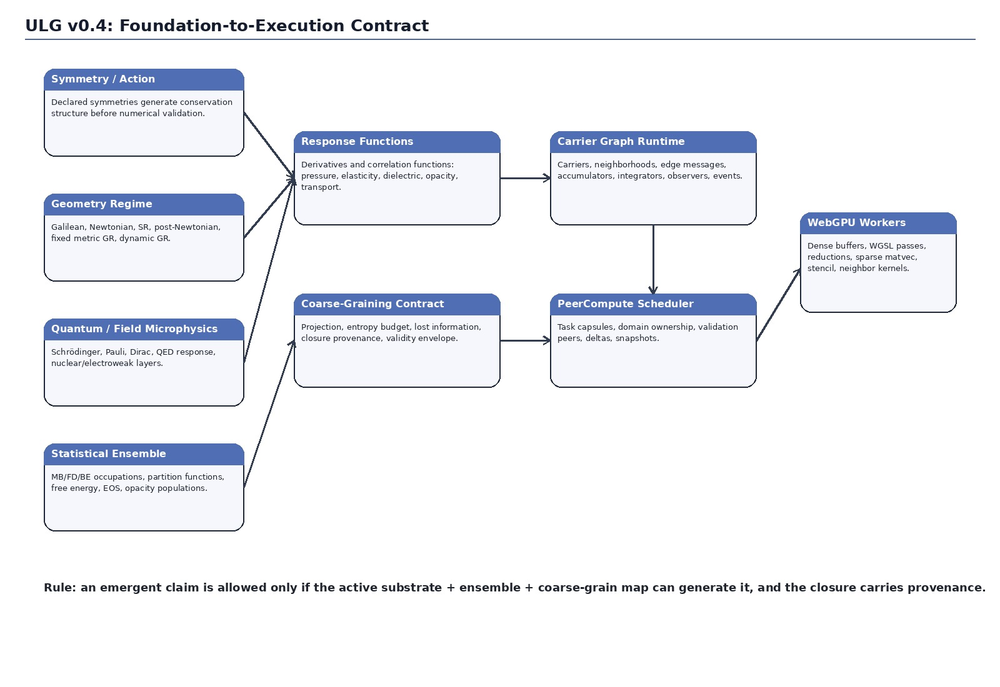
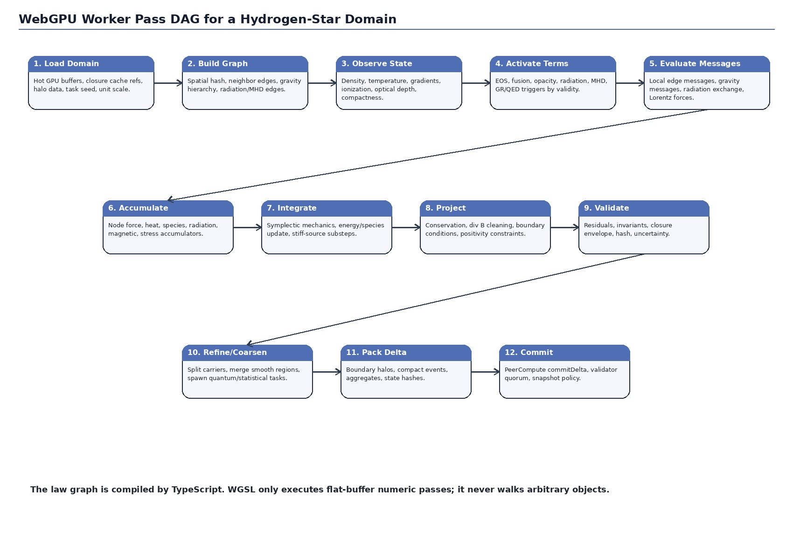
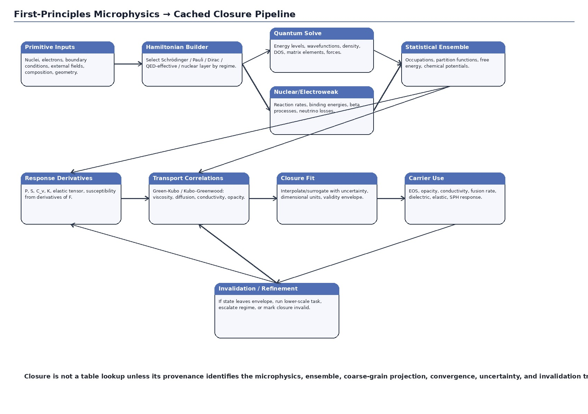
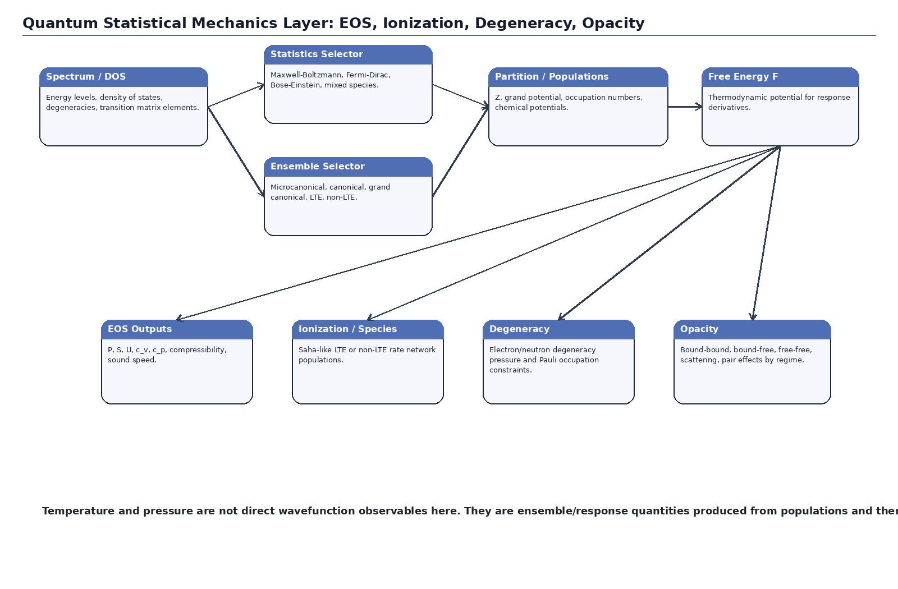
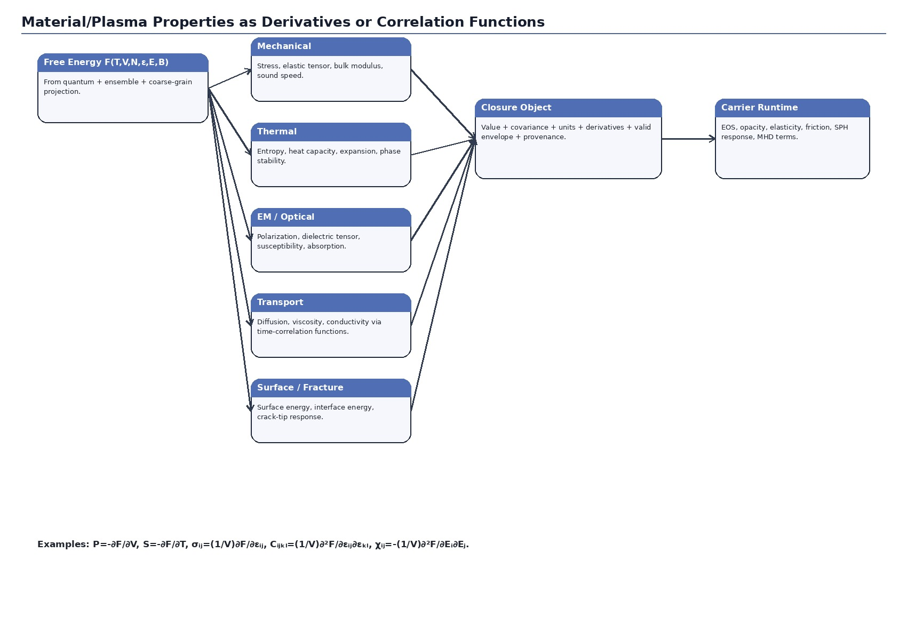
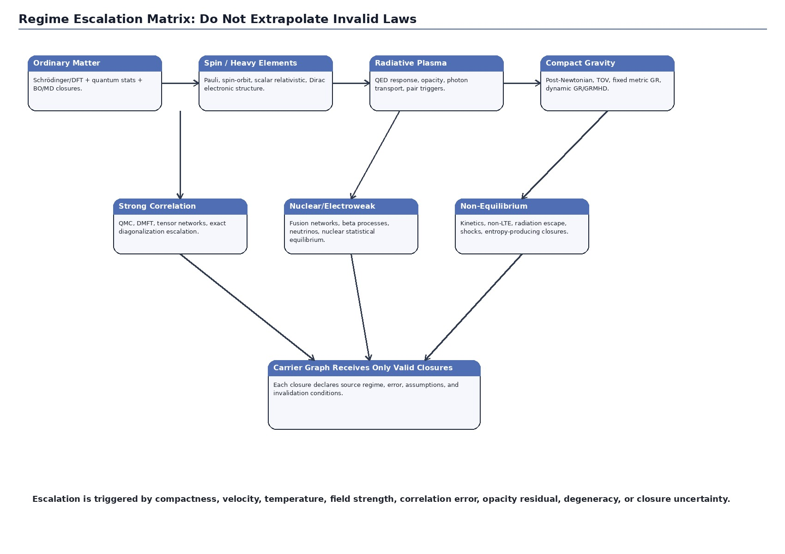
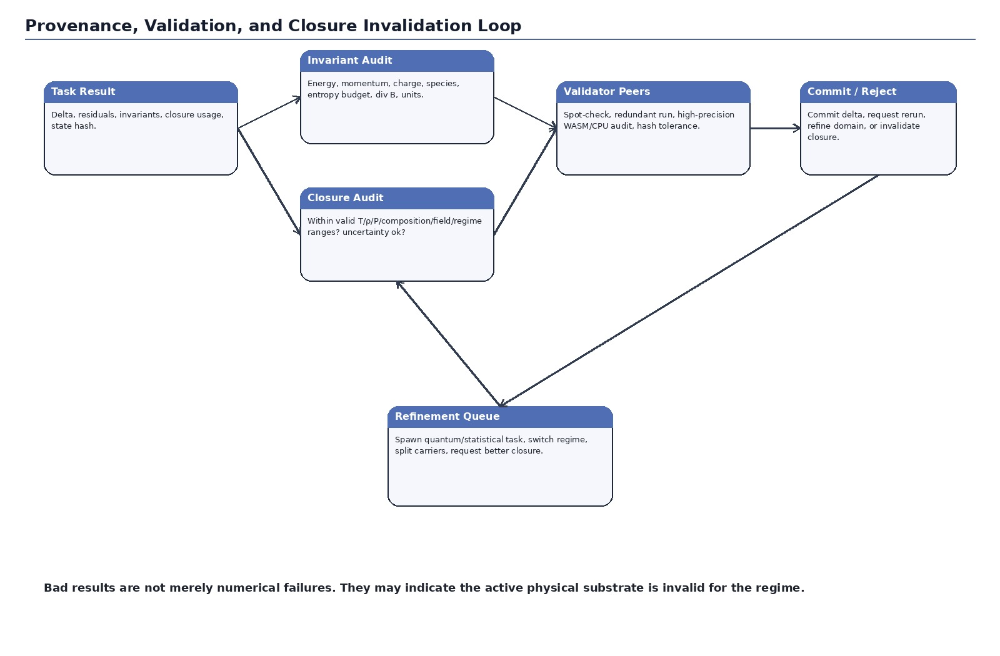
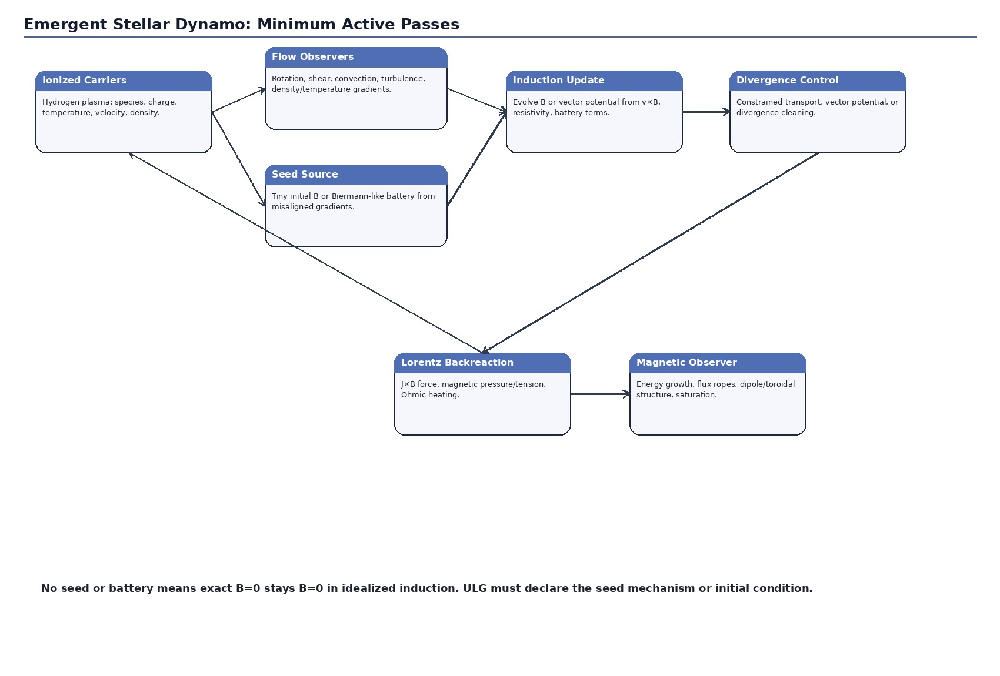
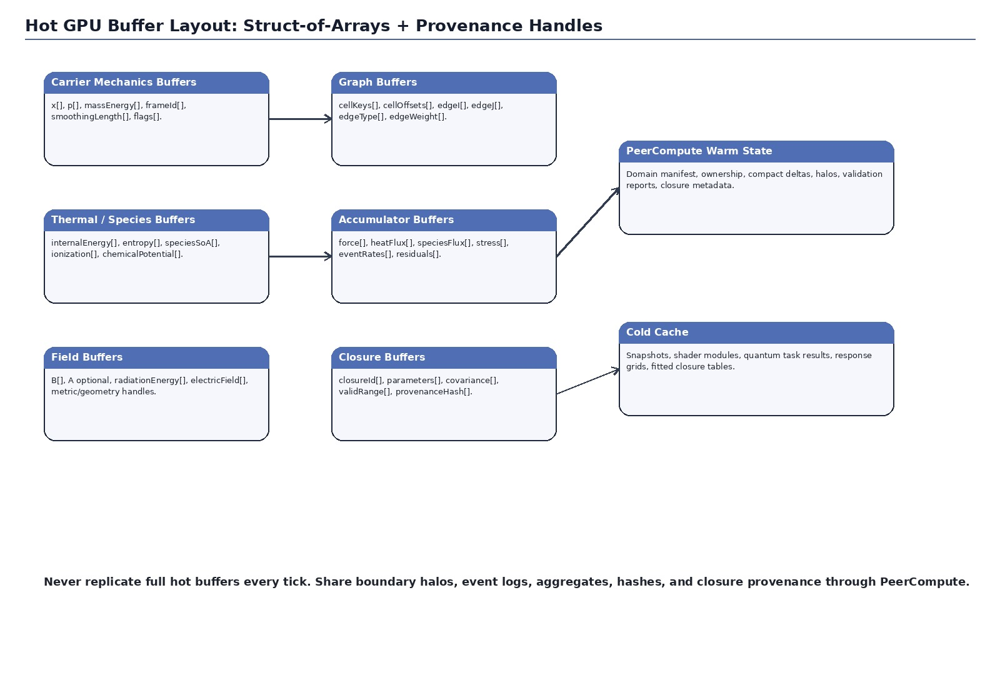

# ULG-Star Runtime Spec v0.4

**Universal Law Graph runtime for emergent stars, plasmas, liquids, phase transitions, crystals, optical/material response, and first-principles closures on PeerCompute + WebGPU compute workers**  
**Draft:** 0.4  
**Date:** 2026-06-05  
**Status:** implementation-oriented specification draft, not a validated physics code.

---

## 0. Purpose of v0.4

v0.4 turns the v0.3 correction into a more operational spec. It does not merely reduce claims. It adds contracts, formulas, pass DAGs, buffer layouts, shader-task boundaries, closure provenance, and acceptance tests.

The core correction remains:

> ULG must not claim that all macroscopic physics emerges from the nonrelativistic molecular Schrödinger Hamiltonian alone.

The stronger claim is:

> ULG allows macroscopic behavior to emerge from a hierarchy of active first-principles substrates, quantum/statistical ensembles, coarse-graining operators, and validity-checked closures.

For a star started as “a large mass of hydrogen,” the runtime should not instantiate a `Star` object. It should instantiate a carrier graph with mass, composition, internal energy, fields, and geometry. The star-like behavior appears only if the graph activates the required substrates: gravity, quantum-statistical EOS, ionization, opacity, radiation transport, nuclear/electroweak fusion, plasma/MHD, and magnetic induction.



---

## 1. Hard rules

### 1.1 No material property is primitive

A material, plasma, liquid, crystal, gas, or optical property must be one of:

```text
1. Directly resolved from active microscopic dynamics.
2. Derived from a first-principles task and cached as a response closure.
3. Imported as an approximation with explicit provenance, validity, and uncertainty.
```

The runtime must never label case 3 as fully emergent.

### 1.2 No named phenomenon emerges without the substrate that can generate it

Examples:

```text
Degeneracy pressure requires Fermi-Dirac statistics.
Opacity requires quantum light-matter coupling, populations, and radiation/scattering models.
A black hole requires a GR geometry layer.
Dissipation requires coarse-graining, environmental coupling, stochastic assumptions, or low-entropy initial state.
Fusion requires nuclear and weak-interaction provenance, not electronic Schrödinger physics.
```

### 1.3 Schrödinger simulation is foundational for ordinary electronic matter, not universal for all physics

The nonrelativistic molecular Hamiltonian is the root for ordinary chemical bonding and many material response functions. It is not enough for every target regime. ULG must select the deepest active substrate required by the local regime:

```text
ordinary electronic matter          -> Schrödinger / Born-Oppenheimer / DFT / quantum statistics
spin-heavy-element material         -> Pauli / spin-orbit / scalar relativistic / Dirac corrections
optical/radiative response          -> quantum light-matter response / QED-effective layer
fusion and evolved stellar cores    -> nuclear + weak interaction layer
compact stars / black holes         -> GR / TOV / GRMHD layer
irreversible transport              -> ensemble + coarse-graining + entropy budget
strongly correlated materials       -> beyond ordinary DFT escalation
```

---

## 2. Target runtime

The target runtime is PeerCompute with WebGPU compute workers.

```text
TypeScript / JavaScript
  graph orchestration
  validity checks
  closure selection
  PeerCompute task capsules
  work distribution
  state deltas
  provenance metadata

WebGPU / WGSL workers
  dense numeric kernels
  flat-buffer particle/field updates
  neighbor lists
  sparse matrix-vector passes
  local reductions
  stencil kernels
  closure interpolation
  low-dimensional quantum kernels
  validation reductions

WASM / CPU fallback
  f64 reference solves
  stiff reaction networks
  high-precision reductions
  small exact eigensystems
  validation audits
  closure fitting
```

WGSL should not walk the law graph. The graph compiler emits a pass plan over flat buffers.



---

## 3. Foundation stack

ULG v0.4 uses this foundation stack:

```text
Symmetry / action contracts
  -> conservation structure and allowed invariants

Geometry / spacetime regime
  -> Galilean, Newtonian, SR, post-Newtonian, fixed metric GR, dynamic GR

Quantum / field microphysics
  -> Schrödinger, Pauli, Dirac, QED-effective response, nuclear/electroweak layer

Quantum statistical mechanics
  -> ensembles, occupations, partition functions, free energy, EOS, degeneracy, ionization

Response-function layer
  -> material/plasma/radiation properties as derivatives or correlation functions

Coarse-graining / decoherence / irreversibility
  -> transport, dissipation, thermalization, stochastic closures, entropy budget

Carrier graph runtime
  -> local interaction messages, SPH-like observation, edge events, integration, validation

PeerCompute/WebGPU execution
  -> distributed task capsules, worker passes, validation peers, compact deltas
```

The corrected implementation pattern is:

```text
microphysical substrate
  + statistical ensemble
  + response operator
  + coarse-grain projection
  + validity envelope
  + numerical solver
  = usable closure
```



---

## 4. Universal carrier graph

A carrier is a sample of physical state. It may represent an atom, molecule, SPH-like parcel, plasma parcel, star macro-particle, radiation packet, field sample, grain node, or quantum coefficient block.

```ts
export interface CarrierState {
  id: number;

  // Local coordinate frame mechanics
  x: Vec3;                       // local-frame position
  p: Vec3;                       // momentum
  massEnergy: number;            // rest mass + tracked internal contribution where applicable
  frameId: number;
  smoothingLength: number;

  // Composition and conserved counts
  species?: SpeciesVector;       // isotopes, ions, molecules, electron/positron populations
  charge?: number;
  baryonNumber?: number;
  leptonNumber?: number;

  // Ensemble/thermal state
  internalEnergy?: number;
  entropy?: number;
  temperature?: number;          // observer/ensemble output, not a primitive wavefunction observable
  chemicalPotential?: Float32Array;
  degeneracyParameter?: number;

  // Field/plasma state
  electricField?: Vec3;
  magneticField?: Vec3;
  vectorPotential?: Vec3;
  radiationEnergy?: number;
  radiationFlux?: Vec3;
  ionizationFraction?: number;

  // Material/phase memory
  phaseOrder?: number;
  crystalOrder?: Vec4;
  damage?: number;
  latent?: Float32Array;

  // Runtime metadata
  activeRegimeMask: number;
  closureIds: Uint32Array;
  flags: number;
}
```

A carrier is not necessarily a literal particle. It is a state sample. The same graph machinery can handle atoms, plasma parcels, fluid chunks, field samples, and star macro-particles.

---

## 5. Minimal generative pass loop

The smallest useful ULG loop is:

```text
1. Load domain and active closures.
2. Build spatial hash / neighbor graph / long-range approximation.
3. Observe local state: density, gradients, temperature, ionization, optical depth, compactness.
4. Activate valid interaction terms.
5. Evaluate edge and field messages.
6. Accumulate messages onto carriers.
7. Integrate mechanics, internal energy, species, radiation, and fields.
8. Project constraints and invariants.
9. Validate residuals, closure envelopes, and uncertainty.
10. Trigger refinement, regime escalation, or closure invalidation.
11. Pack compact delta and submit to PeerCompute.
```

The pass names should remain stable even when the physics modules change:

```text
buildSpatialHash
buildNeighborEdges
buildLongRangeGraph
observeCoarseState
activateTerms
evaluateEdgeMessages
evaluateFieldMessages
evaluateSourceTerms
accumulateMessages
integrateState
projectConstraints
validateDomain
refineOrCoarsen
packPeerDelta
```

---

## 6. First-principles atomic layer

### 6.1 Primitive inputs

For ordinary electronic matter, the primitive data are:

```text
nuclei: species Z_A, masses M_A, positions R_A, optional isotope data
electrons: count, spin, charge, boundary conditions
external fields: E, B, radiation, confinement, pressure/strain
geometry: cell, surface, molecule, crystal, defect, plasma local sample
ensemble parameters: T, V, N, chemical potentials when applicable
```

A first-principles electronic task starts from these primitives. It must not start from “steel,” “water,” “diamond,” or “opaque gas” as fundamental types. Those are labels over derived behavior.

### 6.2 Nonrelativistic molecular Hamiltonian

The default low-energy electronic Hamiltonian is:

```math
\hat{H} = \hat{T}_e + \hat{T}_n + \hat{V}_{ee} + \hat{V}_{en} + \hat{V}_{nn}
```

where:

```math
\hat{T}_e = -\sum_i \frac{\hbar^2}{2m_e}\nabla_i^2
```

```math
\hat{T}_n = -\sum_A \frac{\hbar^2}{2M_A}\nabla_A^2
```

```math
\hat{V}_{ee}=\sum_{i<j}\frac{e^2}{4\pi\epsilon_0 |r_i-r_j|}
```

```math
\hat{V}_{en}=-\sum_{i,A}\frac{Z_A e^2}{4\pi\epsilon_0 |r_i-R_A|}
```

```math
\hat{V}_{nn}=\sum_{A<B}\frac{Z_A Z_B e^2}{4\pi\epsilon_0 |R_A-R_B|}
```

The time-independent Schrödinger problem is:

```math
\hat{H}\Psi = E\Psi
```

The time-dependent problem is:

```math
i\hbar\frac{\partial \Psi}{\partial t}=\hat{H}\Psi
```

### 6.3 Born-Oppenheimer surface

When valid, ULG separates electronic and nuclear motion. For fixed nuclei \(R\):

```math
\hat{H}_e(R)\psi_k(r;R)=E_k(R)\psi_k(r;R)
```

The surface \(E_k(R) + V_{nn}(R)\) becomes a potential energy surface for nuclear/atomistic dynamics.

Forces follow from the energy gradient:

```math
F_A = -\nabla_{R_A} E_{BO}(R)
```

A Born-Oppenheimer closure must declare invalidation triggers:

```text
near electronic degeneracy
conical intersection
strong nonadiabatic transition probability
high electronic excitation
strong radiation coupling
ultrafast field-driven dynamics
```

When invalid, the graph escalates to nonadiabatic dynamics, surface hopping, Ehrenfest dynamics, density matrix methods, or a QED/radiation response layer.

### 6.4 DFT/Kohn-Sham route

For many material response tasks, the practical first-principles route is DFT. The electronic density is:

```math
n(r)=\sum_i f_i |\phi_i(r)|^2
```

The Kohn-Sham equations are:

```math
\left[-\frac{\hbar^2}{2m_e}\nabla^2 + V_{eff}[n](r)\right]\phi_i(r)=\epsilon_i\phi_i(r)
```

where:

```math
V_{eff}[n] = V_{ext} + V_H[n] + V_{xc}[n]
```

The DFT task outputs:

```text
electron density n(r)
total energy E[n]
forces on nuclei
stress tensor
band structure / density of states
phonons / force constants when requested
transition/dipole matrix elements when requested
charge/spin density
polarization / dielectric response when requested
```

The closure must tag the exchange-correlation approximation, pseudopotential/basis/grid, convergence thresholds, finite-temperature treatment, spin/relativistic settings, and uncertainty estimate.

### 6.5 First-principles task schema

```ts
export interface FirstPrinciplesTask {
  taskId: string;
  regime: 'Schrodinger' | 'Pauli' | 'Dirac' | 'DFT' | 'TDDFT' | 'QMC' | 'DMFT' | 'QEDResponse' | 'Nuclear';
  geometry: GeometryRef;
  nuclei: NuclearSpeciesRef;
  electrons?: ElectronCountOrChemicalPotential;
  boundary: BoundarySpec;
  externalFields?: ExternalFieldSpec;
  ensemble?: EnsembleSpec;
  requestedOutputs: RequestedResponse[];
  convergence: ConvergenceSpec;
  validity: ValidityEnvelope;
  cachePolicy: CachePolicy;
}
```

### 6.6 WebGPU-native quantum kernels

The first implementation should not attempt a full production DFT package in browser WGSL. It should expose these GPU-friendly kernels:

```text
finite-difference Hamiltonian application
sparse matrix-vector multiply
power iteration / Lanczos building blocks
conjugate gradient / residual minimization pieces
density-grid update
local potential update
small-batch eigenproblem approximation
response finite-difference sampling
ML-potential inference from first-principles cache
```

The result is still first-principles-provenanced if the closure either:

```text
1. was computed directly by an in-runtime first-principles task, or
2. was imported from a first-principles cache with complete provenance, or
3. was fitted to first-principles data with uncertainty and validity limits.
```

---

## 7. Quantum statistical mechanics layer

This is not optional. Temperature, pressure, entropy, ionization, degeneracy, EOS, and opacity populations are ensemble quantities.



### 7.1 Ensemble node

```ts
export interface StatisticalEnsembleNode {
  id: string;
  ensemble: 'microcanonical' | 'canonical' | 'grand_canonical' | 'local_thermodynamic_equilibrium' | 'non_LTE' | 'non_equilibrium';
  statistics: 'MaxwellBoltzmann' | 'FermiDirac' | 'BoseEinstein' | 'mixed_species';

  inputs: {
    energyLevels?: StateRef;
    densityOfStates?: StateRef;
    transitionMatrixElements?: StateRef;
    species: StateRef;
    volume?: StateRef;
    particleNumbers?: StateRef;
    chemicalPotentials?: StateRef;
    radiationField?: StateRef;
  };

  outputs: {
    partitionFunction?: StateRef;
    grandPotential?: StateRef;
    freeEnergy?: StateRef;
    entropy?: StateRef;
    pressure?: StateRef;
    temperature?: StateRef;
    heatCapacity?: StateRef;
    chemicalPotentials?: StateRef;
    ionizationFractions?: StateRef;
    degeneracyPressure?: StateRef;
    opacityPopulations?: StateRef;
  };

  validity: ValidityEnvelope;
}
```

### 7.2 Partition functions and thermodynamic potentials

Canonical partition function:

```math
Z(T,V,N)=\sum_s e^{-\beta E_s},\quad \beta=\frac{1}{k_B T}
```

Helmholtz free energy:

```math
F=-k_B T \ln Z
```

Entropy:

```math
S=-\left(\frac{\partial F}{\partial T}\right)_{V,N}
```

Pressure:

```math
P=-\left(\frac{\partial F}{\partial V}\right)_{T,N}
```

Internal energy:

```math
U=-\frac{\partial}{\partial \beta}\ln Z
```

Grand potential:

```math
\Omega=-k_B T \ln \mathcal{Z}
```

Pressure from grand potential:

```math
P=-\frac{\Omega}{V}
```

### 7.3 Occupations

Fermi-Dirac occupation:

```math
f_{FD}(\epsilon)=\frac{1}{e^{(\epsilon-\mu)/k_B T}+1}
```

Bose-Einstein occupation:

```math
f_{BE}(\epsilon)=\frac{1}{e^{(\epsilon-\mu)/k_B T}-1}
```

Maxwell-Boltzmann limit:

```math
f_{MB}(\epsilon)\propto e^{-(\epsilon-\mu)/k_B T}
```

Degeneracy must be explicitly represented. A star or compact object simulation without a Fermi-Dirac electron/neutron layer cannot produce degeneracy pressure.

### 7.4 Ionization

LTE ionization can use a Saha-like closure when valid:

```math
\frac{n_{i+1}n_e}{n_i} = \frac{2}{\lambda_e^3}\frac{g_{i+1}}{g_i}e^{-\chi_i/k_B T}
```

where \(\lambda_e\) is the electron thermal wavelength. The runtime must invalidate LTE Saha closure when radiation field, density, or collision rates imply non-LTE behavior.

### 7.5 EOS closure contract

```ts
export interface EOSClosure {
  id: string;
  source: 'partition_function' | 'free_energy_fit' | 'first_principles_table' | 'nuclear_eos' | 'imported';
  inputs: ['rho', 'T', 'species', 'ionization', 'degeneracy', 'radiationField'];
  outputs: ['P', 'u', 'S', 'cv', 'cp', 'soundSpeed', 'chemicalPotentials'];
  derivatives: string[];
  uncertainty: CovarianceSpec;
  validity: ValidityEnvelope;
  provenance: ProvenanceChain;
}
```

---

## 8. Material and plasma properties as response functions

The correct statement is:

> Fundamental material properties are cached response functions derived from microphysics plus ensemble state.

They are not constants assigned to material types.



### 8.1 Free-energy response route

Given a free energy:

```math
F = F(T,V,N,\epsilon_{ij},E_i,B_i,\phi,\ldots)
```

mechanical stress is:

```math
\sigma_{ij}=\frac{1}{V}\left(\frac{\partial F}{\partial \epsilon_{ij}}\right)_{T,N}
```

elastic tensor:

```math
C_{ijkl}=\frac{1}{V}\left(\frac{\partial^2 F}{\partial \epsilon_{ij}\partial \epsilon_{kl}}\right)_{T,N}
```

pressure:

```math
P=-\left(\frac{\partial F}{\partial V}\right)_{T,N}
```

bulk modulus:

```math
K=-V\left(\frac{\partial P}{\partial V}\right)_{T,N}
```

heat capacity:

```math
C_V=-T\left(\frac{\partial^2 F}{\partial T^2}\right)_{V,N}
```

thermal expansion can be derived from the temperature-dependent minimum of \(F(V,T)\).

### 8.2 Electromagnetic and optical response

Polarization:

```math
P_i=-\frac{1}{V}\left(\frac{\partial F}{\partial E_i}\right)
```

Electric susceptibility:

```math
\chi_{ij}^{(e)}=-\frac{1}{V}\left(\frac{\partial^2 F}{\partial E_i\partial E_j}\right)
```

Magnetization:

```math
M_i=-\frac{1}{V}\left(\frac{\partial F}{\partial B_i}\right)
```

Magnetic susceptibility:

```math
\chi_{ij}^{(m)}=-\frac{1}{V}\left(\frac{\partial^2 F}{\partial B_i\partial B_j}\right)
```

Frequency-dependent optical response requires transition matrix elements, populations, and radiation coupling. A minimal closure has:

```text
dielectric tensor ε_ij(ω)
absorption coefficient α(ω)
scattering coefficient σ_s(ω)
emissivity η(ω)
opacity κ(ρ,T,composition,ν)
```

### 8.3 Transport by correlation functions

Diffusion from mean-squared displacement:

```math
D=\lim_{t\to\infty}\frac{1}{6t}\langle |r(t)-r(0)|^2\rangle
```

Viscosity by Green-Kubo stress correlation:

```math
\eta=\frac{V}{k_B T}\int_0^\infty \langle P_{xy}(0)P_{xy}(t)\rangle dt
```

Thermal conductivity:

```math
\kappa=\frac{1}{3Vk_B T^2}\int_0^\infty \langle J_q(0)\cdot J_q(t)\rangle dt
```

Electrical conductivity can use a Kubo/Kubo-Greenwood-style response when the electronic structure layer provides the needed matrix elements and occupations.

### 8.4 Surface, interface, and fracture response

Surface energy:

```math
\gamma=\frac{F_{slab}-N F_{bulk}}{2A}
```

Interface energy:

```math
\gamma_{ab}=\frac{F_{interface}-N_aF_a-N_bF_b}{A}
```

Fracture response is derived from energy release, surface formation, crack-tip process-zone behavior, and microstructure. A simple brittle estimate may use surface energy, but the closure must escalate when plasticity, dislocations, phase change, corrosion, or thermal shock are active.

### 8.5 Closure object

```ts
export interface ResponseClosure<TValue> {
  id: string;
  kind: 'EOS' | 'Elastic' | 'Optical' | 'Transport' | 'Opacity' | 'ReactionRate' | 'Magnetic' | 'Friction' | 'Surface' | 'Fracture';
  valueLayout: string;
  value: TValue;
  derivatives?: ClosureDerivative[];
  covariance?: CovarianceSpec;
  units: UnitSignature;
  validFor: ValidityEnvelope;
  provenance: ProvenanceChain;
  invalidationTriggers: TriggerSpec[];
}
```

---

## 9. Low-level atomic-to-material execution path

This is the mandatory route for derived material behavior.

```text
nuclei + electrons + geometry + boundary
  -> Hamiltonian / electronic-structure task
  -> energy surface / density / DOS / matrix elements / forces
  -> statistical ensemble
  -> free energy or response function
  -> closure fit with uncertainty
  -> carrier graph uses closure
  -> state leaves envelope
  -> closure invalidated or refined
```

### 9.1 Atomic task types

```text
atomic.bound_state_grid
  one/few-electron finite-difference Schrödinger solver for tests and local models

atomic.tight_binding
  fast electronic structure approximation, fitted/provenanced against first-principles data

atomic.dft_sample
  structure optimization, energy, density, forces, stress, DOS, phonon, dielectric samples

atomic.tddft_or_response
  optical and excited-state response samples where valid

atomic.qmc_benchmark
  high-accuracy sample for strong correlation or calibration

atomic.nonadiabatic_patch
  local quantum-classical refinement when Born-Oppenheimer invalidates

atomic.ml_potential_fit
  surrogate trained on first-principles samples with validity and uncertainty
```

### 9.2 Atomic buffer schema

```ts
export interface AtomicGeometryBuffer {
  count: number;
  atomicNumber: Uint16Array;
  isotopeMass: Float32Array;
  positionX: Float32Array;
  positionY: Float32Array;
  positionZ: Float32Array;
  cell: Float32Array;          // 3x3
  boundaryFlags: Uint32Array;
}

export interface ElectronicGridBuffer {
  nx: number;
  ny: number;
  nz: number;
  dx: number;
  potential: Float32Array;
  density: Float32Array;
  orbitalCoefficients?: Float32Array;
  residual?: Float32Array;
}
```

### 9.3 Quantum cache key

```ts
export interface QuantumCacheKey {
  speciesHash: string;
  geometryHash: string;
  boundaryHash: string;
  fieldHash: string;
  ensembleHash: string;
  methodHash: string;
  requestedOutputHash: string;
}
```

The cache key is part of the closure provenance. Two closures with different Hamiltonians, exchange-correlation methods, pseudopotentials, spin settings, finite-temperature treatments, or relativistic corrections are not interchangeable.

---

## 10. Strong-correlation and many-body escalation

Ordinary DFT/BO is not enough for all emergent material behavior. The runtime must be able to say “this closure is not trustworthy here.”

Escalation triggers:

```text
large DFT functional disagreement
localized partially filled d/f shells with high correlation indicator
Mott-like gap disagreement
magnetic ordering ambiguity
fractional occupations with strong self-interaction error
nonadiabatic transition probability high
excited-state/optical residual high
experimental/calibration mismatch, if available
```

Escalation ladder:

```text
DFT / Kohn-Sham
  -> hybrid functional / DFT+U / spin-polarized correction
  -> GW / Bethe-Salpeter for spectra/excitons
  -> QMC benchmark for energies/correlation
  -> exact diagonalization / tensor network for small correlated models
  -> DMFT / DFT+DMFT for correlated solids
  -> nonadiabatic density-matrix methods when BO fails
```

For v0.4, these can be task interfaces and provenance contracts rather than fully implemented solvers.

---

## 11. Relativistic, QED, and radiation response layer

### 11.1 Regime ladder

```text
R0 nonrelativistic Schrödinger
  ordinary low-energy chemistry/materials

R1 Pauli Hamiltonian
  spin and magnetic moment effects

R2 scalar relativistic / spin-orbit corrections
  heavy elements, fine structure, spin Hall, magnetism corrections

R3 Dirac electronic structure
  high-Z atoms/materials and relativistic electrons

R4 QED-effective light-matter response
  emission, absorption, spontaneous/stimulated processes, pair triggers where needed

R5 radiation transport
  photons as packets/fields with opacity, emissivity, scattering, energy/momentum exchange
```



### 11.2 Radiation closure

```ts
export interface RadiationClosure {
  id: string;
  spectralGrid: FrequencyGrid;
  opacity: ClosureRef;       // κ_ν(ρ,T,species,ionization,field)
  emissivity: ClosureRef;    // η_ν
  scattering: ClosureRef;    // σ_ν and phase function
  sourcePopulationModel: 'LTE' | 'non_LTE' | 'imported' | 'quantum_response';
  qedoFlags: string[];
  validity: ValidityEnvelope;
  provenance: ProvenanceChain;
}
```

### 11.3 Opacity sources

Opacity may include:

```text
bound-bound transitions
bound-free photoionization
free-free absorption
Thomson/Compton scattering
molecular/solid-state bands where applicable
pair production / annihilation in high-energy regimes
magnetized plasma effects in strong fields
```

A closure that only says `opacity = table.interpolate(rho,T)` is allowed only if the table has provenance and validity. It is not “from scratch emergent” unless the response layer generated it.

---

## 12. Spacetime and gravity layer

Gravity is regime-selected.

```ts
export interface GeometryRegimeNode {
  id: string;
  regime: 'Galilean' | 'SpecialRelativistic' | 'NewtonianGravity' | 'PostNewtonian' | 'FixedMetricGR' | 'DynamicGR';
  metric?: StateRef;
  gravitationalPotential?: StateRef;
  stressEnergy?: StateRef;
  validity: ValidityEnvelope;
  escalationTriggers: TriggerSpec[];
}
```

For a basic hydrogen star:

```text
Newtonian self-gravity is acceptable if compactness GM/(Rc²) is small and velocities are nonrelativistic.
```

For compact objects:

```text
white dwarfs require quantum statistical degeneracy pressure and may need relativistic electrons.
neutron stars require nuclear EOS + GR/TOV.
black holes and magnetars near black holes require GR or GRMHD.
```

The runtime must invalidate Newtonian gravity when compactness or velocity exceeds the envelope:

```text
compactness = GM/(Rc²)
velocityFraction = |v|/c
curvatureProxy = GM/(r³c²)
```

---

## 13. Nuclear and weak interaction layer

Fusion is not derived from electronic Schrödinger simulation. It needs nuclear and weak-interaction provenance.

```ts
export interface NuclearReactionNetwork {
  id: string;
  species: NuclearSpecies[];
  reactions: NuclearReaction[];
  screeningModel?: ClosureRef;
  neutrinoLossModel?: ClosureRef;
  integrator: 'explicit' | 'implicit' | 'operator_split' | 'wasm_stiff';
  validity: ValidityEnvelope;
  provenance: ProvenanceChain;
}
```

A reaction record:

```ts
export interface NuclearReaction {
  reactants: SpeciesStoich[];
  products: SpeciesStoich[];
  rate: ClosureRef;          // λ(T,ρ,composition,screening)
  qValue: number;            // energy release
  neutrinoEnergyLoss?: ClosureRef;
  forceTags: ('strong' | 'electromagnetic' | 'weak')[];
}
```

For proton-proton burning, the weak interaction must be represented in the provenance of the rate. Neutrino losses must be tracked as an energy escape or transport term.

---

## 14. Irreversibility, decoherence, and coarse-graining

The microscopic equations used by ULG are often reversible. Dissipation, thermalization, diffusion, shocks, and cooling require explicit coarse-graining contracts.

```ts
export interface CoarseGrainingNode {
  id: string;
  projection: 'spatial_smoothing' | 'ensemble_average' | 'velocity_moment_closure' | 'Markovian_bath' | 'radiation_escape' | 'molecular_chaos' | 'decoherence_projection';
  inputs: StateRef[];
  outputs: StateRef[];
  lostInformation: string[];
  entropyBudget: StateRef;
  validity: ValidityEnvelope;
  provenance: ProvenanceChain;
}
```



Entropy production check:

```math
\dot{S}_{coarse} \ge -\epsilon_{numerical}
```

The graph may permit local entropy decrease only when the exported entropy/information/radiation budget accounts for it.

Quantum-to-classical bridge:

```ts
export interface QuantumClassicalBridgeNode {
  representation: 'wavefunction' | 'density_matrix' | 'Wigner_distribution' | 'classical_phase_space_distribution';
  projection: 'BornOppenheimer_surface' | 'thermal_ensemble' | 'decohered_pointer_basis' | 'semiclassical_WKB' | 'Ehrenfest' | 'surface_hopping' | 'Langevin_bath';
  validity: ValidityEnvelope;
}
```

---

## 15. Symmetry and invariants

Conservation laws should be generated by declared symmetries, then audited numerically.

```ts
export interface ActionSymmetryNode {
  id: string;
  actionFunctional?: StateRef;
  symmetryGroup: 'time_translation' | 'space_translation' | 'rotation' | 'Lorentz' | 'gauge_U1' | 'gauge_SU2' | 'gauge_SU3' | 'diffeomorphism';
  generatedInvariant: 'energy' | 'momentum' | 'angular_momentum' | 'charge' | 'weak_isospin' | 'color_charge' | 'stress_energy_covariant_conservation';
}
```

Invariant report:

```ts
export interface InvariantReport {
  invariantId: string;
  expected: number | Vec3 | Tensor;
  actual: number | Vec3 | Tensor;
  drift: number;
  tolerance: number;
  severity: 'ok' | 'warn' | 'invalid';
}
```

---

## 16. SPH-like liquids as emergent carrier behavior

ULG should not make Navier-Stokes the primitive liquid law. It should use carriers and smoothing observers.

Density observer:

```math
\rho_i = \sum_j m_j W(|r_i-r_j|,h_i)
```

Smoothed velocity:

```math
v_i^{obs}=\frac{1}{\rho_i}\sum_j m_j v_j W(|r_i-r_j|,h_i)
```

Pressure-like response must come from a free-energy or EOS response:

```math
P = \rho^2\left(\frac{\partial (F/N)}{\partial \rho}\right)_{T,composition}
```

Liquid behavior emerges from:

```text
short-range repulsion
medium-range cohesion
thermal/internal energy exchange
dissipative pairwise momentum exchange with entropy accounting
density-gradient/surface free-energy terms
phase/free-energy basins
coarse-grain SPH-style observers
```

Bad version:

```text
Hardcode Navier-Stokes or hardcode an SPH pressure equation and call it emergence.
```

Better version:

```text
Use SPH smoothing as observation/coarse-graining, then derive pressure, viscosity, surface behavior, and phase response from the active substrate/closure.
```

---

## 17. Star from hydrogen: activation path

Initialize only:

```text
large mass of mostly hydrogen
initial spatial distribution
initial internal energy / temperature proxy
composition/isotope vector
possibly angular momentum
possibly tiny seed field or seed battery mechanism
boundary/radiation environment
```

The runtime partitions the hydrogen into macro-carriers. Each carrier represents an ensemble of real particles, not literal atoms.

Activation path:

```text
self-gravity compresses the cloud
  -> density and internal energy rise
  -> statistical EOS produces pressure response
  -> ionization activates plasma channels
  -> opacity/radiation transport changes energy escape
  -> hot dense core activates nuclear/electroweak reaction network
  -> fusion releases energy and neutrinos
  -> radiation/plasma pressure feeds back
  -> hydrostatic/star-like behavior emerges
```

The graph never calls `makeStar()`.

### 17.1 Hydrogen star carrier fields

```ts
export interface StarCarrierChannels {
  x: Vec3;
  p: Vec3;
  massEnergy: number;
  rho: number;                  // observer output
  internalEnergy: number;
  temperature: number;          // ensemble output
  entropy: number;
  species: SpeciesVector;       // H1, H2, He3, He4, electrons, positrons, neutrinos if tracked
  ionizationFraction: number;
  pressure: number;             // EOS closure output
  opacityGroup: Float32Array;
  radiationEnergy: Float32Array;
  magneticField: Vec3;
  closureIds: Uint32Array;
}
```

### 17.2 Star pass DAG

```text
buildSpatialHash
buildNeighborEdges
buildGravityHierarchy
observeDensityTemperature
selectEOSClosure
solveIonizationPopulation
selectOpacityClosure
evaluateGravityMessages
evaluatePressureThermalMessages
evaluateRadiationExchange
evaluateNuclearNetworkWhereValid
evaluateMHDWhereIonized
accumulateMessages
integrateMechanicsEnergySpecies
projectConservationAndDivB
validateAndRefine
packPeerDelta
```

---

## 18. Emergent stellar magnetic field / dynamo

A magnetic field can emerge only if the active substrate supports it:

```text
ionized matter
moving charges/current
rotation/shear/convection
a seed field or battery source
induction update
Lorentz-force backreaction
divergence-free magnetic constraint
```



Induction equation form:

```math
\frac{\partial B}{\partial t}=\nabla\times(v\times B)-\nabla\times(\eta\nabla\times B)+S_{battery}
```

Current:

```math
J=\frac{1}{\mu_0}\nabla\times B
```

Lorentz force density:

```math
f=J\times B
```

Divergence constraint:

```math
\nabla\cdot B=0
```

If the simulation starts with exactly \(B=0\) and no battery term, ideal induction preserves \(B=0\). ULG must declare either a seed field or a battery source.

---

## 19. Opacity and optical behavior

Optical properties are response closures, not renderer constants.

```text
electronic/nuclear structure
  -> transition energies and matrix elements
  -> statistical populations
  -> absorption/emission/scattering coefficients
  -> opacity/dielectric closure
  -> radiation transport or renderer consumes closure
```

Opacity closure schema:

```ts
export interface OpacityClosure {
  id: string;
  groups: FrequencyGroup[];
  inputs: ['rho', 'T', 'species', 'ionization', 'radiationField', 'magneticField'];
  outputs: ['kappaAbs', 'kappaScat', 'emissivity', 'meanOpacity'];
  sourceProcesses: ('bound_bound' | 'bound_free' | 'free_free' | 'Thomson' | 'Compton' | 'pair' | 'molecular_band' | 'solid_band')[];
  populationModel: 'LTE' | 'non_LTE' | 'imported';
  provenance: ProvenanceChain;
  validity: ValidityEnvelope;
}
```

---

## 20. PeerCompute task capsule

```ts
export interface LawTaskCapsule {
  taskId: string;
  graphId: string;
  domainId: string;
  scaleBand: ScaleBand;
  timestep: number;
  dt: number;

  passPlan: KernelPassSpec[];
  inputRefs: StateRef[];
  outputRefs: StateRef[];
  closureRefs: ClosureRef[];
  boundaryRefs: StateRef[];

  unitSystemHash: string;
  lawGraphHash: string;
  closureProvenanceHash: string;
  inputStateHash: string;
  seed: string;

  tolerance: {
    absolute: number;
    relative: number;
    invariantDrift: number;
    closureUncertainty: number;
  };

  validation: ValidatorSpec;
  commitPolicy: 'authoritative' | 'quorum' | 'optimistic' | 'local_only';
}
```

Task result:

```ts
export interface LawTaskResult {
  taskId: string;
  outputStateHash: string;
  delta: CompactDelta;
  residuals: ResidualReport;
  invariants: InvariantReport[];
  closureUsage: ClosureUsageReport[];
  uncertainty: UncertaintyReport;
  refinementEvents: PhysicsEvent[];
  performance: KernelTimingReport;
}
```

---

## 21. WebGPU kernel pass contracts

Every WGSL pass must have a pass contract. The graph compiler can refuse to schedule passes with missing units, missing bounds, or incompatible buffer layouts.

```ts
export interface KernelPassSpec {
  id: string;
  backend: 'webgpu' | 'wasm' | 'cpu';
  kernel: string;
  dispatch: DispatchSpec;
  reads: BufferBindingSpec[];
  writes: BufferBindingSpec[];
  barriers: BarrierSpec[];
  units: UnitSignature[];
  precision: PrecisionMode;
  deterministic: boolean;
  validates?: string[];
}
```

### 21.1 Required core passes

| Pass | Purpose | Primary buffers | Validation |
|---|---|---|---|
| `buildSpatialHash` | map carriers to cells | x, h, cellKeys | no NaNs, bounds |
| `buildNeighborEdges` | compact local interaction graph | cellOffsets, edgeI/J | max edge count |
| `observeCoarseState` | density, gradients, T, ionization candidates | x, species, energy | positivity, units |
| `selectClosures` | choose EOS/opacity/reaction/transport closures | observer outputs, closure metadata | validity envelope |
| `evaluateEdgeMessages` | conservative and dissipative local messages | edges, closures | pair antisymmetry where applicable |
| `evaluateGravity` | local/tree/PM gravity | mass, x, hierarchy | energy drift estimate |
| `evaluateRadiation` | group transport/source exchange | opacity, radiation buffers | positivity, flux limit |
| `evaluateNuclearNetwork` | source term for species/energy | species, T, rho | baryon/charge accounting |
| `evaluateMHD` | induction/Lorentz terms | B/A, velocity, ionization | div B residual |
| `accumulateMessages` | edge-to-node reductions | edge messages | reduction residual |
| `integrateState` | update x,p,u,species,fields | accumulators | finite outputs |
| `projectConstraints` | conservation, div B, positivity | all hot buffers | invariant report |
| `packPeerDelta` | compact network output | changed ranges | hash |



### 21.2 Example WGSL skeleton: edge message pass

```wgsl
struct SimParams {
  dt: f32,
  edgeCount: u32,
  carrierCount: u32,
  _pad: u32,
}

@group(0) @binding(0) var<storage, read> edgeI: array<u32>;
@group(0) @binding(1) var<storage, read> edgeJ: array<u32>;
@group(0) @binding(2) var<storage, read> posMass: array<vec4<f32>>;
@group(0) @binding(3) var<storage, read> closureParam: array<vec4<f32>>;
@group(0) @binding(4) var<storage, read_write> edgeForceI: array<vec4<f32>>;
@group(0) @binding(5) var<uniform> params: SimParams;

@compute @workgroup_size(128)
fn evaluate_edge_messages(@builtin(global_invocation_id) gid: vec3<u32>) {
  let e = gid.x;
  if (e >= params.edgeCount) { return; }

  let i = edgeI[e];
  let j = edgeJ[e];

  let xi = posMass[i].xyz;
  let xj = posMass[j].xyz;
  let r = xj - xi;
  let d2 = max(dot(r, r), 1e-20);
  let invD = inverseSqrt(d2);
  let dir = r * invD;

  // Placeholder closure: force magnitude from selected response parameters.
  // Production kernels are generated from a closure term list, not hardcoded here.
  let c = closureParam[e];
  let rest = c.x;
  let k = c.y;
  let dist = 1.0 / invD;
  let fmag = k * (dist - rest);

  edgeForceI[e] = vec4<f32>(fmag * dir, 0.0);
}
```

A separate accumulation pass writes node accumulators. Do not use many uncontrolled atomics in the first MVP; sort/scan edges or use tiled reductions where possible.

---

## 22. Hot/warm/cold state layout

```text
Hot GPU state
  carrier SoA buffers
  edge buffers
  accumulators
  closure parameters
  field grids
  radiation groups
  temporary reductions

Warm PeerCompute state
  domain manifests
  compact deltas
  boundary halos
  closure hashes
  residual reports
  validation reports
  event logs

Cold cache
  snapshots
  quantum task results
  closure tables
  fitted potentials
  shader modules
  provenance records
```

Never replicate full hot buffers every tick unless the domain is tiny. Share deltas, halos, aggregates, events, hashes, and provenance.

---

## 23. Precision model

```ts
export type PrecisionMode =
  | 'f16_approx'
  | 'f32'
  | 'mixed_f32_f16'
  | 'compensated_f32'
  | 'double_double_f32'
  | 'fixed_point_i64_emulated'
  | 'wasm_f64'
  | 'cpu_reference';
```

Use:

```text
f32 WebGPU
  particles, fields, neighbor passes, local reductions, visualization

compensated f32
  global energy/momentum/mass reductions

double-double or local coordinate frames
  long-time orbital dynamics, huge dynamic range, phase accumulation

WASM f64 / CPU
  reference audits, stiff networks, small exact quantum solves, high-precision reduction
```

Coordinate frames must be nested:

```text
universe frame
  -> galaxy frame
    -> star frame
      -> local plasma domain
        -> material patch
          -> atomic frame
```

---

## 24. Validity envelope

```ts
export interface ValidityEnvelope {
  scaleMin?: number;
  scaleMax?: number;
  temperature?: Range;
  density?: Range;
  pressure?: Range;
  composition?: CompositionRange;
  fieldStrength?: Range;
  velocityFractionC?: Range;
  compactness?: Range;
  degeneracy?: Range;
  opticalDepth?: Range;
  assumptions: string[];
  invalidWhen: TriggerSpec[];
  fallback?: ClosureRef | LawModuleRef;
  refinementRequest?: ScaleBand | Regime;
}
```

A closure without a validity envelope is invalid by default.

---

## 25. Refinement and regime escalation

Refinement triggers:

```text
large residual
large gradient
shock or discontinuity
phase boundary
crack tip / bond topology change
closure uncertainty high
out-of-envelope thermodynamic state
degeneracy crosses threshold
compactness crosses threshold
optical depth/radiation non-LTE trigger
magnetic divergence or reconnection trigger
fusion source stiffness high
```

Actions:

```text
split carriers
spawn lower-scale quantum/material task
switch EOS/opacity/reaction closure
request validator rerun
move subproblem to WASM/CPU reference
escalate geometry from Newtonian to post-Newtonian/GR
escalate electronic model from Schrödinger/DFT to Pauli/Dirac/QED response
```

---

## 26. Validation and provenance

### 26.1 Provenance chain

```ts
export interface ProvenanceChain {
  id: string;
  primitiveInputs: string[];
  microphysics: string[];
  ensemble: string[];
  coarseGrain: string[];
  numericalMethods: string[];
  convergence: ConvergenceSpec;
  sourceData?: SourceDataRef[];
  uncertainty: UncertaintyReport;
  validFor: ValidityEnvelope;
  createdAt: string;
}
```

### 26.2 Commit validation

A domain commit requires:

```text
unit compatibility pass
finite values pass
mass/charge/species accounting pass
energy/momentum drift report
entropy/coarse-grain budget report
div B report if MHD active
closure envelope report
peer validation mode satisfied
state hash/delta hash created
```

---

## 27. Acceptance tests

### 27.1 Atomic/quantum tests

```text
hydrogen-like one-electron bound states converge with grid refinement
wavefunction normalization preserved
Hermitian Hamiltonian application test passes
finite-difference force agrees with energy gradient
DFT/imported closure provenance hash changes when method settings change
```

### 27.2 Quantum statistical tests

```text
ideal classical gas EOS recovered in MB limit
Fermi gas degeneracy pressure scaling recovered in low-temperature limit
Bose occupation behaves correctly near condensation threshold where modeled
Saha-like ionization increases with temperature in valid LTE range
free-energy derivatives produce consistent P, S, C_v
```

### 27.3 Material property tests

```text
elastic tensor from finite strain derivative is symmetric within tolerance
surface energy finite-size convergence tracked
diffusion from MSD matches velocity-correlation estimate within tolerance
viscosity/thermal conductivity closures include correlation window uncertainty
optical closure changes with band/DOS/population changes
```

### 27.4 Liquid/phase tests

```text
carrier fluid forms droplets without Navier-Stokes primitive
surface behavior emerges from density-gradient/cohesion term
cooling melt nucleates ordered structure
latent heat accounting prevents free energy creation during phase transition
```

### 27.5 Star tests

```text
self-gravitating hydrogen cloud collapses and heats
virial-like relation is approached in non-radiating collapse test
EOS pressure support stabilizes a simple star-like configuration
fusion activation occurs only in hot dense core regions
species and energy accounting pass through fusion network
radiation cooling changes thermal evolution and luminosity observer
```

### 27.6 Magnetic/dynamo tests

```text
exact B=0 remains B=0 without seed or battery
seed field is amplified by rotating/convective plasma in valid regime
magnetic energy saturates when Lorentz backreaction matters
div B residual stays below tolerance
```

### 27.7 Relativistic/regime tests

```text
Newtonian gravity invalidates when compactness threshold exceeded
post-Newtonian/GR route is requested for compact-object envelope
relativistic electron EOS route activates at high degeneracy/velocity fraction
QED/pair/radiation route activates at high photon energy or strong fields
```

---

## 28. MVP implementation order

### Stage 1: Runtime skeleton

```text
CarrierState
LawTerm
ClosureRef
ValidityEnvelope
ProvenanceChain
TaskCapsule
KernelPassSpec
InvariantReport
```

### Stage 2: WebGPU core passes

```text
spatial hash
neighbor edge build
edge message evaluation
accumulation
integration
coarse observation
validation reductions
compact delta packing
```

### Stage 3: First-principles mini-pipeline

```text
finite-difference Schrödinger test kernel
small Hamiltonian sparse matvec
simple bound-state/eigen residual test
closure object generated from a toy quantum response
cache/provenance/invalidation path
```

### Stage 4: Statistical/EOS closures

```text
MB ideal gas EOS
Fermi gas degeneracy closure
Saha-like ionization closure
free-energy derivative framework
```

### Stage 5: Emergent fluid/material demo

```text
cohesive carriers
SPH-style observer
liquid droplet
cooling/crystallization toy model
phase energy/latent heat accounting
```

### Stage 6: Hydrogen star demo

```text
self-gravity
EOS pressure
ionization
radiative cooling/opacity toy closure
simple fusion network
adaptive carrier splitting
```

### Stage 7: Magnetic dynamo demo

```text
seed/battery mechanism
induction update
Lorentz backreaction
div B control
magnetic energy observer
```

### Stage 8: Regime escalation demos

```text
closure invalidation
quantum task spawn
strong-correlation placeholder escalation
Newtonian-to-GR trigger
QED/radiation trigger
```

---

## 29. Minimal file/module layout

```text
ulg/
  graph/
    CarrierState.ts
    LawGraph.ts
    ValidityEnvelope.ts
    ProvenanceChain.ts
    ClosureRegistry.ts
  peercompute/
    TaskCapsule.ts
    DeltaPacker.ts
    Validator.ts
  webgpu/
    PassCompiler.ts
    buffers.ts
    kernels/
      buildSpatialHash.wgsl
      buildNeighborEdges.wgsl
      evaluateEdgeMessages.wgsl
      accumulateMessages.wgsl
      integrateState.wgsl
      observeCoarseState.wgsl
      validateReductions.wgsl
  physics/
    symmetry/
    geometry/
    quantum/
    statistical/
    material/
    radiation/
    nuclear/
    mhd/
    coarsegrain/
  demos/
    liquid-droplet/
    cooling-crystal/
    hydrogen-star/
    stellar-dynamo/
```

---

## 30. Explicit non-goals for v0.4

```text
No claim of a complete browser-native DFT package.
No claim that nonrelativistic Schrödinger derives nuclear fusion.
No claim that Newtonian gravity produces black holes or neutron stars.
No claim that dissipation emerges without declared coarse-graining.
No claim that opacity is derived unless quantum light-matter response and populations are present.
No claim that all closures are exact; uncertainty and validity are required.
```

---

## 31. Bottom-line architecture statement

ULG v0.4 is a PeerCompute/WebGPU distributed carrier-graph runtime where emergent behavior is generated by minimal local interactions, but every macroscopic property used by the graph must be backed by an explicit derivation path:

```text
primitive microphysics
  -> quantum/statistical/field/nuclear task
  -> response or transport operator
  -> coarse-grained closure
  -> validity + uncertainty + provenance
  -> carrier graph execution
```

That preserves the project’s core ambition while removing the weak assumption that “the rest should emerge” from an incomplete foundation.

---


## 32. Detailed derivation recipes

This section makes v0.4 more than an architecture sketch. Each recipe defines a minimal route from low-level substrate to a carrier-usable closure. The implementation may begin with simple approximations, but the contract shape should remain stable.

### 32.1 EOS derivation recipe

Inputs:

```text
species populations N_s
volume or density V / ρ
temperature T or internal energy u
energy levels or density of states g_s(ε)
interaction/free-energy correction model
ionization/population model
```

Outputs:

```text
P(ρ,T,species)
u(ρ,T,species)
S(ρ,T,species)
c_v, c_p
sound speed c_s
chemical potentials μ_s
validity and uncertainty
```

Minimal implementation ladder:

```text
EOS-0: ideal gas / radiation pressure toy model
EOS-1: MB + Saha ionization + radiation pressure
EOS-2: Fermi-Dirac electron degeneracy + ion gas + radiation
EOS-3: first-principles free-energy table for local composition/phase
EOS-4: nuclear EOS / relativistic degeneracy / TOV-compatible compact object EOS
```

Useful formula anchors:

```math
P_{gas}=\frac{\rho k_B T}{\mu m_u}
```

```math
P_{rad}=\frac{1}{3}aT^4
```

```math
u_{rad}=aT^4
```

```math
c_s^2=\left(\frac{\partial P}{\partial \rho}\right)_S
```

For a closure object, the runtime should store derivative channels explicitly, not estimate all derivatives by noisy finite differences during dynamics:

```ts
export interface EOSDerivatives {
  dP_dRho_T: number;
  dP_dT_Rho: number;
  dU_dT_Rho: number;
  dS_dT_Rho?: number;
  dMu_dComposition?: Float32Array;
  soundSpeed2: number;
}
```

### 32.2 Electron degeneracy recipe

Activation indicators:

```text
degeneracy parameter η = μ_e / (k_B T)
Fermi temperature T_F comparable to or greater than T
high electron number density
compactness or pressure residual requiring quantum statistics
```

Required substrate:

```text
Pauli exclusion
Fermi-Dirac occupation
electron density of states
relativistic correction when p_F approaches m_e c
```

Nonrelativistic Fermi energy estimate:

```math
E_F = \frac{\hbar^2}{2m_e}(3\pi^2 n_e)^{2/3}
```

Fermi temperature:

```math
T_F = \frac{E_F}{k_B}
```

The closure must escalate if relativistic degeneracy is indicated:

```text
p_F/(m_e c) > threshold
```

### 32.3 Ionization recipe

Inputs:

```text
species, density, temperature, radiation field, electron density, partition functions
```

Outputs:

```text
ion fractions
electron density
mean molecular weight
opacity population inputs
conductivity/plasma activation flag
```

Ladder:

```text
ION-0 fixed ionization toy flag
ION-1 LTE Saha equilibrium
ION-2 collisional-radiative non-LTE network
ION-3 radiation-coupled time-dependent ionization
```

Invalidation triggers:

```text
radiation field far from Planck/LTE
collisional timescale > dynamical timescale
optical-depth gradients large
high-energy pair plasma regime
strong magnetic field modifies atomic states
```

### 32.4 Opacity derivation recipe

Inputs:

```text
transition energies
oscillator strengths / matrix elements
ionization fractions
free-electron density
radiation frequency groups
temperature, density, magnetic field
```

Outputs:

```text
κ_abs(ν), κ_scat(ν), emissivity η(ν), mean opacities, radiation pressure coupling
```

Process families:

```text
bound-bound
bound-free
free-free
Thomson / Compton scattering
pair production / annihilation when high-energy regime active
molecular or condensed matter bands where relevant
magnetized plasma corrections where strong B active
```

Carrier-level radiation source term:

```math
\frac{dE_{rad}}{dt}=\eta - \kappa_{abs} c E_{rad} + \text{scattering/exchange terms}
```

Matter energy receives the opposite exchange, except for escaping radiation or neutrino loss terms explicitly exported from the domain.

### 32.5 Nuclear reaction network recipe

Species evolution:

```math
\frac{dY_i}{dt}=\sum_r \nu_{ir}\lambda_r(T,\rho,Y)\prod_j Y_j^{\alpha_{jr}}
```

Energy source:

```math
\dot{q}_{nuc}=\sum_r Q_r R_r - \dot{q}_{\nu}
```

where \(Y_i\) are abundances, \(R_r\) are reaction rates, \(Q_r\) are reaction Q-values, and \(\dot{q}_{\nu}\) is neutrino energy loss.

Implementation ladder:

```text
NUC-0 toy ignition threshold + energy release for demos
NUC-1 pp-chain reduced network with weak-process provenance
NUC-2 CNO / helium burning modules
NUC-3 stiff implicit network in WASM/CPU fallback
NUC-4 NSE / high-temperature nuclear statistical equilibrium
```

Hard accounting requirements:

```text
baryon number conserved
charge conserved including positron/electron changes
energy release equals mass/binding-energy delta minus neutrino/exported losses
weak-interaction tags present for beta/pp/electron-capture processes
```

### 32.6 Radiation transport recipe

Implementation ladder:

```text
RAD-0 local cooling function
RAD-1 flux-limited diffusion group model
RAD-2 Monte Carlo radiation packets
RAD-3 moment method with closure
RAD-4 GR radiation transport when metric regime active
```

Diffusion-like group update:

```math
\frac{\partial E_g}{\partial t}=\nabla\cdot(D_g\nabla E_g)+\eta_g-\kappa_g cE_g
```

The closure \(D_g\) must declare how it handles optically thin and thick limits.

### 32.7 MHD and dynamo recipe

Minimum state:

```text
velocity v
magnetic field B or vector potential A
conductivity/resistivity
charge/ionization state
battery source or seed field
```

Passes:

```text
observe ionization/conductivity
compute battery source if enabled
update induction
clean/project divergence
compute current J
compute Lorentz force
update thermal energy from Ohmic heating
validate magnetic energy and div B
```

Ohmic heating:

```math
Q_{ohm}=\eta |J|^2
```

Magnetic energy density:

```math
u_B=\frac{|B|^2}{2\mu_0}
```

### 32.8 Gravity recipe

Ladder:

```text
GRAV-0 direct all-pairs only for tiny tests
GRAV-1 Barnes-Hut / multipole tree
GRAV-2 particle-mesh / multigrid Poisson
GRAV-3 post-Newtonian correction
GRAV-4 fixed metric geodesic + GR source terms
GRAV-5 dynamic GR / GRMHD task interface
```

Newtonian potential:

```math
\nabla^2\Phi = 4\pi G\rho
```

Acceleration:

```math
a=-\nabla\Phi
```

Invalidation:

```text
GM/(Rc²) exceeds closure threshold
|v|/c exceeds threshold
strong curvature proxy exceeds threshold
black-hole/neutron-star endpoint event forms
```

### 32.9 Phase and crystal formation recipe

Minimum ingredients:

```text
species-dependent interaction energy
local order parameter observer
phase/free-energy basins
thermal noise or ensemble fluctuations
latent heat accounting
topology event updater
```

Order observer examples:

```text
radial distribution peaks
coordination number
bond-angle distribution
local lattice orientation
structure factor sample
crystal grain graph
```

Phase evolution is not an if-statement on temperature. It is a transition between free-energy basins with barriers, nucleation sites, and energy accounting.

---

## 33. Concrete closure registry contract

The closure registry is the boundary between first-principles/provenance work and the fast carrier runtime.

```ts
export interface ClosureRegistry {
  register<T>(closure: ResponseClosure<T>): void;
  resolve(query: ClosureQuery): ClosureMatch;
  invalidate(closureId: string, reason: InvalidationReason): void;
  requestRefinement(query: ClosureQuery, reason: string): RefinementTask;
}

export interface ClosureQuery {
  kind: ResponseClosure<any>['kind'];
  regime: Regime;
  inputState: StateSummary;
  requiredOutputs: string[];
  maxUncertainty: number;
  preferredBackend?: 'webgpu' | 'wasm' | 'cpu' | 'peer' | 'cache';
}

export interface ClosureMatch {
  closureId: string;
  confidence: number;
  interpolationWeights?: Float32Array;
  uncertainty: UncertaintyReport;
  warnings: string[];
  refinementSuggested: boolean;
}
```

Closure lookup must be deterministic for the same state summary and registry snapshot.

---

## 34. Domain decomposition for PeerCompute

A domain is a spatial/scale partition with its own hot buffers and boundary exchange.

```ts
export interface SimulationDomain {
  domainId: string;
  parentDomainId?: string;
  scaleBand: ScaleBand;
  coordinateFrame: CoordinateFrame;
  ownerPeer?: PeerId;
  validatorPeers: PeerId[];
  bounds: DomainBounds;
  haloDepth: number;
  hotBuffers: BufferRef[];
  warmStateRefs: StateRef[];
  activeClosures: ClosureRef[];
  activeRegimes: Regime[];
}
```

Domain split criteria:

```text
too many carriers for one worker
large spatial gradient
shock/phase boundary
fusion core refinement
magnetic reconnection region
quantum/material patch spawned
peer memory pressure
validation failure localized
```

Domain merge criteria:

```text
smooth state
low residual
low event rate
low gradient
same closure set and regime
neighboring domains owned by compatible peers
```

Boundary exchange contents:

```text
halo carrier summaries
field boundary samples
radiation group boundary flux
closure hashes
invariant flux accounting
compact event summaries
```

---

## 35. Pass-level failure modes and responses

| Failure | Detector | Response |
|---|---|---|
| NaN/Inf in hot buffer | validation reduction | reject task, rerun smaller dt, lower precision mode not allowed |
| negative density/energy/species | positivity projection | clamp only with energy/species audit; otherwise reject |
| closure out of envelope | closure audit | switch closure, refine, or spawn first-principles task |
| energy drift high | invariant audit | reduce dt, switch integrator, validator rerun |
| entropy budget violation | coarse-grain audit | inspect dissipative closure, reject if unaccounted |
| div B high | MHD validation | divergence clean, reduce dt, switch vector potential/constrained transport |
| reaction network stiff | source-term monitor | route to WASM implicit integrator |
| compactness threshold crossed | geometry audit | invalidate Newtonian gravity, request PN/GR path |
| opacity residual high | radiation audit | switch frequency grouping or non-LTE model |
| peer disagreement | quorum validator | reject outlier, lower trust, rerun task |

---

## 36. Example task: first-principles elastic closure

Goal: derive an elastic tensor closure for a local crystalline patch.

```text
1. Select representative atomic cell from carrier/material patch.
2. Build nuclei/electron primitive input.
3. Run or fetch DFT/Schrödinger-provenanced energy calculation.
4. Apply small strain samples ε_ij.
5. Compute total free energy F(ε,T) or energy E(ε) if T≈0.
6. Fit stress and second derivatives.
7. Produce C_ijkl closure with units, covariance, and valid strain/T range.
8. Register closure.
9. Carrier graph uses closure for local elastic response.
10. If damage, phase change, temperature, or strain exits envelope, invalidate.
```

Pseudocode:

```ts
async function deriveElasticClosure(task: FirstPrinciplesTask): Promise<ResponseClosure<ElasticTensor>> {
  const samples: StrainSample[] = buildSymmetryReducedStrainSet(task.geometry);
  const energies = [];

  for (const sample of samples) {
    const geom = applyStrain(task.geometry, sample.epsilon);
    const q = await runOrFetchQuantumTask({ ...task, geometry: geom, requestedOutputs: ['free_energy', 'stress'] });
    energies.push({ epsilon: sample.epsilon, F: q.outputs.freeEnergy, stress: q.outputs.stress });
  }

  const fit = fitElasticTensorFromFreeEnergy(energies);
  return {
    id: makeClosureId(task, 'Elastic'),
    kind: 'Elastic',
    valueLayout: 'C_ijkl_6x6_voigt',
    value: fit.tensor,
    covariance: fit.covariance,
    units: unit('pressure'),
    validFor: inferElasticValidity(task, fit),
    provenance: buildProvenance(task, energies, fit),
    invalidationTriggers: [
      trigger('strain_norm', '>', fit.maxStrain),
      trigger('temperature', 'outside', task.validity.temperature),
      trigger('phaseOrder', 'changes_by', 0.1),
      trigger('damage', '>', 0.01)
    ]
  };
}
```

---

## 37. Example task: opacity closure from quantum response

Goal: derive a carrier-usable opacity closure.

```text
1. Identify local composition, ionization range, density range, and temperature range.
2. Fetch/compute energy levels, transition strengths, continuum cross sections, scattering terms.
3. Build population model: LTE or non-LTE.
4. Compute group opacities over requested frequency bins.
5. Store derivatives with respect to T, ρ, composition, and ionization if possible.
6. Register opacity closure with provenance and source-process tags.
```

Pseudocode:

```ts
async function deriveOpacityClosure(req: OpacityRequest): Promise<ResponseClosure<OpacityTable>> {
  const transitions = await runOrFetchQuantumTask({
    regime: req.requiresRelativistic ? 'Dirac' : 'DFT',
    geometry: req.representativeGeometry,
    nuclei: req.nuclei,
    ensemble: req.ensemble,
    requestedOutputs: ['transition_energies', 'oscillator_strengths', 'photoionization_cross_sections']
  });

  const populations = solvePopulationModel(req.populationModel, transitions.outputs, req.stateGrid);
  const table = integrateOpacityGroups(req.frequencyGroups, transitions.outputs, populations, req.processes);

  return makeOpacityClosure(table, req, transitions.provenance, populations.provenance);
}
```

---

## 38. Example task: hydrogen star timestep

Pseudocode at graph level:

```ts
async function stepHydrogenStarDomain(domain: SimulationDomain, dt: number) {
  await gpu.pass('buildSpatialHash', domain);
  await gpu.pass('buildNeighborEdges', domain);
  await gpu.pass('buildGravityHierarchy', domain);

  await gpu.pass('observeCoarseState', domain); // rho, gradients, T proxy, opticalDepth proxy

  const closurePlan = closureRegistry.resolveBatch([
    eosQuery(domain),
    ionizationQuery(domain),
    opacityQuery(domain),
    conductivityQuery(domain),
    fusionRateQuery(domain)
  ]);

  if (closurePlan.anyInvalid) {
    scheduler.enqueue(closurePlan.refinementTasks);
    closurePlan.applyFallbacksOrAbort();
  }

  await gpu.pass('evaluateGravity', domain);
  await gpu.pass('evaluatePressureThermalMessages', domain, closurePlan.eos);
  await gpu.pass('evaluateRadiation', domain, closurePlan.opacity);
  await maybeWasm('evaluateNuclearNetwork', domain, closurePlan.fusionRates);
  await gpu.pass('evaluateMHD', domain, closurePlan.conductivity);
  await gpu.pass('accumulateMessages', domain);
  await gpu.pass('integrateState', domain);
  await gpu.pass('projectConstraints', domain);

  const report = await gpu.pass('validateDomain', domain);
  const events = refinementPolicy.evaluate(report);
  scheduler.enqueue(events);

  return peercompute.commitDelta(packDelta(domain, report));
}
```

The point is that the star behavior is not a special engine path. It is the generic carrier pass loop with a particular active closure set.

---

## 39. v0.4 compliance checklist

A module is v0.4-compliant only if it answers these questions:

```text
What state channels does it read and write?
What units does every input/output carry?
What physical substrate justifies it?
What statistical ensemble, if any, is assumed?
What coarse-graining or irreversibility assumption is inserted?
What validity envelope limits it?
What is the uncertainty model?
What provenance record identifies the source calculation/data/model?
What happens when the envelope is violated?
Which WebGPU/WASM/CPU passes implement it?
Which invariants should it preserve or audit?
What acceptance tests prove it behaves correctly in simple limits?
```

No module that answers these with “unknown” should be allowed into an authoritative simulation run.

---

## 40. Reference anchors

These are conceptual anchors, not runtime dependencies.

- PeerCompute README: browser-based P2P compute/state architecture.  
  https://github.com/MetaverseJS/peercompute/blob/main/README.md

- WebGPU specification.  
  https://www.w3.org/TR/webgpu/

- WGSL specification.  
  https://www.w3.org/TR/WGSL/

- Hohenberg and Kohn, “Inhomogeneous Electron Gas,” Physical Review, 1964.  
  https://link.aps.org/doi/10.1103/PhysRev.136.B864

- Kohn and Sham, “Self-Consistent Equations Including Exchange and Correlation Effects,” Physical Review, 1965.  
  https://link.aps.org/doi/10.1103/PhysRev.140.A1133

- Born-Oppenheimer approximation overview.  
  https://chem.libretexts.org/Bookshelves/Physical_and_Theoretical_Chemistry_Textbook_Maps/Time_Dependent_Quantum_Mechanics_and_Spectroscopy_2014e_%28Tokmakoff%29/06%3A_Adiabatic_Approximation/6.01%3A_BornOppenheimer_Approximation

- Saha ionization equation overview.  
  https://en.wikipedia.org/wiki/Saha_ionization_equation

- Tolman-Oppenheimer-Volkoff equation overview.  
  https://en.wikipedia.org/wiki/Tolman%E2%80%93Oppenheimer%E2%80%93Volkoff_equation

- NASA solar dynamo explanation.  
  https://solarscience.msfc.nasa.gov/dynamo.shtml
